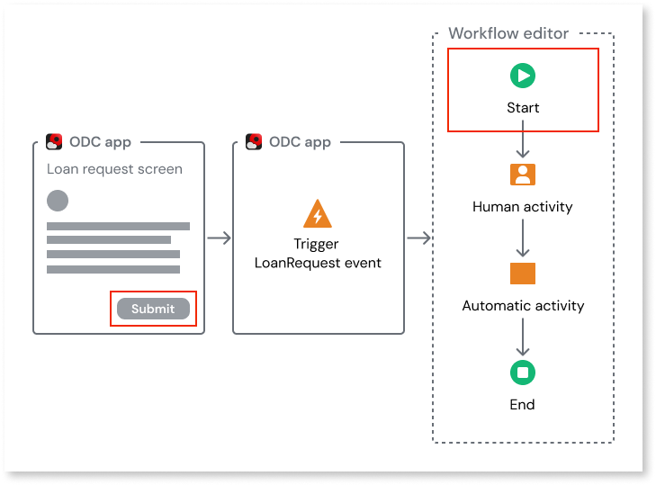
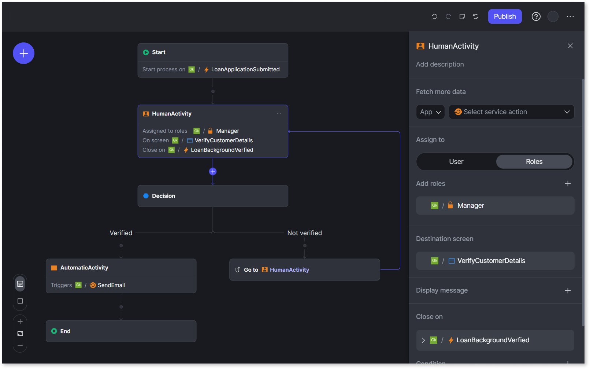

# Workflows in ODC

With Workflows, you can design, implement, and automate [business processes](business-processes.md) such as vacation approval, loan approval, or order management and integrate them in your apps. A workflow is a repeatable process consisting of tasks to be completed in a specific sequence. Workflows introduce automation in your apps by allowing you to design and implement repeatable business processes, automating tasks and interactions that would otherwise require manual intervention. For detailed information about how to implement workflows in ODC, refer to [Implement workflows](workflow-components.md).

Workflows are triggered by events in ODC apps. For detailed information about how to create, trigger, and handle events, refer to [Implement events](../../building-apps/events/implement-events.md). 

Here are some examples of events that can trigger a workflow:

* Approval Request: An employee submits a time-off request, initiating a workflow for manager approval and updating their leave balance.

* Online Form Submission: A customer fills out a contact form on a website, triggering a workflow to  send an automated welcome email.

* Order placement: A customer places a new order in an e-commerce system, triggering a workflow for order fulfillment, inventory update, and shipping notification.

The diagram below illustrates how clicking the Submit button on a Loan Request screen in an ODC app triggers the LoanRequest event, initiating the loan approval workflow in the Workflow Editor.

 

Here's a video providing a concise overview of workflows.

<iframe src="https://player.vimeo.com/video/1027587143" width="750" height="422" frameborder="0" allow="autoplay; fullscreen" allowfullscreen="">This video provides a concise overview of ODC workflows</iframe>

## Key features

Workflows enable you to integrate the business processes in your ODC apps.

With workflows, you can:

* Reduce manual effort and errors by streamlining tasks that require human intervention, such as approvals or document reviews.

* Improve operational efficiency by automating repetitive tasks and notifications, ensuring faster response times and consistent execution.

* Increase process flexibility by enabling multiple conditional paths, so you can easily adapt business processes based on specific criteria. For example, you can route your loan application business process to separate paths based on whether the loan documents were approved or rejected.

* Scale business operations by supporting high volumes of workflow instances and automating complex, multi-step processes.

## Use cases

Here are some use cases where you can use workflow for automation:

* Expense approval

* Vacation approval

* Fleet management

* Complaint management

* Loan approval

* Invoice approval

* Travel reimbursement

## Using workflow editor

ODC provides a **workflow editor**, a visual web-based tool for implementing workflows. You can access the workflow editor from the ODC Portal. You can implement workflows as a new type of asset similar to ODC apps and libraries with an independent lifecycle.

To use workflows you need the requisite *Asset Management* permission(s). To get the necessary permission(s), contact the administrator from your ODC organization.

 

With workflow editor, you can:

* Implement your workflow using a set of nodes such as **Start**, **End**, **HumanActivity**, **AutomaticActivity**, **Go to a previous step**, and **Decision**. For detailed information, refer to [Implement workflows](workflow-components.md).

* Select service actions and events to exchange data between the app and the workflow.
For example, while implementing a human activity in a workflow, you can select a service action from the app to retrieve the manager's user ID. You can then use that user ID to assign human activity to the manager within the workflow.

* Import and export workflows to share within your organization and with external partners.

* Switch between the default summary view for comprehensive understanding of workflows and the iconified view for a high-level structure. In the summary view, for each node in the workflow you are provided detailed information such as events triggered, conditions configured and service actions invoked. The iconified view displays only the icon of each node.

### Search in workflow editor

Workflow editor provides search capability which is a single point of entry for various commands and searches simplifying editing and navigation of complex workflows. You can open the search menu using the keyboard shortcut **Ctrl + K (or Cmd + K on a Mac**).

With search, you can do the following:

**Search and execute commands**: In addition to in-built commands, you can also search for a specific flow step (activity) or properties within your workflow.

**Edit properties**: Edit a specific expression or an outcome in the corresponding panel or editor.

**Add new flow-steps**: Select a flow-step and type add. A list of flow-steps to be added appears, allowing you to insert them into your workflow. 

### Managing workflow revisions

The workflow editor includes revisions history to help you track, manage, and restore previous versions of your workflows.

With revisions history, you can:

* **View past workflow revisions**: Access the full history of all published workflow revisions, including revision number, publication date, and publisher

* **Discard or restore workflow changes**: Easily discard unpublished workflow changes or restore the workflow to any previous published revision

## Key considerations for implementing workflows

Here are some points to consider as you implement workflows in ODC:

* **Workflows are loosely coupled** to apps and can consume only the public elements from the app, such as events, service actions, and screens. To learn more about strong and weak dependencies, refer to [Understanding strong and weak dependencies](../reuse/intro.md).

* **Workflows are always consumers** and not producers.

* **Workflows can be implemented, tested, and deployed across stages independent of ODC apps and libraries**. Because they rely on the app's public elements, they are subject to impact analysis. For detailed information about deploying workflows, refer to [Deploying assets](../../deploying-apps/deploy-apps.md).  

* **Workflows can have** [**multiple revisions**](../../deploying-apps/deploy-apps.md#multiple-revisions-of-a-workflow) **running simultaneously in the same stage**, and every revision can have one or more instances of the workflow in execution. An instance is a unit of execution of a workflow. Each instance can run up to 1,000 activities. 

    

    
    In the development stage, you can only have instances running in the last five revisions. For example, if there are five revisions (revisions 1 to 5) in the development stage with active instances running in each one, once revision six is created, all active instances running in revision one are terminated immediately. There is no limit to the number of revision instances for the QA and production stages. 

    

## Known constraints

* Workflows **do not support real-time collaboration**, meaning multiple users cannot edit a workflow simultaneously. However, basic conflict detection is supported. If a new version of a workflow exists in dev, you are notified when you open it or try to publish your changes.

* There is **no debugger** for workflows. However, you can monitor the workflow's current state in the portal in near real-time.

## Related resources

### Implement workflows

* [Getting started](using-workflows.md)

* [Implement workflows](workflow-components.md)

* [Troubleshooting workflows](troubleshooting-workflows.md)

* [Deploy workflows](../../deploying-apps/deploy-apps.md)

### Online training

* [Building workflows in ODC](https://learn.outsystems.com/training/journeys/building-workflows-in-odc-2690) 
