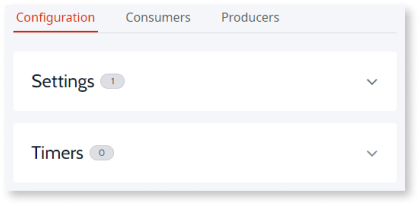

# Configuration management

Project Neo documentation is under construction. It's frequently updated and expanded. Leave your feedback and help us build the most useful content.

For DevOps activities, Project Neo Portal lets you adjust the configuration values in your app for each stage (such as development, test, and production). Changes to configuration values don’t require you to deploy your app. This increases the speed in which changes to the app are available to customers and reduces the number of times a deployment is necessary.

Being able to make changes to an app in use is critical in cases where you can't change a property after deployment.

## How configuration management works

A goal of Project Neo is to decrease complexity and increase productivity by making it easy to make changes from the Project Neo Portal. Developers create configurations with default values in Service Studio. From the Project Neo Portal, you select the stage on which you want to work. Then you can view and modify some configuration values for apps deployed on that stage.

You can override the configuration values from Service Studio in non-development stages. For example, in Service Studio a default value is set. When you deploy your app to Test, you can change the configuration values to mirror production values for testing and troubleshooting. Then when you move this configuration to Production you can change your values using real data. The changes you make are specific to a stage. This process occurs without needing to publish your application again.

Configurations can use one of the following values:

* **Default** - is the value set in Service Studio for the configuration. You can use this value in the Development, Test, or Production stages.

* **Current** - is the value currently in use, if defined, otherwise the default value is the current value in use.

The values you change take effect when the Apply process (asynchronous setting) completes. The Apply process saves the new values and updates the configuration.

## Managing settings

Settings exist in both apps and Libraries. When developers create an app in Service Studio, they create the settings and enter default values. You can modify the configuration values from the Project Neo Portal. From the Project Neo Portal menu, click **Configuration**. An accordion format displays a list of configurations by type such as Settings and Timers.

A bubble to the right of the name shows the number of configurations. To see the list of Settings, click the down arrow and open the accordion. A list of Settings displays. To change values, click a setting. When you click on the setting, a sidebar opens and displays the current values. Remember settings are stage-specific.

After you make the changes, apply the settings to make the new values available.

## Managing timers

Timers execute logic in apps. For example, you can use timers to:

* Execute batch tasks.
* Execute logic in an application at a specific time.
* Start actions that are machine intensive during high availability times.

You can also set how long a task should run before it times out.

In Service Studio, your developers set the default values for the timers. You can change the values in the Project Neo Portal.

Like Settings, you can access Timers from the Configuration tab. When you open the Timers section, a list of timers displays along with the schedule name and status. When you click on the name of a timer, the current values display in the sidebar.

When you deactivate a timer on the Project Neo Portal, you prevent it from running.

## Managing REST integrations

In Service Studio, developers define which systems you want to integrate with so that you can present an integrated view of data or provide data to another system. From the Project Neo Portal, the REST information you see is for the app on the selected stage.

To access the list of REST integrations, go to the Configuration tab for your App. From here you can get access to the Consumed REST APIs. The bubble to the right of the section name shows the number of APIs in each category.

When you click **Consumed REST APIs**, a list of the consumed APIs displays. To manage a Consumed REST integration, click on the integration name. The sidebar opens for you to make updates. When you apply your changes, Project Neo saves them, and your new Consumed REST integrations settings are available.
