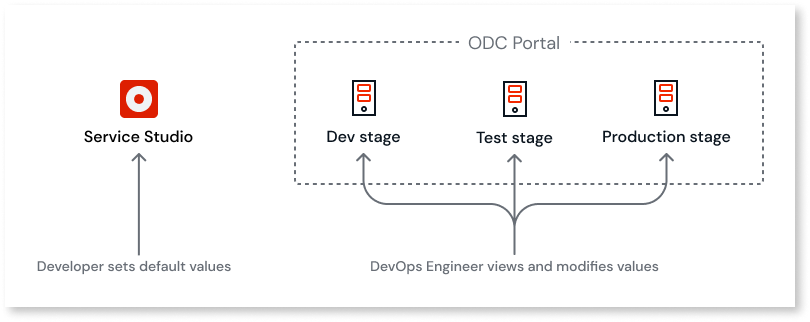
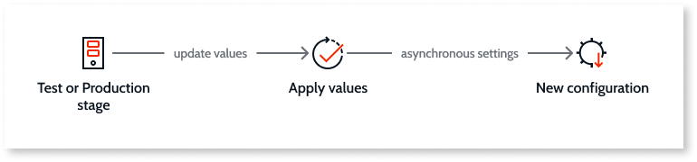

# Configuration management

Project Neo documentation is under construction. It's frequently updated and expanded.

For DevOps activities, Project Neo Portal lets you adjust the configuration values in your app for each stage (such as development, test, and production). Changes to configuration values don't require you to deploy your app. This increases the speed in which changes to the app are available to customers and reduces the number of times a deployment is necessary.

User management is a configuration that's often necessary for both developers and end-users. Find more about it in [Manage Users](./manage-users.md).

Being able to make changes to an app in use is critical in cases where you can't change a property after deployment.

## How configuration management works

For app configurations, developers create settings with default values in Service Studio. From the Project Neo Portal, you select the stage on which you want to work. Then you can view and modify some configuration and settings values for apps deployed on that stage.

You can override the configuration values from Service Studio in non-development stages. When you deploy your app to Test, you can change the configuration values to mirror production values for testing and troubleshooting. Then when you move this configuration to Production you can change your values using real data. The changes you make are specific to a stage. This process occurs without needing to publish your app again.

App configurations can use one of the following values:

* **Default**. The value set in Service Studio for the configuration. You can use this value in the Development, Test, or Production stages.

* **Current**. The value currently in use, if defined, otherwise the default value is the current value in use.

The values you change take effect when the asynchronous apply process completes. The apply process saves the new values and updates the configuration.

## Managing settings

Settings are custom public values that change the behavior of the app or library in a stage. Once you create the setting values in Service Studio and publish the app, you can override the default values in Portal without the need to republish or redeploy the app.

In Service Studio, for new or published apps in the **development stage only** you can:

* Create or change settings
* Arrange settings into folders
* View and edit the default values of the runtime settings

Open your app in Service Studio and go to **Data** > **Settings** to add or edit settings. You need to publish your app after any changes you make.

In Portal, for all apps **of a given stage only** you can:

* View or override the default values of the settings for the stage

From the Project Neo Portal menu, click **Configuration**. An accordion format displays a list of configurations by type such as settings and timers.

To see the list of settings, click the down arrow and open the accordion. A list of settings displays. To change values, click a setting. When you click on the setting, a sidebar opens and displays the current values.

After you make the changes, apply the settings to make the new values available.

Remember that settings are stage-specific.

## Managing timers

Timers execute logic in apps. In Service Studio, your developers set the default values for the timers. For example, you can use timers to:

* Run batch tasks
* Run logic in an app at a specific time
* Start actions that are machine intensive during high availability times
* Set how long a task should run before it times out

You can change the values in the Project Neo Portal. Access timers from the **Configuration** tab in Portal. When you open the **Timers** section, a list of timers displays along with the schedule name and status. When you click on the name of a timer, the current values display in the sidebar.

When you deactivate a timer on the Project Neo Portal, you prevent it from running.

## Managing REST integrations

In Service Studio, developers define which systems you want to integrate with so that you can present an integrated view of data or provide data to another system. From the Project Neo Portal, the REST information you see is for the app on the selected stage.

To access the list of REST integrations, go to the **Configuration** tab for your app. From here you can get access to the Consumed REST APIs. The bubble to the right of the section name shows the number of APIs in each category.

When you click **Consumed REST APIs**, a list of the consumed APIs displays. To manage a Consumed REST integration, click on the integration name. The sidebar opens for you to make updates. When you apply your changes, Project Neo saves them, and your new Consumed REST integrations settings are available.
