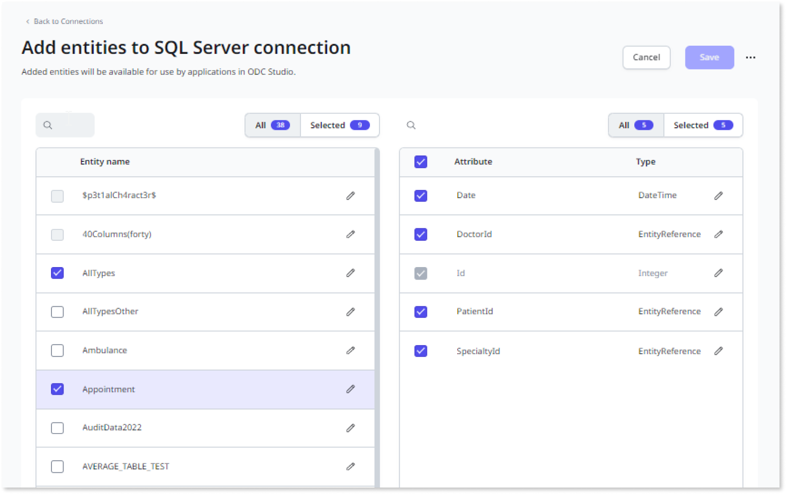

# Integrate with external databases

OutSystems Developer Cloud (ODC) enables developers to integrate external data into their apps. First, from ODC Portal, admins create connections to the supported databases and select the entities. Then, in ODC studio, developers use the data as entities in their apps.

Admins must set up configurations for each stage, such as development, QA, and production, to be able to connect an app to an external database. Admins must also ensure the app and its connection information are in the same stage. Additionally, the database model must be the same in all the stages.

There is no limit to the number of entities you can add from the external database.

ODC offers [private gateways](../private-gateway.md) to connect your apps to private data and services that aren't accessible through the internet. Since an external database is usually hosted in a private network, using a private gateway ensures security.

## Supported databases

OutSystems supports the following versions of databases:

* Microsoft SQL Server
    * SQL Server 2014
    * SQL Server 2016
    * SQL Server 2017
    * SQL Server 2019
    * SQL Server 2022

* Oracle Server
    * Oracle 19c

## Permissions requirements

Before accessing data from an external database, verify you have the correct access to the database and ODC. By default, only admins can manage connections and select entities. Managing connections requires the following permissions:

* Configure Connections
* Connection management

External database permissions take priority over permissions in ODC. For example, a developer with read permission in an external database, and read-write permission in ODC, only can read data in the external database. Contact the external database admin to gain access information to the external database.

For more information about users, permissions, and custom roles, see [User management](../../user-management/intro.md).

## Create a new connection

To create a new database connection, follow these steps:

1. Go to ODC Portal, select **Configurations** > **Connections** > then click the **Create connection** button.
1. From the popup, select a Database provider, then click **Confirm** to display the new connection form.
1. In the connection form, enter the required database connection information, including Connection name, Description, Username, Password, Server, Port (which can be customized), Database, and Additional parameters (if applicable). For more information, refer [connection parameters](#connection-parameters).
1. After entering the information, click **Test connection** button at the bottom of the form. Developer must test the connection, and it must pass to continue. If the test fails, an error message displays. Make the necessary changes and test again. When the test passes, the **Apply to all stages** button becomes activated.
1. An admin can apply to a stage by choosing one of the following.
    * Click Apply to all stages to use the same connection information in all stages.
    * Select the stage name to use connection information for a single stage.
1. An admin must select how to represent null values in external database. For more information, refer [Handle null values](#handle-null-values).

To use private gateways to connect to your external databases, enter secure-gateway in the Server/Host field and the secure gateway port value in the Port field.

Use advanced parameters to add additional parameters for a database connection. If there is more than one parameter, separate them with  a semi-colon (;). Different databases may require different parameters, for example:

* For the **SQL** server to select the desired schema on the database, enter `currentSchema = <schema-name>`
* For **Oracle** to select the desired schema on the database, enter `current_schema = <schema-name>`

To establish a connection with the SQL server and allow the client to bypass certificate validation, add the `trustServerCertificate=true` parameter to the additional parameters.

  

## Select entities for use in an app

After connecting to an external database, select the entity names and attributes available in ODC Studio and the apps.

Follow the steps below to select entities:

1. Go to ODC Portal, select **Configurations** > **Connections** > then click **Select entities** to display the **Add entities** connection screen. The connection screen shows the entities available from a database.

    

1. From the Entity name column, select the entities and attributes you want to use.
1. Click **Save** to confirm. Developers can now use the selected entities and attributes as [public elements](../../building-apps/use-public-elements.md).

Developers can rename entities to better describe them in ODC Studio. For example, instead of using an entity name like "Product_id_version1", developers can rename it to "Product_id" to make it easier.

## Edit an existing connection

To edit an existing database connection, follow these steps:

1. Go to ODC Portal and select **Configurations** > **Connections** > to display the list of connections.
1. Find the connection you want to edit, and select it from the list of connections.

You can only change the name and description without testing your connection again.

## Handle null values

Admins must assign new values to represent null values in external databases. You can use the following options to handle null values.

* Overwrite database NULL values(default option):
    * When writing data, ODC stores default values instead of null values in external databases.
    * When reading data, ODC reads null values as default values.
* Keep database NULL values:
    * When writing data, ODC stores null values in external databases.
    * When reading data, ODC reads null values as default values.

Admins can define handling null values at either connection or entity level:

* The connection level impacts all entities in the connection. 
* The entity level impacts only the selected entity to define unique behavior for the selected entity.

An entity level configuration takes priority over the connection level.

  

Null behavior doesn't apply to Primary and Foreign Keys; they keep null values in the database.

### Default value configuration

Admins must set up a configuration for the default values. ODC suggests default values for every data type, which admins can change. This configuration is available at the connection and attribute levels.

* The connection level applies to nullable attributes of all entities in the connection. 
* The attribute level applies to the selected attribute to define unique behavior for the selected attribute.

Attribute level configuration takes priority over the connection level.

  

### Non-relational databases

The Null Behavior configuration functions differently for non-relational databases.

* For a Null behavior configuration, the available option is to keep the database null values, which developers can't modify.
* For a Default values configuration, developers can select the default values.

## Connection parameters

Admins need to supply the following information to connect to the external database.

| Parameter | Description | Needs testing connection when edited | Notes |
|--|--|--|--|
| Connection name | The name of the connection | No |  |
| Description | Information about the database connection | No | Optional |
| Username | Username to access the database | Yes |  |
| Password | Password to access the database. | Yes |  |
| Server for SQL server \ Host for Oracle server | Endpoint for your database connection | Yes | For Private Gateway, enter `secure-gateway` |
| Port | The port number to connect to the database | Yes | ODC has a default port number that an admin can change. For a private gateway, enter the port configured in the connector. |
| Database for SQL server \ Service name for Oracle server | Name of the database | Yes |  |
| Additional parameters | Additional parameters for a database connection | Yes | Different databases may require different parameters |

## ODC Data types mapping

When connecting to external databases, OutSystems maps the external database data types to OutSystems data types as follows:

| SQL Server | Oracle Data Type | OutSystems Data Type |
|--|--|--|
Char Varchar Text Nchar Nvarchar Ntext Xml Decimal(Any,> 8) Numeric(Any,> 8) Real Float UniqueIdentifier Time Datetimeoffset | Char Varchar Varchar2 Clob Long Nchar NVarchar2 Nclob Number(Any,> 8) Float RowId URowId | Text |
Tinyint Smallint Int Decimal(1-9,0) Numeric(1-9,0) | Number(2-9,0) | Integer |
Bigint Decimal(10-18,0) Numeric(10-18,0) | Number(10-18,0) | Long Integer |
Decimal(19-28,0-8) Decimal(1-18,>1-8) Numeric(19-28,0-8) Numeric(1-18,>1-8) Money Smallmoney | Number(19-28,0-8) Number(1-18,1-8) | Decimal |
Bit | Number(1,0) | Boolean |
Date |  | Date |
Datetime DateTime2 Smalldatetime | Date Timestamp | DateTime |
Image Binary Varbinary | Blob Raw Long Raw | Binary Data |
Sql_variant Geometry HierarchyId Geography Rowversion Timestamp | Interval day to second Interval year to month Bfile Binary_float Binary_double XmlType VARRAY OBJECT(structured)| Not supported, these attributes won't appear in ODC Portal. |

## Considerations when integrating external database

Consider the following when integrating external database.

* The `DiffMinutes`` and `DiffSeconds`` built-in functions for Oracle only allow max intervals between dates are:
    * Seconds: 31 years, 9 months, 9 days, 1 hour, 46 minutes, and 39 seconds
    * Minutes: 1901 years, 4 months, 29 days, 10 hours, 39 minutes, and 59 seconds
* .NET does not support the Julian calendar for Oracle, and the minimum supported timestamp value is -62135596800000. 
    * To avoid .NET breaking, send the maximum value between the original timestamp and the minimum supported to convert dates like 0001-01-01 to 0001-01-03.
* Data Preview and runtime queries with Unicode characters aren't supported.
* Advanced SQL Nodes don't support external entities.
