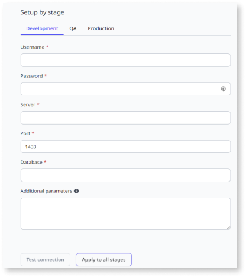

# Integrate with external databases 

OutSystems Developer Cloud (ODC) enables you to integrate external data into your apps. From the ODC Portal, you create connections to the supported databases and use the data in your apps through ODC Studio for selected entities.

ODC currently supports SQL Server, from version 2016 or later.

Before you can access data from your external database, you must have the correct access information to create a connection from ODC Portal to your external database. Contact your database administrator to get access information. The apps in ODC can be in several stages, such as Development, QA, and Production. If you want your app to use different databases depending on the stage, you should set up a connection for each stage.

Here is an overview of how to use an external database in ODC:

1. In ODC Portal, **admins** create and test connections to an external database.
2. In ODC Portal, **admins** select the entities and attributes you want developers to use in ODC apps.
3. In ODC Studio, **developers** add the entities as public elements and develop the app.

## Allow developers to manage connections to an external database

By default, only users with the administrator role can manage connections and select entities. If you want to give your developers the same, you need to grant developers the following permissions:

* Edit connection entities
* Manage connections

For more information about users and custom roles, see [User management](../../user-management/intro.md)

## Create and test a new connection

From ODC Portal, select **Configurations** > **Connections** > then click **Create connection** and then select a database provider. After selecting the provider, enter the information about the connection. Testing the connection is required to continue. Click **Test connection** to test the connection. 

* To use the same connection for all stages, enter information about the connection in any stage. Click **Apply to all stages**.
* To use a different database for each stage, click the stage name and enter information about the connection.

Developers can write to your external database if the database user in the connection you created has the write permissions. External database permissions take priority over permissions in ODC. For example, developers can only read data from your database if you have read permission on your external database and read-write permission in ODC.

### Additional parameters

Use the **Additional parameters** field if you need to include additional parameters for your database connection. For example, you can add `trustServerCertificate=true;`. Separate these values with `;` in the additional parameters field.

## View and edit an existing connection

From the ODC Portal, you can view all connections to the external databases by selecting **Configurations** > **Connections**. 

To edit a connection to an external database, select the connection's name and click **Edit** on the screen that opens.

You don't have to test your connection again if you modify the name or description in the configuration.

## Select entities for use in an app

After you create a connection to an external database, you need to select the entity names and attributes you want to be visible in ODC Studio. You can also rename entities. From ODC Portal, select **Configurations** > **Connections** > **Select entities**. In the next screen, select entity names and attributes you want to use. Click **Save** to confirm.

The developers can now use the selected entities and attributes as [public elements](../../building-apps/use-public-elements.md) in their apps.   

## Current limitations

* CreateOrUpdateSome (Bulk Inserts/Updates) entity action is not supported
* Images aren't being fetched when reading from a SQL Server database
* In aggregates, only some scenarios with calculated columns are supported.
* Some OutSystems built-in functions are ready such as TIMESTAMPADD and Timestamp cast
* Data conversion built-in functions such as TextToDateTime and TextToDate are not supported
* External entities are not supported in Advanced SQL Nodes
* Editing data is not yet available
* Preview data is not displaying the OS default value data type instead of the Null value
