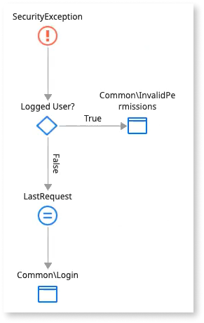
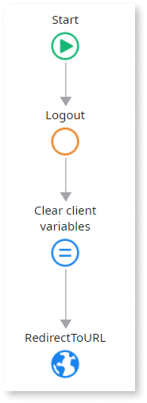

# Use external identity providers in an app

After assigning an external IdP to stage(s) (Development, QA, Production) in ODC Portal, you must modify the end-user login and logout flows for each app you want to use it.

You can do one of the following:

* [**Delete the built-in login screen and redirect to an external provider.**](#delete-the-built-in-login-screen-and-redirect-to-external-provider) The recommended solution if you want to use a single external provider for your app, without the option of built-in provider.

* [**Modify the built-in login screen to add button(s) for external provider login.**](#modify-the-built-in-login-screen-to-add-buttons-for-external-provider-login) The recommended solution if using multiple external providers or a single external provider and retain the option to login with the built-in provider.

After you complete the steps for your selected solution, republish the app and [promote](../../deploy/deploy-apps.md) the new revision to the stage(s) where the provider is active.

## Delete the built-in login screen and redirect to external provider

For each app you want to modify, open it in ODC Studio and follow the steps in the **Modify main user login flow**, **Modify user info bar login flow** and **Modify user info bar logout flow** sections below.

### Modify main user login flow

To load the login action onto the canvas, click the **Interface** tab, then expand the **UI Flows** > **Common** folder and double-click **OnException**. You see the end-user login flow for the built-in provider on the left. Now follow these steps.

1. Delete the built-in login screen by deleting the **Common\Login**  element from the logic flow.

    

1. Navigate to the **Add public elements** icon on the top toolbar of ODC Studio or use the **Ctrl+Q** shortcut. Search for the [**GetExternalLoginURL** action](../../reference/system-actions/auth.md#getexternalloginurl), select it, and click **Add**.

1. Click the **Logic** tab. Expand the **Client Actions** > **(System)** folder. Drag the **GetExternalLoginURL** action in place after the **LastRequest** element and connect them.

1. In the **Properties** pane for **GetExternalLoginURL** action, set **IdentityProvider** using the name of the provider you applied in ODC Portal. Input as a Text data type. For example, `"providerA"`.

1. Drag a **Destination** element from the toolbox bar to end the flow. A **Select Destination** popup screen displays. Expand the **UI Flows** > **Common** folder and select **RedirectToURL**.

    

1. In the Properties pane for the **RedirectToURL** action, set the **URL** setting to `GetExternalLoginURL.ExternalLoginURL`. This is where the user is redirected to perform the login.

### Modify user info bar login flow

Click the **Interface** tab, then expand the **UI Flows** > **Common** folder and double-click **UserInfo**. You see the user info block which by default displays in the right corner of the top bar of your published app. Now follow these steps.

1. Click the **Login** text. Hover over the **Text** button and then click the **Link** button. The **Properties** pane for the **Link** button displays to the right of the canvas.

1. In the **On Click** setting replace **Common\Login** by selecting **New Client Action** from the dropdown. A new client action is created, set in the **On Click** setting and displayed on the canvas.

1. Click the **Logic** tab. Expand the **Client Actions** > **(System)** folder. Drag the **GetExternalLoginURL** action in place after the **Start** element.

1. In the **Properties** pane for **GetExternalLoginURL** action, set **IdentityProvider** using the name of the provider you applied in ODC Portal. Input as a Text data type. For example, `"providerA"`.

1. Delete the **End** element. Drag a **Destination** element from the toolbox bar to end the flow. A **Select Destination** popup screen displays. Expand the **UI Flows** > **Common** folder and select **RedirectToURL**.

    

1. In the Properties pane for the **RedirectToURL** action, set the **URL** setting to `GetExternalLoginURL.ExternalLoginURL`. This is where the user is redirected to perform the login. 

### Modify user info bar logout flow

Click the **Interface** tab, then expand the **UI Flows** > **Common** > **UserInfo** folder and double-click **ClientLogout**. You see the logout action for the user info bar. Now follow these steps.

1. Delete the built-in logout action by deleting the **Logout** element from the logic flow.

    

1. Navigate to the **Add public elements** icon on the top toolbar of ODC Studio or use the **Ctrl+Q** shortcut. Search for the [**GetExternalLogoutURL** action](../../reference/system-actions/auth.md#getexternallogouturl), select it, and click **Add**.

    

1. Click the **Logic** tab. Expand the **Client Actions** > **(System)** folder. Drag the **GetExternalLogoutURL** action in place after the **Start** element.

If you revert the provider for stage(s) back to the built-in provider, you must change the login flow for the apps back to that shown in Step 1.

## Modify the built-in login screen to add button(s) for external provider login

To login with an external provider to the built-in login screen, follow the steps below. To add multiple buttons, repeat the steps.

1. To load the login screen onto the canvas, click the **Interface** tab, then expand the **UI Flows** > **Common** folder and double-click **Login**. The built-in login screen displays.

1. Drag a **Button** element from the toolbox onto the screen. Place it alongside or below the existing **Log in** button (button for the built-in provider). You can also use a [social login button](../sso.md#add-the-social-login-button-to-the-login-screen) here.

1. In the Properties pane for the new button change the **Text** setting of the button to meet your requirement, for example `Log in with providerA`. You may also want to modify the **Text** setting of pre-existing **Log in** button.

    

1. In the **On Click** setting select **New Client Action** from the dropdown. A new client action is created, set in the **On Click** setting and displayed on the canvas. Delete the **LoginForm.Valid?** element and associated logic.

1. Navigate to the **Add public elements** icon on the top toolbar of ODC Studio or use the **Ctrl+Q** shortcut. Search for the [**GetExternalLoginURL** action](../../reference/system-actions/auth.md#getexternalloginurl), select it, and click **Add**.

1. Click the **Logic** tab. Expand the **Client Actions** > **(System)** folder. Drag the **GetExternalLoginURL** action in place after the **Start** element.

1. In the **Properties** pane for **GetExternalLoginURL** action, set **IdentityProvider** using the name of the provider you applied in ODC Portal. Input as a Text data type. For example, `"providerA"`.

1. Delete the **End** element. Drag a **Destination** element from the toolbox bar to end the flow. A **Select Destination** popup screen displays. Expand the **UI Flows** > **Common** folder and select **RedirectToURL**.

    

1. In the Properties pane for the **RedirectToURL** action, set the **URL** setting to `GetExternalLoginURL.ExternalLoginURL`. This is where the user is redirected to perform the login.
