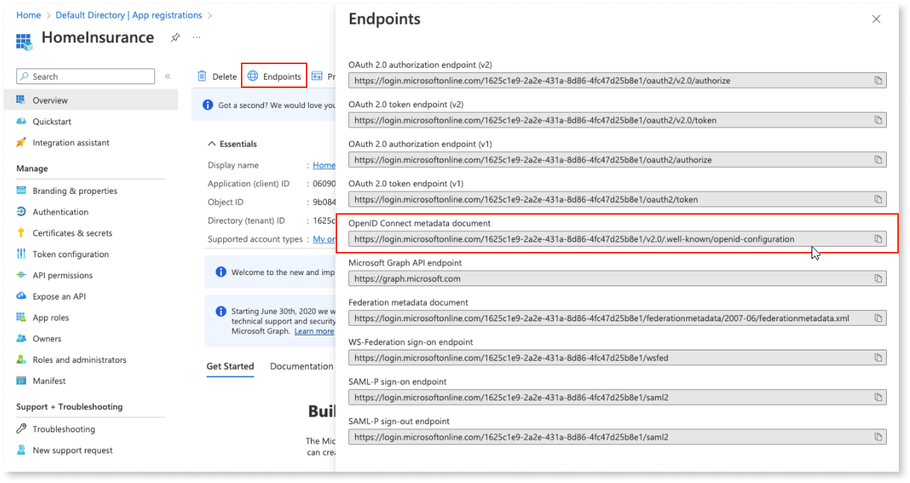

# Add Azure AD for use as external identity provider

ODC admins can configure Azure AD as an external IdP by going to the ODC Portal and selecting the **Identity providers** tab. 

To launch the **New provider** configuration screen, click the **Add Provider** > **OpenID Connect** button. Now follow these steps:

1. Enter a name for the new provider in the **Provider name** field. This can be any name less than 255 characters and can't include special characters.

1. Login to the [**Azure Portal**](https://portal.azure.com/) and create a new app registration in the Azure Active Directory screen. For guidance, see Microsoft documentation [here](https://learn.microsoft.com/en-us/azure/active-directory/develop/quickstart-register-app).

1. Open the app registration you created and click the **Endpoints** button. Copy the URL from the **OpenID Connect metadata document** field and paste it into the **Discovery endpoint** field in ODC Portal.

    

1. Click **Get details** in ODC Portal. This retrieves the JSON of the Azure AD OpenID configuration and shows a preview.

1. Copy the value of the **Application (client) ID** field from the main screen of the app registration in Azure Portal and paste it into the **Client ID** field in ODC Portal.

    

1. Click the **Certificates & secrets** tab from the main screen of the app registration in **Azure Portal**. Click **New client secret** button. Enter a description for the new secret in the **Description** field and then click **Add** to generate the secret. 

    

1. Copy the newly generated value from the **Value** field and paste it into the **Client secret (secret value)** field in ODC Portal. 

    

    

    ODC safely stores the configuration details in a secret manager.
    

1. Complete the configuration in ODC Portal by leaving the **PKCE** as the default value (**SHA-256**) and fields in **Claim Mapping** section as default values (**name**, **email**) and clicking **Save**.

ODC tests the configuration and on success adds Azure AD to the list of available providers. If the test fails, a notification with the error displays. 

Now follow the steps [here](intro.md#apply-an-external-idp) to apply for the newly added Azure AD provider for use by your organization or apps.
