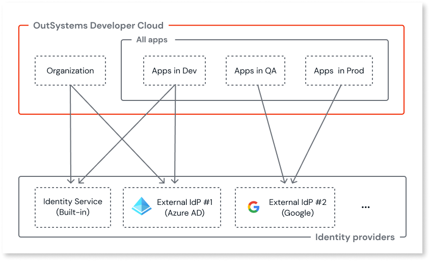

# Configure authentication with external identity providers

OutSystems Developer Cloud (ODC) comes bundled with Identity Service, a built-in Identity Provider (IdP). It provides authentication, authorization, and user management for your [organization](../../architecture/intro.md#platform) and apps. You access your organization services through ODC Portal and ODC Studio. As the default IdP, Identity Service is always available.

In addition, you can use an external, self-managed IdP as an authentication provider for your organization and your apps. You can use any IdP that follows the OpenID Connect (OIDC) standard. You can configure most commercial IdPs, such as AzureAD and Okta, to support this standard. ODC supports using **PKCE** (Proof Key for Code Exchange) with external IdPs for an additional layer of security.

**Note:** ODC supports all IdPs that follow the OIDC standard. The following IdPs have been successfully tested to integrate with ODC apps:

* Linkedin
* Google
* Ping Federation Identity
* Facebook
* Apple
* Azure AD
* Okta
* Amazon Cognito
* Keycloak

You can use an accelerator to add [commonly used social providers](#social-accelerators) for use as social authentication for your organization and your apps.

When you successfully configure and save an external IdP to ODC, it becomes an option for use as an active provider for your organization, your apps, or both. You can use multiple active providers for your organization and each stage your apps are deployed to. You must use the same provider(s) for all the apps deployed to a given stage. The following diagram shows an example setup.

## Before you begin

If you're configuring [Azure AD](azure-ad.md) or [Okta](okta.md) you can skip this section and follow the specific guidance by following one of the embedded links.

Before you begin configuring an external identity provider for use in ODC, you need to get the following information from the provider:

* URL of the OpenID configuration
* Provider credentials. Your provider might use different names for these fields such as **Application ID** for the **Client ID** field and **Client secret** or **Value** for the **Client secret (secret value)** field. For more guidance, see your provider's support documentation.

If you want a user associated with an external provider to retain their profile and associated roles, they should use the same email address as on the built-in provider.

## Add an external IdP

ODC admins can configure an external IdP by going to the ODC Portal and selecting the **Identity providers** tab. A list of built-in providers and any external IdPs already added displays.

To launch the **New provider** configuration screen, click the **Add Provider** dropdown and select **OpenID Connect** or a social provider. Now follow these steps:

### OpenID Connect

1. Enter a name for the new provider in the **Provider name** field. This can be any name less than 255 characters and can't include special characters.

1. Enter the URL of the OpenID configuration in the **Discovery endpoint** field. 

1. Click **Get details**. ODC retrieves the JSON of the OpenID configuration and shows a preview. 

1. Enter the credentials for the provider in the **Client ID** and **Client secret (secret value)** fields. Then, select **PKCE** if your provider supports it.

    

    
    ODC safely stores the configuration details in a secret manager.
    
    

1. If your provider uses different attribute names, then in the **Claim Mapping** section overwrite the prefilled **Name**, **Email** and **Photo URL** fields. Otherwise, skip this step. For more guidance, see your provider's support documentation.

1. Click **Save**. ODC adds the provider to the list of available providers. If this fails, a notification with the error displays.

### Social provider with accelerator

1. Enter a name for the new provider in the **Provider name** field. This can be any name less than 255 characters and can't include special characters.

1. Fill in the configuration fields with the [information required from your provider](#social-accelerators).

    

    ODC safely stores the configuration details in a secret manager.

    

1. Click **Save**. ODC adds the provider to the list of available providers. If this fails, a notification with the error displays.

## Assign an external IdP

To assign an added external IdP, navigate to the **Identity providers** tab in ODC Portal. Then follow these steps:

1. Click on the provider card you want to assign as a provider for your organization, your apps, or both.

1. Check the summary in the **Configurations** tab. If you want to proceed, click the **Assign** button (when provider not assigned anywhere yet) or **Manage assignments** (when already assigned).

1. Check the boxes of where you want to assign the provider and then click **Next**.

    

    When you switch the IdP for your organization or apps, all signed-in users get logged out when their current access token expires. Users have to log back in using the newly assigned provider. Users may have to wait up to a minute to log back in while new certificates are processed. 
    
    

1. Read the confirmation pop-up and then do one of the following:

    * Click the **Confirm changes** button to proceed.
    * Click the **Cancel** to exit.

    Once ODC applies the provider successfully, a notification displays.

1. Copy the pair(s) of **Redirect URLs** to the list of permitted redirects in the setup page of your external provider. You should copy the pair(s) for both the built-in domain and any active [custom domains](../custom-domains.md). If you're configuring [Okta](okta.md#setup-redirect-urls) you can follow the embedded link for specific guidance. Otherwise see your provider's support documentation for further guidance (for example, [Azure AD](https://learn.microsoft.com/en-us/azure/active-directory/develop/quickstart-register-app#add-a-redirect-uri)). Click **Next**.

When you assign a provider for use by the apps, you need to create the logic in ODC Studio for each app you want to use it. For guidance on how to create the logic, see [Use external identity providers in an app](apps.md).

You don't need to do anything else when you assign a provider for use by the organization. The option to log in with the provider becomes immediately available for users on the ODC Portal and ODC Studio login screens.

## Edit the configuration or delete an external IdP

You can only edit or delete a provider not in use. Navigate to the **Identity providers** tab in ODC Portal. Then:

1. Click on the provider card you want to edit or delete.

1. Click the **ellipsis** (3-dots) to the right of the **Assign** button. Then click the **Edit configuration** or **Delete provider** button to launch the edit page or launch the delete confirm pop-up.

## Social accelerators

ODC provides accelerators to add commonly used social providers easily.

To add a new social provider using an accelerator you need to get the following information from your provider:

### Apple

Accelerator field | Information required | Description
---|---|---
Client ID | Identifier | A public identifier your app on the provider side. It's a string type value available to any registered developer on Apple Developer. You can access the Identifier value on the Certificates, Identifiers, and Profiles pages of your app.
Key ID | Key ID | Key ID corresponding to your Secret (`.p8`).
Team ID | Team ID | Identifier of your team on Apple Developer.
Client secret | Secret (`.p8`) | A confidential code known only to your app and the authorization server. It's a string type value type value available to any registered developer on Apple Developer. You can access the Secret value during the configuration creation on Apple Developer.

For further guidance check [Configure app capabilities - About Sign in with Apple](https://developer.apple.com/help/account/configure-app-capabilities/about-sign-in-with-apple).

### Google

Accelerator field | Information required | Description
---|---|---
Client ID | Client ID | A public identifier your app on the provider side. It's a string type value available to any registered developer on the Google Cloud Platform. You can access the ClientID value on the OAuth Consent tab on your app's Credentials screen.
Client Secret | Client Secret | A confidential code known only to your app and the authorization server. It's a string type value type value available to any registered developer on the Google Cloud Platform. You can access the ClientSecret value on the OAuth Consent tab on your app's Credentials screen.

For further guidance check [Google Identity - Authentication](https://developers.google.com/identity/gsi/web/guides/overview).

### Facebook

Accelerator field | Information required | Description
---|---|---
Client ID | App ID | A public identifier your app on the provider side. It's a string type value available to any registered developer on Meta for Developers. You can access the AppID value in your app's settings.
Client Secret | App Secret | A confidential code known only to your app and the authorization server. It's a string type value available to any registered developer on Meta for Developers. You can access the AppSecret value in your app's settings.

For further guidance check [Facebook Login - Documentation - Facebook for Developers](https://developers.facebook.com/docs/facebook-login/).
