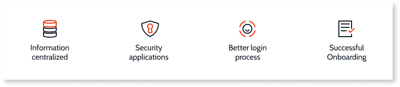

# Manage users

Project Neo documentation is under construction. It's frequently updated and expanded.

The **Project Neo Portal** is the central place to manage users. In the portal you can:

* Invite a new user
* Search for a user
* Turn on or off organization permissions
* Assign and revoke end-user roles

Users in Project Neo can have IT (organizational) permissions and end-user (app) roles. Following, is an overview of different terms found in this document:

* **User**. A person who belongs to an organization and has access to the OutSystems platform and/or its assets. For example, organization (IT) user or end (app) user. 
* **IT user** or **organization user**. A technical user of OutSystems tools, such as an administrator or a developer, that belongs to an organization. The IT users have permissions for tasks such as creating and managing users and apps, monitoring or troubleshooting apps. Developers are commonly IT users in an organization.
* **End user** or **app user**. A person who uses the apps made with OutSystems tools.
* **Role** or **end-user role**. A set of permissions applied to a user to control access to an app and within an app.

Currently in the Project Neo Early Access Program, all **IT users** have admin permissions.

The following features aren't available in the EAP at the moment:

* Change password
* Deactivate user
* Delete user

## Add new users to your organization

From the Portal, select **Users & Access** > **Users** > then click **Invite users**. The user receives an invitation email to join the organization. New users must set up their password. The password must be at least 12 characters long, and contain at least:

* One upper case letter
* One lower case letter
* One numeric digit
* One special character from this set: `!` `\` `#` `$` `%` `&` `'` `(` `)` `*` `+` `,` `-` `.` `/` `:` `;` `<` `=` `>` `?` `@` `[`

## Give or revoke admin permissions

You can assign or revoke OutSystems admin permissions. From the Portal, select **Users & Access** > **Users**.

* For an existing user - search for a user, and from the **Organization permissions** section, toggle **OutSystems administrator**.  
* For a new user - click **Invite user** and select  **OutSystems administrator**.

IT users with the OutSystems administrator permission can:

* Access a list of available apps
* Assign users to roles such as organization or end-user roles
* Create and change apps
* Deploy apps across stages
* [Configure apps](./configuration-management.md)
* View application logs
* View and manage all other IT and end users

## Use and manage end-user roles

End-user roles let you control access to screens and operations of your app.

If the end-user roles aren't available in your Portal and Service Studio, expect an onboarding communication soon. OutSystems is currently in the process of releasing this feature to the EAP customers.

Here is how you can use roles:

1. In Service Studio, create some end-user roles.
2. In the Portal, assign end-user roles to users.
3. In Service Studio, use end-user roles to control access.

Functions to add and revoke user roles are currently available in the Portal only.

### Create end-user roles

You can create roles in Service Studio, during design time. From the **Logic** tab select **Roles**. Right-click the **Roles** folder and select **Add Role**.

### Assign end-user roles

To assign roles to users, from the Portal select **Users & Access** > **Users**. Search for a user and then from user properties, click **Manage permissions**.  Then, set the permissions for the user by one or more:

* Apps
* Stages

You can also assign roles at the same time you invite new users to your organization.

Currently, users need to sign out and sign back in for the changes in role permission to become effective.

### Control access in your app with end-user roles

After you assign roles to your end-users, you can:

* Allow or block access to a screen
* Restrict access to data
* Restrict logic flows

Currently, users need to sign out and sign back in for the changes in role permission to become effective.

#### Restricting access to a screen

To allow only users with a certain role to access a screen, you need to [create some roles first](#create-end-user-roles).

1. Select the screen for which you want to edit the access.
1. From the screen properties, select **Authorization** > **Accessible by** and from the list select **Authenticated users**. The list of roles now shows in the **Authorization** section.
1. Select the roles users need to have to access the screen.

#### Restricting logic flows

In the logic of server actions, use **CheckROLENAMERole()** function in the condition of the If element of the flow. The function **CheckROLENAMERole()** is available in the server actions only.

#### Restricting access to data

Use **CheckROLENAMERole()** function in expressions to verify that the user of the app has a role. For example, you can create a filter in an aggregate with the expression `CheckAdminsRole() = True`. The aggregate now returns data if the signed-in user has an "Admin" role.

