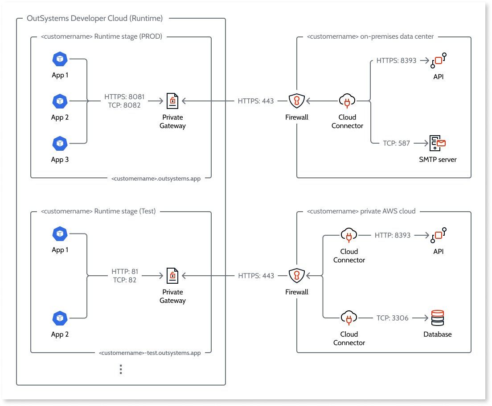

# Configure a private gateway to your network

Private Gateways is an OutSystems Developer Cloud (ODC) feature that lets you connect your apps to private data and private services ("endpoints") that aren't accessible by the internet. These endpoints may be in an on-premise network, a private cloud, or a public cloud.

The complexity of a multitenant cloud-native platform means that ODC requires a modern solution over a traditional VPN in order to connect securely to private assets.

VPN limitations over a cloud-native infrastructure are overcome by Private Gateway. VPNs are often the main vector for data breaches often allowing unrestricted access to the company's network, are complex to configure and set up, and are rigid when it comes to failover.

Private Gateways is a secure-by-design solution for the cloud-native, multi-tenant OutSystems Developer Cloud (ODC). Its standout benefits include:

* Provides fine-tuned control over what data is accessible. You can control the ingress while not exposing any private endpoints.
* Highly flexible and configurable. For example, supports connecting to your private endpoints hosted in multi-tenant, multi-zone, or multi-region environments.
* Strong scaling and failover capabilities.
* Apps and their data remain isolated.

There are two components to the Private Gateways feature.

* The server component, **Private Gateway**. There is one instance of Server Gateway for each stage in your organization. By default a Private Gateway is inactive and you activate it in ODC Portal. 
* The client component, **Cloud Connector**. You use the configuration generated on activating a Private Gateway to run Cloud Connector on system(s) in your private network(s). Your apps connect to the endpoints through a secure tunnel established between the endpoints and a Private Gateway. The Cloud Connector requires only outbound access to the internet in the private network(s) in which it's running.

Common use cases include accessing data through a private REST API service, requesting internal services (SMTP, SMB, NFS,..), and [connecting to external databases](./external-databases/intro.md) in private networks.

A Private Gateway supports multiple tunnels and uses a load balancer to handle requests. Each tunnel connection is secured via SSH using ECDSA with SHA256 keys. You can connect multiple endpoints to each Cloud Connector and multiple Cloud Connector to each Private Gateway.

Private Gateway requires the subscription of an add-on to the ODC Platform edition. Please contact your OutSystems account team for more information.

The following diagram shows a sample ODC customer setup for a Private Gateway that's active on two stages.

Like the apps running in a stage, each Private Gateway benefits from automatic failover.

## Activate a Private Gateway

To activate a Private Gateway, navigate to the **Private Gateways** tab in the ODC Portal. Then follow these steps.

1. Select the tab of the stage for which you want to activate a Private Gateway. The **Status** shows **Inactive**.
1. Click the Toggle icon to activate. It should only take a few seconds.
1. The Private Gateway generates a **Token** and **Address** and the pair displays on the screen. This is only done on the first activation and the pair remains unique to the organization and stage.

Make sure to copy the Token and save it in a safe location. For security reasons, you won't be able to access it again after you close or refresh the page.

You or a member of your team can now use the Token and Address to run Cloud Connector on the system(s) in your private network(s). For guidance follow [this documentation](https://github.com/OutSystems/cloud-connector/).

If you deactivate a Private Gateway, the tunnel(s) are deleted and your apps can't access the connected endpoints. If you reactivate, the Token and Address remain the same. The Private Gateway automatically reestablishes a tunnel with any Cloud Connector instances still running with that unique Token and Address.

To renew the Token, click the Renew icon. 

Instances of Cloud Connector running with the old Token will continue to work until the connection fails or it's restarted. If you restart the instance, ensure you use the new Token.

The Cloud Connector has a built-in connection retry mechanism. After you renew the Token, any subsequent retry attempt will fail, as it uses the old Token. To minimize disruption, carefully plan the timing for renewing your Token and restarting any affected Cloud Connector instances.

## Use endpoints in your apps

For each Private Gateway, a list of connected endpoint(s) of the form `secure-gateway:<port>` and associated swagger specification file(s) is available from the member of your team responsible for running Cloud Connector.

For each endpoint you want to use in your app, follow the procedure under [Consume several methods of a REST API](../building-apps/consume_rest/consume-a-rest-api.md#consume-several-methods-of-a-rest-api--all-methods) using the swagger specification file for the endpoint. After you complete the procedure, replace the first part of **Base URL** setting with `https://secure-gateway:<port>/` if the endpoint is connected to `cloud-connector` over TLS/SSL or `http://secure-gateway:<port>/` if it's not.

For security reasons, only the deployed app can access the `secure-gateway` domain in runtime, so you cannot test consuming the methods of the endpoint in ODC Studio.

