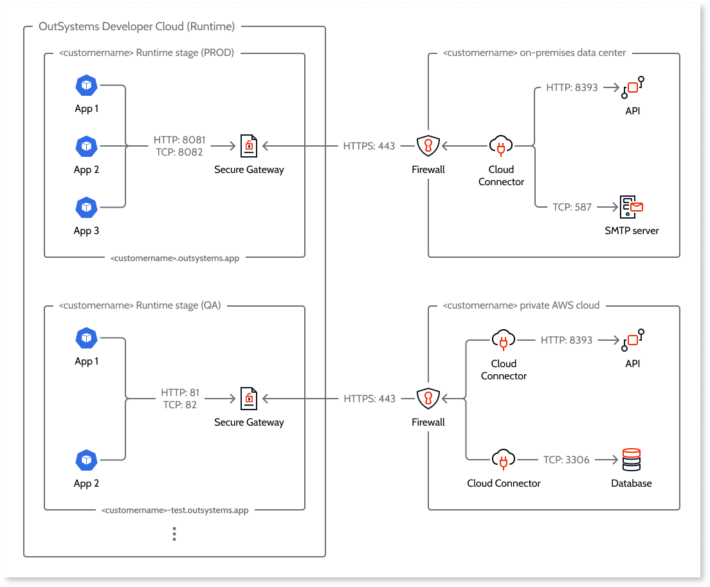

# Configure a secure gateway to your private network

Secure Gateways is a OutSystems Developer Cloud (ODC) feature that lets you connect your apps to private data and private services ("endpoints") that aren't accessible by the internet. These endpoints may be in an on-premise network, a private cloud, or a public cloud.

There are two components to the Secure Gateways feature.

* The server component, **Secure Gateway**. There is one instance of Server Gateway for each stage in your organization. By default a Secure Gateway is inactive and you activate it in ODC Portal. 
* The client component, **Cloud Connector**. You use the configuration generated on activating a Secure Gateway to run Cloud Connector on system(s) in your private network(s). Your apps connect to the endpoints through a secure tunnel established between the endpoints and a Secure Gateway.

Common use cases include accessing data through a private REST API service and making requests to internal services (SMTP, SMB, NFS,..).

A Secure Gateway supports multiple tunnels and uses a load balancer to handle requests. Each tunnel connection is secured via SSH using ECDSA with SHA256 keys. You can connect multiple endpoints to each Cloud Connector and multiple Cloud Connector to each Secure Gateway.

The following diagram shows an example ODC customer setup for a Secure Gateway active on two stages.

Like the apps running in a stage, each Secure Gateway benefits from automatic failover.

## Activate a Secure Gateway

To activate a Secure Gateway, navigate to the **Secure Gateways** tab in the ODC Portal. Then follow these steps.

1. Select the tab of the stage for which you want to activate a Secure Gateway. The **Status** shows **Inactive**.
1. Click the Toggle icon to activate. It should only take a few seconds.
1. The Secure Gateway generates a **Token** and **Address** and the pair displays on the screen. This is only done on the first activation and the pair remains unique to the organization and stage.

You or a member of your team can now use the Token and Address to run Cloud Connector on the system(s) in your private network(s). For guidance follow [this documentation](https://github.com/OutSystems/cloud-connector/).

If you deactivate a Secure Gateway, the tunnel(s) are deleted and your apps can't access the connected endpoints. If you reactivate, the Token and Address remain the same. The Secure Gateway automatically reestablishes a tunnel with any Cloud Connector instances still running with that unique Token and Address.

To refresh the token, click the Refresh icon. You must then stop each instance of the Cloud Connector and run with the new Token.

## Consume endpoints in your apps

For each Secure Gateway, a list of connected endpoint(s) of the form `secure-gateway:<port>` is available from the member of your team responsible for running Cloud Connector.

You use these addresses as you would use a public internet address in app development in ODC Studio.

For example, to add multiple REST API methods from a service hello at the address `secure-gateway:8081`, you would input the URL as `https://secure-gateway:8081/hello`:

When you click **Add methods**, ODC retrieves the swagger specification from the connected endpoint.
