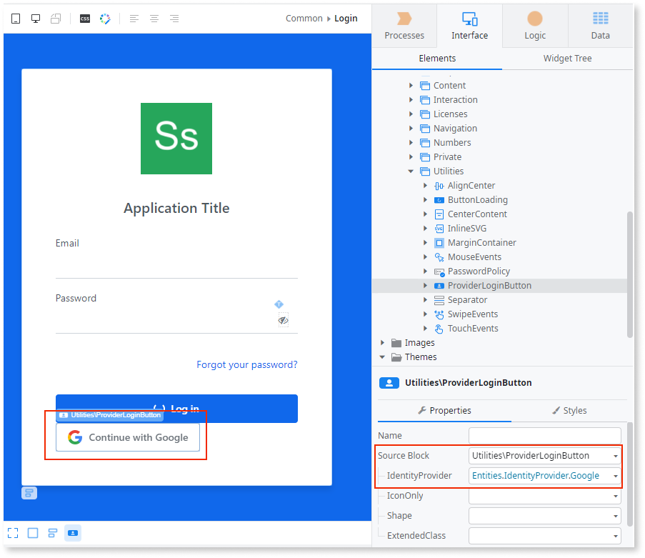

# Single sign-on

Single sign-on (SSO) is an authentication method that simplifies the login process for users that accept cookies. After users authenticate in one app, they can access all other apps in the same stage without having to sign in again. ODC shares the authentication information between the apps that have the same identity provider, using the OpenID Connect (OIDC) protocol. The provider can be the built-in identity provider or a supported external provider.

With the OutSystems UI component you can choose to have one or many providers available in your app.

## Add the social login button to the login screen

ODC provides a login flow with the app template. Part of that flow is the screen to enter the credentials, and it's where you can add the social login button. The login process runs on the client side (the DoLogin action), so that no email and password go through any of the OutSystems servers.

You need to [configure an external identity provider](./external-idps/intro.md) before adding the social login button.

To add the social login button in the app, do the following in ODC Studio:

1. From the **Interface** tab, go to **UI Flows** > **Common** and double-click **Login**. The login screen opens for editing.
2. From the **Interface** tab, go to > **OutSystems UI** > **Utilities**, and drag **ProviderLoginButton** to the login screen.
3. From the properties of **ProviderLoginButton**, select the provider from the **IdentityProvider** list.

