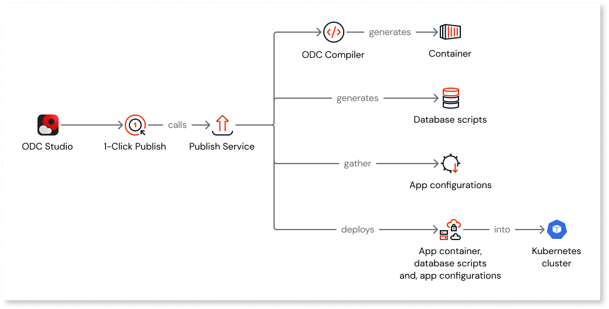

# App publishing workflow

OutSystems Developer Cloud (ODC) automates app publishing with its 1-Click Publish button. When you click the 1-Click Publish button to publish an app in the Development stage, the button initiates the following steps:

1. The ODC compiler compiles the app and generates HTML, CSS, JavaScript, and C# code while bundling the necessary libraries.
1. The ODC compiler creates a container image containing the compiled code.
1. The ODC Data tool generates database scripts to synchronize the app's data schema with the code's version, ensuring data consistency.
1. The ODC Deployment tool deploys the container image in the Kubernetes cluster using app configurations set in the ODC Portal. Simultaneously, the ODC Data tool starts executing the database scripts.

When you deploy your app from the Development stage to the QA stage, ODC follows these steps:

1. ODC grabs the container image for the specified version of the app.
1. ODC updates app configurations for the QA stage as per your updates in the ODC Portal. 
1. ODC retrieves the container image of the app version and integrates the updated configurations.

## Library publishing workflow

When you click the 1-Click Publish button to publish a library, ODC initiates the following steps:

1. The ODC compiler compiles the library and generates HTML, CSS, JavaScript, and C# code while bundling the necessary libraries.
1. The ODC compiler stores the compiled library build and integrates it into the container image.

Libraries within ODC do not handle data management or generate database scripts, as ODC doesn't deploy libraries into containers. Instead, libraries define static entities that function as enumerations without query capabilities.
 