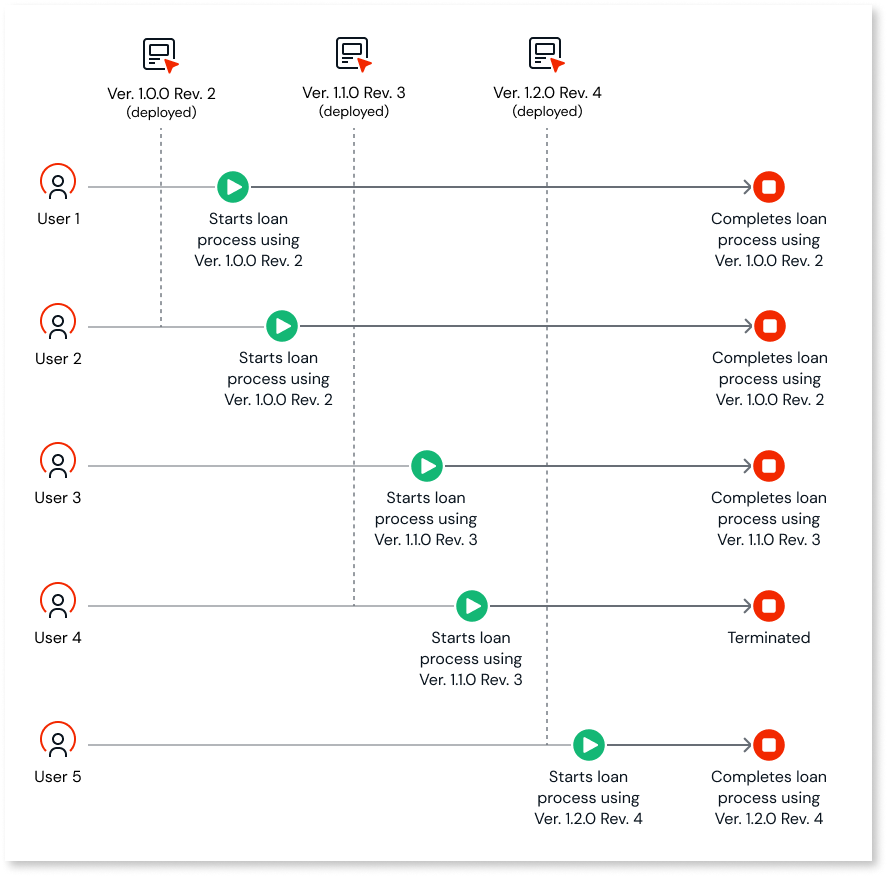

# Deploying assets

Use OutSystems Developer Cloud (ODC) Portal to deploy your assets (apps and workflows). In ODC, you deploy your assets to stages. A stage is a step within your delivery pipeline that includes runtime resources. By default, ODC includes two stages: development and production.

ODC has a single code repository. When you deploy in ODC Studio, your asset is containerized, deployed to the development stage, and a container image is available. When you're ready to deploy your asset to the next stage your asset deploys without the need to recompile code again.

Assets in each stage are isolated from each other. When you publish an asset to the development stage, it doesn't impact the assets running in other stages. Similarly, publishing assets to production doesn't affect assets in a previous stage, such as development.

## Track releases across stages

OutSystems Developer Cloud (ODC) helps you manage and track deployments across multiple stages in your delivery pipeline. Each time you publish an asset to Development, ODC creates a new revision. When deploying to QA or Production, you select a specific revision and, for Production, define a semantic version (for example, 1.2.0).

In the **Deployments** screen of the ODC Portal, you can view deployment history for each asset. The screen displays the asset name, deployment stage, revision or version, deployment date, and who performed the deployment.

Tracking releases helps you:

* Verify which revision or version is deployed in each stage.
* Understand the deployment flow across stages.
* Troubleshoot issues by identifying when and where a specific revision was deployed.

Workflow assets support multiple revisions in the same stage. Each workflow instance runs on the revision it was created in, and completes execution independently of any newer deployments. This ensures that ongoing instances are not affected by later changes. [Learn more about workflow revisions](#workflow-revisions).

For apps, only one revision can be deployed per stage. A new deployment replaces the previous revision.

To learn how to roll back to a previous version, refer to [Rollback apps](rollback.md).

There is no information about libraries, as libraries are bundled with apps. In ODC, libraries are not deployed independently. Instead, when an app that incorporates a library is published, the library's package is included in the app's container. This means libraries are deployed as an integral part of the app, not separately. For more information about libraries, refer to [Libraries](../building-apps/libraries/libraries.md).

## Deploy to stages

Use ODC Studio to create and publish your apps. Use the ODC Portal to create and publish your workflows and deploy both apps and workflows to different stages. 

When you build and publish an app or workflow, your asset becomes available in the development stage. You can only publish to development and then deploy to other stages.

To deploy your asset to a stage:

1. Go to the ODC Portal and click **Deployments**.

    A list of assets is displayed, with details about the stage, status, deployment start date, and who deployed the asset.

1. From the **Deploy to** dropdown, select the stage to which you want to deploy your asset.

1. Select the asset you want to deploy.

1. Select the revision you want to deploy, and click **Continue**.

    An impact analysis runs in the background, and an impact analysis report with information about warnings and blockers is displayed. Review the impact analysis and make a deployment decision. You can fix the issues in ODC Studio and deploy the app, or you can deploy the app with warnings.

1. (Optional) To fix the issues, go back to your asset and rectify the identified inconsistencies.

1. (Optional) To deploy the asset to the next stage, click **Deploy Now**.

    

    
    If you are deploying an app to production, you can change the version number before deploying.

    

Your asset is deployed to your selected stage. To roll back an update from a stage, you must deploy an older version in ODC Portal. For more information, refer to [Rollback asset](rollback.md)

For more information about the impact analysis report, refer to [Understanding the impact analysis report](#understanding-the-impact-analysis-report).

## Versions and revisions

Versions and revisions help you track changes in your assets. You can publish your apps and workflows to Development, and every time you publish, the revision number increments by one. Revision numbers are whole numbers displayed below the asset's name on the **Deployments** screen. 

Versions and revisions help you keep track of changes in your workflows in different stages, such as:

* **Development**: When you publish your asset in the Development stage, ODC automatically creates a new revision and its number increments by one.

    

    
    You can not change the asset revision number.

    

* **QA**: You can deploy any revision of your asset from Development to QA.

* **Production**: After testing, when you deploy your asset from QA  to Production, ODC assigns a three-part semantic version number in the format major.minor.patch. The system always suggests a version (the first suggestion is always 0.1.0). Depending on the changes you deploy to Production, you can change the version number (it must be equal to or higher than the previous version). 

### Multiple revisions of a workflow { #workflow-revisions }

You can have multiple revisions of a workflow in the same stage. A revision can have multiple instances. Once an instance starts execution in a revision, it completes its execution within that specific revision. Subsequent deployments of newer revisions or versions do not affect these running instances. Once all instances of a revision are completed or terminated, the revision is removed from the stage (unless it is the latest one deployed).  

For example, consider a bank loan application workflow with three workflow revisions in production.

**Scenario**

Two users (user 1 and user 2)  (each user application = an instance) initiate the application process using  version 1.0.0 revision 2 of the workflow, typically taking a month or two to complete. During this time, a newer workflow version version 1.1.0 revision 3 with an additional step may be deployed. 

Then, two new users (user 3 and user 4) initiate the application process using version 1.1.0 revision 3 of the workflow. During this time, the latest workflow version 1.2.0 revision 4 with more enhancements may be deployed.

**Outcome**

* Users 1 and 2 complete the application process on version 1.0.0 revision 2.

* User 3 completes the application process on version 1.1.0 revision 3.

* The user 4 application process has been terminated for external reasons.

    All instances of version 1.0.0 revision 2 and version 1.1.0 revision 3 are either complete or terminated; hence, they are no longer available in production.

* User 5 initiates the application process on the final deployed version 1.2.0 revision 4.

### Multiple revisions of an app

For ODC apps, you cannot have multiple revisions of an app in a stage. The deployed app revision overrides the previous revisions.

## Understanding the impact analysis report

When you deploy an asset in the ODC Portal, ODC automatically runs an impact analysis. The impact analysis checks for dependency issues that might cause runtime errors in your asset. By identifying and fixing issues that might negatively impact your assets, you can deliver better-performing apps. The analysis provides information for blockers and warnings.

**Blockers** prevent you from deploying your app. A blocker occurs when there is an app name collision. The blocker indicates another app on the target stage has the same name as the app you are deploying.

**Warnings** provide information but allow you to proceed. Warnings are mostly about [producers and consumers](../building-apps/data/sharing.md). For example, a warning can occur in any of the following situations:

* Your asset references other assets (producers) with missing or incompatible elements.

* Other assets (consumers) reference your asset and have missing or incompatible elements.

When **deploying an app**, the impact analysis report displays:

* Potential impacts the app you are deploying could have on workflows and consumer apps 

* Potential impacts producer apps could have on the app you are deploying

When **deploying a workflow**, the analysis report displays:

* Potential impacts producer apps could have on the workflow you are deploying

For more information about the impact analysis inconsistencies, refer to [Guidance for deployment inconsistencies](../deploying-apps/deployment-inconsistencies.md)

## Deployment status

An asset can have one of the following deployment statuses:

* **Running:** The deployment is in progress. You must wait for it to finish.

* **Finished with errors**: The deployment finished, but it wasn't successful. Review the errors.

* **Finished successfully**: The deployment finished successfully. The asset is available in the deployed stage.

You can access the log information for each **asset deployment** by clicking the row for which you want more information.

## Related resources

* [Continuous Delivery in ODC](https://learn.outsystems.com/training/journeys/continuous-delivery-2396) online course
