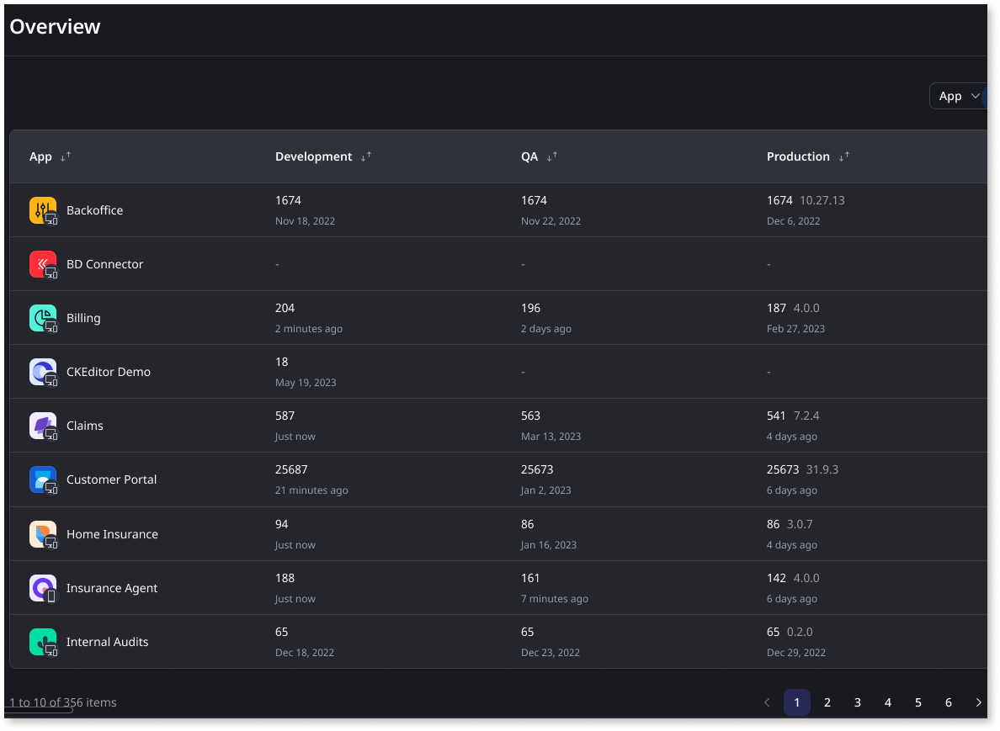
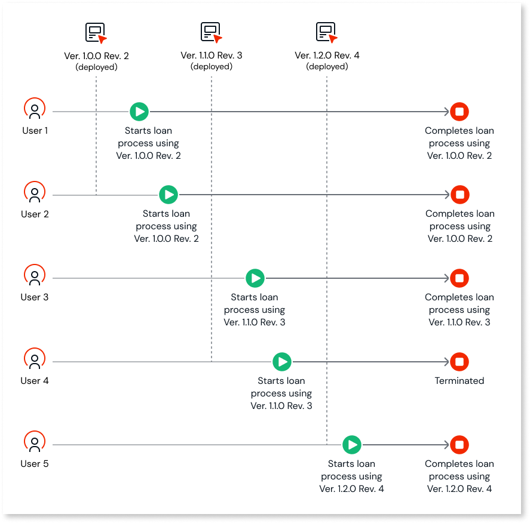

# Deploying assets

Use OutSystems Developer Cloud (ODC) Portal to deploy your assets (apps and workflows). In ODC, you deploy your assets to stages. A stage is a step within your delivery pipeline that includes runtime resources. By default, ODC includes 3 stages: development, non-production, and production. You can add up to 10 non-production stages per portfolio between them, and [change their order](../manage-platform-app-lifecycle/reorder-stages.md).

ODC has a single code repository. When you publish an asset in ODC Studio, ODC stores a revision of it and builds that revision for the Development stage. To deploy the asset to the next stage, ODC uses a release build of the same revision, which packages the asset as a [container image](../app-architecture/intro.md). You deploy that build from the ODC Portal.

Assets in each stage are isolated from each other. Each stage runs its own copy of an asset, so work in one stage stays in that stage.

In a multi-portfolio organization, an asset is deployed and promoted only through the stages of its portfolio. For more information, refer to [Asset deployment with multiple portfolios](../manage-platform-app-lifecycle/portfolios/portfolios-deploy-assets.md).

## Track releases across stages

OutSystems Developer Cloud (ODC) helps you manage and track deployments across multiple stages in your delivery pipeline. Each time you publish an asset with changes, ODC creates a new revision. When deploying to QA or Production, you select a specific revision and, for Production, define a semantic version (for example, 1.2.0).

The **Deployments** screen of the ODC Portal shows the deployment history for each asset, including the asset name, deployment stage, revision or version, deployment date, and who performed the deployment.

Tracking releases helps you:

* Verify which revision or version is deployed in each stage.
* Understand the deployment flow across stages.
* Troubleshoot issues by identifying when and where a specific revision was deployed.

Workflow assets support multiple revisions in the same stage. Each workflow instance runs on the revision it was created in, and completes execution on that revision regardless of later deployments. [Learn more about workflow revisions](#workflow-revisions).

For apps, only one revision runs per stage. A new deployment replaces the previous revision.

For more information about rolling back to a previous revision, refer to [Rollback apps](rollback.md).

The **Deployments** screen lists apps and workflows. A library reaches each stage inside its consumers: when you publish an app that incorporates a library, ODC bundles the library's package into the app's container. For more information about libraries, refer to [Libraries](../building-apps/libraries/libraries.md).

## Deploy to stages

Use ODC Studio to create and publish your apps. Use the ODC Portal to create and publish your workflows and deploy both apps and workflows to different stages.

When you build and publish an app or workflow, your asset becomes available in the Development stage. You publish to Development first, and then deploy to other stages.

To deploy your asset to a stage:

1. Go to the ODC Portal and select **Deployments**.

    A list of assets appears, with details about the stage, status, deployment start date, and who deployed the asset.

1. From the **Deploy to** dropdown, select the stage to which you want to deploy your asset.

1. Select the asset you want to deploy.

1. Select the revision you want to deploy, and select **Continue**.

    An impact analysis runs in the background. The impact analysis report shows warnings and blockers. Review the report and make a deployment decision. You fix the issues in ODC Studio and redeploy, or you deploy with warnings.

1. (Optional) To fix the issues, go back to your asset and rectify the identified inconsistencies.

1. (Optional) To deploy the asset to the next stage, select **Deploy Now**.

    

    If you're deploying an asset to Production, you set the version number before deploying.

    

Your asset is deployed to your selected stage. To roll back an update from a stage, you must deploy an older revision in ODC Portal. For more information, refer to [Rollback apps](rollback.md).

For more information about the impact analysis report, refer to [Understanding the impact analysis report](#understanding-the-impact-analysis-report).

## Deployment considerations for agentic apps {#deploy-agentic}

Agentic apps follow the standard ODC continuous delivery model. They're built and containerized in the Development stage, and that exact container is promoted to subsequent stages. However, due to their autonomous nature, specific rules apply to their deployment and dependencies.

### Deployment dependencies

Agentic apps are often part of a larger system that involves workflows. You must manage the deployment order of these assets carefully to avoid runtime errors or blocked deployments.

If you deploy a **workflow** that triggers an event in an agentic app, you must ensure the agentic app is deployed to the target stage (Quality or Production) **before** the workflow. If the agentic app is missing from the target stage, the workflow deployment is blocked due to missing dependencies.

## Undeploy assets

To undeploy an asset from any stage, go to the asset detail in the ODC Portal and select **&#183;&#183;&#183;** > **Undeploy**.

When you undeploy an asset, it no longer consumes containers in that stage. For more information about resource consumption, refer to [Monitor ODC resource capacity](../getting-started/capacity-limits.md).

## Versions and revisions

Versions and revisions help you track changes in your assets. When you publish an asset with changes, ODC creates a new revision, an incremental, immutable whole-number snapshot of the asset's source code. For more information about revisions and how they work across asset types, refer to [Revisions](../building-apps/publishing/revisions.md).

Revisions and versions serve different purposes at different stages:

* **Development**: Each publish that changes the asset creates a new revision. Revision numbers increment automatically by one and remain fixed.

* **QA**: You deploy any revision from Development to QA.

* **Production**: A deployment to Production carries a three-part semantic version number in the format major.minor.patch. ODC suggests `0.1.0` for the first version. A version number you enter must be higher than the highest one the asset already has. Deploying a revision that already has a version keeps that version, which is how a rollback returns an earlier version to Production.

### Multiple revisions of a workflow {#workflow-revisions}

Workflows support multiple revisions in the same stage. Each workflow instance runs on the revision that created it and completes execution within that revision, independently of later deployments. Once all instances of a revision are completed or terminated, ODC removes the revision from the stage, unless it's the latest deployed one.

For apps, only one revision runs per stage. Each new deployment replaces the previous revision.

The following example illustrates how multiple workflow revisions coexist. A bank loan application workflow has three revisions in Production. Two users start the application process on version 1.0.0 revision 2. Each user's application is an instance. While those instances are in progress (a process that takes one to two months), the team deploys version 1.1.0 revision 3 with an additional step. Two new users start on revision 3. Later, the team deploys version 1.2.0 revision 4.

Each user completes the process on the revision they started with. Users 1 and 2 finish on version 1.0.0 revision 2. User 3 finishes on version 1.1.0 revision 3. User 4's application is terminated for external reasons. Once all instances of revisions 2 and 3 are complete or terminated, ODC removes those revisions from Production. User 5 starts on the latest deployed version, 1.2.0 revision 4.

## Understanding the impact analysis report

When you deploy an asset in the ODC Portal, ODC runs an impact analysis automatically. The impact analysis checks for dependency issues that could cause runtime errors in your asset. Identifying and fixing these issues before deployment helps you deliver more stable apps. The analysis reports blockers and warnings.

**Blockers** prevent you from deploying your app. A blocker occurs when another app on the target stage has the same name as the app you're deploying.

**Warnings** provide information but let you proceed. Warnings are mostly about [producers and consumers](../building-apps/data/sharing.md). For example, a warning occurs in any of the following situations:

* Your asset references other assets (producers) with missing or incompatible elements.

* Other assets (consumers) reference your asset and have missing or incompatible elements.

When **deploying an app**, the impact analysis report shows:

* Potential impacts your app has on workflows and consumer apps

* Potential impacts producer apps have on your app

When **deploying a workflow**, the analysis report shows:

* Potential impacts producer apps have on the workflow you're deploying

For more information about impact analysis inconsistencies, refer to [Guidance for deployment inconsistencies](../deploying-apps/deployment-inconsistencies.md).

## Deployment status

An asset can have one of the following deployment statuses:

* **Running:** The deployment is in progress. You must wait for it to finish.

* **Finished with errors**: The deployment finished, but it wasn't successful. Review the errors.

* **Finished successfully**: The deployment finished successfully. The asset is available in the deployed stage.

To access the log information for an asset deployment, select the row for the deployment you want to inspect.

## Related resources

For more information about deployment and delivery in ODC, refer to:

* [Asset portfolios](../manage-platform-app-lifecycle/portfolios/portfolios-overview.md)
* [Continuous Delivery in ODC](https://learn.outsystems.com/training/journeys/continuous-delivery-2396) online course
