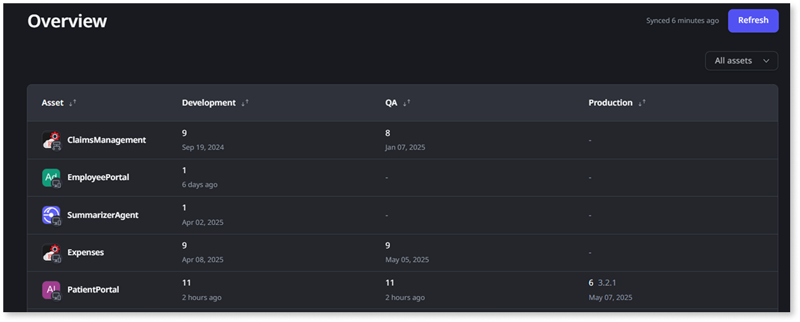

# Deploying apps

Use ODC Portal to deploy your apps. In OutSystems Developer Cloud (ODC), you deploy your apps to stages. A stage is a step within your delivery pipeline that includes runtime resources. ODC includes two stages by default.

ODC has a single code repository. When you deploy in ODC Studio, your app is containerized, deployed to the Development stage, and a container image is available. When you're ready to deploy your app to the next stage your app deploys without the need to recompile code again. Libraries are also packaged in the same container as an app.

Apps in each stage are isolated from each other. When you publish an app to the Development stage, there is no impact to the apps running in other stages. Similarly, publishing apps to  Production, doesn’t affect apps in a previous stage, such as Development.

Libraries contain functionality that's business agnostic and which you can use in multiple apps. Libraries don't hold data, and can't use entities. You can define themes, UI patterns, and blocks in libraries.

To help you understand what's deployed in each stage, ODC provides an overview page. To access the overview page, go to the ODC Portal > select **Delivery** > **Overview**. A list of apps displays and shows the name of the app, the stage in which it's deployed, the number of deployments, and the date of the last deployment. The list also shows apps that still need to be deployed. Hovering over a date displays a pop up that shows the name of the person who deployed the app and the date and time on which it was deployed. Libraries are bundled with apps, so you won't see information about the libraries. You can use the sort and filter options to narrow your search.```



## Deploy to stages

You use ODC Studio to create and publish your apps. Then you use the ODC Portal to deploy and move your apps to the different stages.

In ODC Studio, when you build an app and then click **1 Click Publish**, your app becomes available in the Development stage. You can only publish to development and then deploy to other stages. Deploying to another stage only moves the app's runtime.

To deploy your app to a stage, go to the ODC Portal and click **Deployments**. A list of apps displays showing their stage, status, when deployed, and who deployed it. From the top right, choose the stage to which you want to deploy your app. The next Deployment screen provides you with instructions to deploy your app to a stage.

1. Click the app you want to deploy. A list of available revisions for your app displays.

1. Click the revision of the app you want to deploy, and click **Continue**. The app with the revision you chose displays.  

1. When ready, click **Deploy Now**. Your app gets deployed to your selected stage. Optionally, if deploying to production you can change the version number before deploying. The [Impact analysis](#impact-analysis) runs when you click **Deploy Now**.

<div class="info" markdown="1">

A deployment status displays. You can also click **View app** to see your deployed app.

</div>  

## Versions and revisions

Versions and revisions help you track changes in your apps and libraries. You can publish your apps to Development, and every time you publish, the revision number increments by one. Revision numbers are whole numbers displayed below the app's name on the Deployments screen. 

Versions and revisions help you keep track of changes in your apps and libraries in different stages, such as:

* Development: When you publish your app in the Development stage, ODC automatically creates a new revision and the revision number increments by one. 
* QA: You can deploy any revision of your app from Development to QA. 
* Production: After testing, when you deploy your app from QA to Production, ODC assigns a three-part semantic version number in the format major.minor.patch. ODC always suggests a version (the first suggestion is always 0.1.0). Depending on the changes you deploy to Production, you can change the version number (it must be equal to or higher than the previous version). 

## Impact analysis

ODC automatically runs an impact analysis when you deploy an app in ODC Portal. The impact analysis checks for dependency issues that might cause runtime errors in your app or its consumers. By identifying issues that might negatively impact your apps or the consumers, you can deliver better-performing apps. The analysis provides information for blockers and warnings.

**Blockers** prevent you from deploying your app. For example, a blocker occurs when there is an app name collision. The blocker indicates another app on the target stage has the same name as the app you are deploying.

**Warnings** provide information but allow you to proceed. Warnings are mostly about [producers and consumers](../building-apps/data/sharing.md). For example, a warning can occur in any of the following situations:

* Your app references other apps (producers) with missing or incompatible.
* Other apps (consumers) reference your app and have missing or incompatible elements.

To review the analysis, choose the app, then choose the revision, and click  **Analyze impact**. A list of blockers and warnings show in order of severity. First, you see the blockers and then the warnings, and in each section, you see producer issues followed by consumer issues.

Developers then review the impact analysis and make a deployment decision. If there are no blockers, the **Deploy Now** button becomes enabled. But, depending on the warnings, developers might not want to continue.

For example, developers might see some unexpected warnings and decide to fix the issues in ODC Studio before continuing with the deployment. Depending upon the warning, such as a missing app, developers might decide to deploy the missing app first. In this case, you can click the **Choose App** button to return to the **App** page and deploy the missing app. Then developers can deploy the original app.  

## Deployment status

An app's deployment status can be one of the following:

* **Running:** the deployment is in progress; wait for it to finish.
* **Finished with errors**: the deployment has finished, but it wasn't successful. Review the errors.
* **Finished successfully**: the deployment finished successfully. The app is available in the deployed stage.

Log information is available for each deployment listed by clicking the row for which you want more information.
