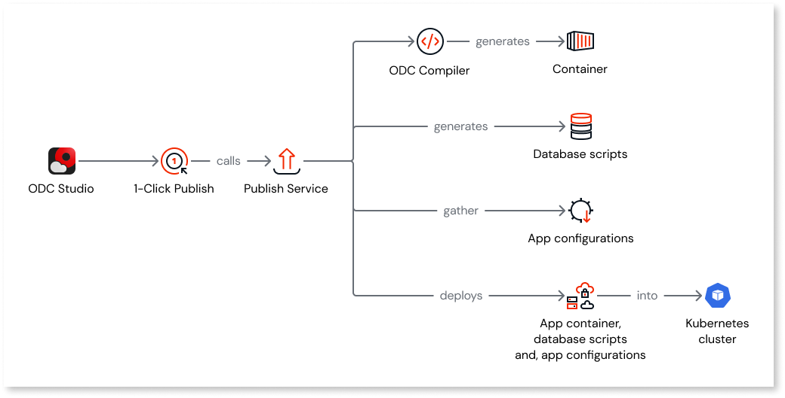
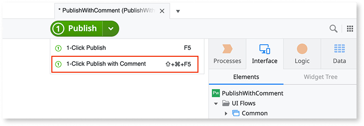

# Understanding 1-Click Publish

1-Click Publish compiles your code and deploys it to the Development stage. Each publish creates a new revision of your app or library. You can optionally add a comment describing your changes when publishing.

## Publishing an app

OutSystems Developer Cloud (ODC) automates app publishing with its 1-Click Publish button. When you click the 1-Click Publish button to publish an app in the Development stage, the button initiates the following steps:

1. The ODC compiler compiles the app and generates HTML, CSS, JavaScript, and C# code while bundling the necessary libraries.
1. The ODC compiler creates a container image containing the compiled code.
1. The ODC Data tool generates database scripts to synchronize the app's data schema with the code's version, ensuring data consistency.
1. The ODC Deployment tool deploys the container image in the Kubernetes cluster using app configurations set in the ODC Portal. Simultaneously, the ODC Data tool starts executing the database scripts.

When you deploy your app from the Development stage to the QA stage, ODC follows these steps:

1. ODC grabs the container image for the specified version of the app.
1. ODC updates app configurations for the QA stage as per your updates in the ODC Portal.
1. ODC retrieves the container image of the app version and integrates the updated configurations.

## Publishing a library

When you click the 1-Click Publish button to publish a library, ODC initiates the following steps:

1. The ODC compiler compiles the library and generates HTML, CSS, JavaScript, and C# code while bundling the necessary libraries.
1. The ODC compiler stores the compiled library build and integrates it into the container image.

Libraries within ODC do not handle data management or generate database scripts, as ODC doesn't deploy libraries into containers. Instead, libraries define static entities that function as enumerations without query capabilities.

## Adding a comment when publishing

You can add a comment when publishing to describe the changes you made. Comments help your team understand the intent behind each revision, improving traceability and collaboration.

To publish with a comment, do one of the following in ODC Studio:

* Click the dropdown arrow on the **Publish** button and select **1-Click Publish with comment**.
* Press **Shift+F5** (Windows) or **Shift+Cmd+F5** (macOS).

In the dialog that opens, type your comment and publish. The comment is optional and supports up to 2,000 characters. After publishing, the comment becomes a permanent, read-only record of that revision.

To review comments, open ODC Studio and go to **App** > **View revisions**.
