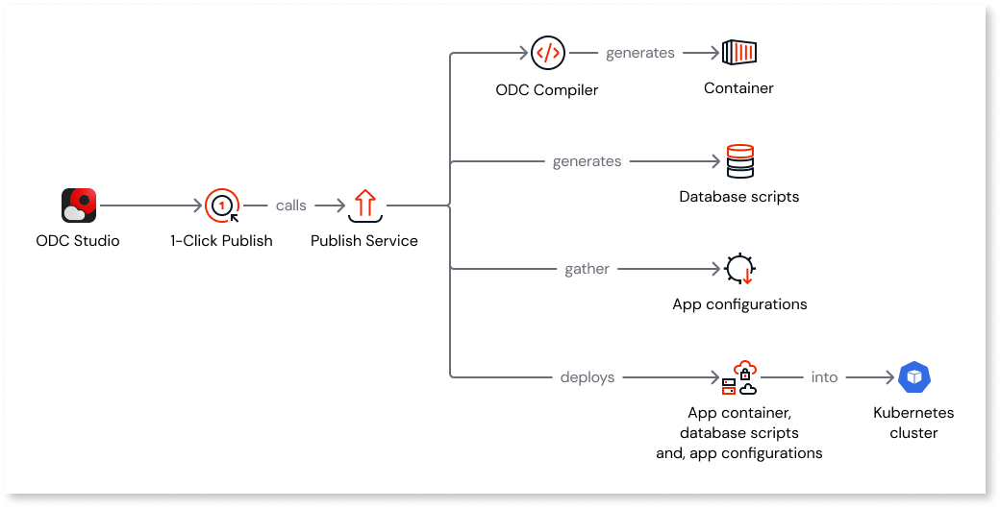
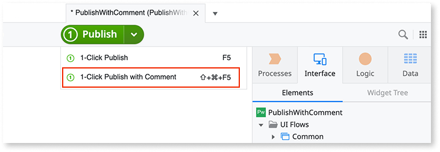

# Understanding 1-Click Publish

1-Click Publish (1-CP) builds your app or library for the Development stage. Each publish that changes the asset stores a new revision. You can optionally add a message describing your changes when publishing.

## Publishing an app {#publishing-app}

OutSystems Developer Cloud (ODC) automates app publishing with its 1-Click Publish button. When you click the 1-Click Publish button to publish an app in the Development stage, the button initiates the following steps:

1. ODC compiles the app and generates HTML, CSS, JavaScript, and C# code while bundling the necessary libraries.
1. The ODC compiler produces a debug build of the revision. A debug build stores the compiled files directly, which supports differential builds and shortens publish time.
1. Database scripts to synchronize the app's data schema with the code's version are generated, ensuring data consistency.
1. The debug build is deployed in the Kubernetes cluster in the Development runtime stage using the app configurations set in the ODC Portal. Simultaneously, ODC starts executing the database scripts to update the application data model.

In a multi-portfolio organization, refer to [Asset deployment with multiple portfolios](../manage-platform-app-lifecycle/portfolios/portfolios-deploy-assets.md).

Stages other than Development run release builds, which package a revision as a container image. Each deployment fetches the existing build and runs the database scripts for the target stage. When you deploy your app from the Development stage to the QA stage, ODC follows these steps:

1. ODC retrieves the release build for the selected revision of the app.
1. ODC generates and executes the database scripts for the QA stage.
1. ODC updates app configurations for the QA stage as per your updates in the ODC Portal.
1. ODC integrates the updated configurations into the container image and deploys it to the QA stage.

The **Deployments** screen shows these steps for each deployment, to Production as well as QA.

## Publishing a library {#publishing-library}

When you click the 1-Click Publish button to publish a library, ODC initiates the following steps:

1. The ODC compiler compiles the library and generates HTML, CSS, JavaScript, and C# code while bundling the necessary libraries.
1. The ODC compiler stores the result as a self-contained package.

A library reference is a strong reference, so ODC merges the library's package into the container of each asset that consumes it. A library runs inside its consumers, so the consuming asset owns the database scripts that ODC generates. Libraries define static entities that act as enumerations, and data storage and queries stay with the consuming app.

To make a library's elements available to other assets, you release it in the ODC Portal. For more information, refer to [Release a new version of a library](../building-apps/libraries/libraries.md#release-library).

## Adding a message when publishing {#adding-message}

A message describes the changes in a revision. Consistent messages make
comparing versions, rolling back, and reviewing a colleague's work faster and
less error-prone. Write the message yourself, or let Mentor draft it.

### Write the message yourself {#write-message}

The message dialog opens from the **Publish** button in ODC Studio.

To publish with a message, do one of the following:

* Click the dropdown arrow on the **Publish** button and select **1-Click Publish with message**.
* Press **Shift+F5** (Windows) or **Shift+Cmd+F5** (macOS).

In the dialog that opens, type your message and publish. The message is
optional and supports up to 500 characters. After publishing, the message
becomes a permanent, read-only record of that revision.

To review messages, open ODC Studio and go to **App** > **View revisions**.

### Let Mentor write the message {#mentor-write-message}

When you publish with a message, Mentor analyzes the changes you're about to
commit, including added and modified screens, logic, data, and dependencies,
and proposes a message that describes them.

In the publish dialog, choose one of the following:

* Accept the proposed message and publish.
* Manually edit the proposed message, then publish.
* Ask Mentor to rewrite the message, then review it again.

Mentor drafts the message, and you decide when to publish. The same character limit and read-only record apply.
