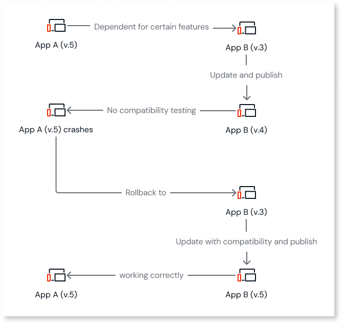

# Rollback apps

When apps have dependencies, managing revisions and versions is critical to ensure stability. An update to one app can unintentionally cause errors in another app, especially when dependencies exist between apps. Rolling back is necessary when an update introduces issues, such as compatibility problems between dependent apps. If an app crashes or behaves unexpectedly after an update, rolling back to a previous revision is the fastest way to restore functionality.

Versioning allows you to manage backward compatibility, control changes, and roll an app back in case of deployment issues. This ensures smoother and more predictable updates.

For example, consider App A, which depends on App B. You publish a new revision of App B, which causes deployment inconsistencies with App A. To fix this, you must roll App B back to a previous revision.

In a multi-portfolio organization, refer to [Asset deployment with multiple portfolios](../manage-platform-app-lifecycle/portfolios/portfolios-deploy-assets.md).

To roll an app back, follow these steps:

1. Go to the ODC Portal and select **Deployments**.

1. From the **Deploy to** dropdown, select the stage to which you want to deploy your app.

1. Select the app you want to deploy.

1. Select the revision you want to roll back to and select **Continue**.

1. To roll back the app, select **Deploy Now**.

For more information about deploying assets, refer to [Deploying assets](deploy-apps.md).
