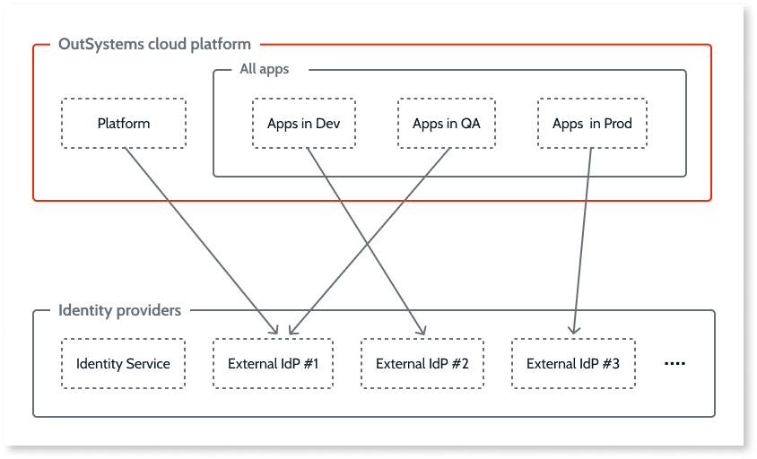
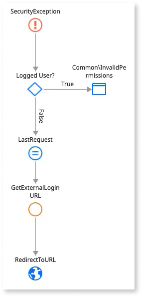

# Configuring authentication with external identity providers

Project Neo documentation is under construction. It's frequently updated and expanded.

Project Neo comes bundled with Identity Service, a built-in Identity Provider (IdP). It provides authentication, authorization, and user management for the [Platform services](architecture/intro.md#platform) and your apps. You access the Platform services through Service Studio and the Project Neo Portal. As the default IdP, Identity Service is always available.

In addition, you can use an external, self-managed IdP as the authentication provider for the Platform services and your apps. You can use any IdP that follows the OpenID Connect (OIDC) standard. You can configure most commercial IdPs to support this standard. Project Neo supports using **PKCE** (Proof Key for Code Exchange) with external IdPs for an additional layer of security.

When you successfully configure and save an external IdP to Project Neo, it becomes an option for use as the active provider for the Platform services, your apps, or both. You can use a different active provider for the Platform services and each stage your apps are deployed to. You must use the same provider for all the apps deployed to a given stage. The following diagram shows an example setup.

In the Portal on the **Users** tab, you can manage users associated with a provider.

## Before you begin

Before you begin configuring an external provider for use in Project Neo, you need to get the following information from the provider:

* URL of the OpenID configuration
* Provider credentials, like client ID and client secret

## Add an external IdP

A Project Neo admin can configure an external IdP. Navigate to the **Identity providers** tab in the Portal. You see listed the built-in provider and any external IdPs already added. Follow these steps:

1. To launch the **New provider** configuration screen, click the **Add OpenID Connect provider** button.
1. Enter a name for the new provider in the **Provider name** field. This can be any name less than 255 characters and can't include special characters. It's for your own reference.
1. Enter the URL of the OpenID configuration in the **Well-known endpoint** field. 
1. Click **Get details**. Project Neo retrieves the JSON of the OpenID configuration and shows a preview. 
1. Enter the credentials for the provider in the **Client ID** and **Client secret** fields. Then, select PKCE if your provider supports it.

    

    Project Neo safely stores the configuration details in a secret manager.

    

1. If your provider uses different attribute names, then in the **Claim Mapping** section overwrite the prefilled **Name** and **Email** fields. Otherwise, skip this step. For more guidance, see your provider's support documentation.
1. Click **Save**. Project Neo tests the configuration and on success adds the provider to the list of available providers. If the test fails, a notification with the error displays.

## Apply an external IdP

To apply an added external IdP, navigate to the **Identity providers** tab in the Portal. Then follow these steps:

1. Click on the card of the provider you want to apply as the provider for the Platform services, your apps, or both.
1. Copy the relevant pair(s) of **Redirect URLs** to the list of permitted redirects in the setup page of your external provider. See your provider's support documentation for further guidance.
1. Check the summary of the configuration details. If you want to proceed, click the **Apply provider** button.
1. Check the boxes of where you want to apply the provider and then click **Next**.

    

    When you switch the IdP for your Platform services or apps, all signed-in users get logged out after their current access token expires. They have to log back in using the newly applied provider.

    

1. Read the confirmation pop-up and then do one of the following:
    * Click the **Replace provider** button to confirm. 
    * Click the **Cancel** to exit.

Once Project Neo applies the provider successfully, a notification displays and users can start authenticating with the provider. If the provider was applied to the Platform services, you now have to log back in to the Portal.

## Use external IdP in an app { #in-an-app }

After you apply an external IdP to stage(s) (Dev, QA, Prod) in the Portal, you must modify the end-user login flow for each app in which you want to use it. For each app you want to modify, open it in Service Studio and follow these steps:

1. To load the login action onto the canvas, click the **Interface** tab, then expand the **UI Flows** > **Common** folder and double-click **OnException**. You see the end-user login flow for the built-in provider.

    

1. To delete the built-in login screen, delete the **Common\Login**  element from the login action.
1. Navigate to the **Add public elements** icon on the top toolbar of Service Studio or use the **Ctrl+Q** shortcut. Search for the [**GetExternalLoginURL** action](./reference/system-actions/auth.md#getexternallogouturl), select it, and click **Add**.
1. Click the **Logic** tab. Expand the **Client Actions** > **(System)** folder. Drag the **GetExternalLoginURL** action in place after the **LastRequest** element.
1. For the **IdentityProvider** setting, use the name of the provider you applied in the Portal. It takes the form of a string. For example, `"providerA"`.
1. Drag a **Destination** element from the toolbox bar to end the flow. A **Select Destination** popup screen displays. Expand the **UI Flows** > **Common** folder and select **RedirectToURL**.

    

1. In the Properties pane for the **RedirectToURL** action, set the **URL** setting to `GetExternalLoginURL.ExternalLoginURL`. This is where the user is redirected to perform the login.

After you complete the steps, [promote](deploy-apps.md) the revision of the app to the stage(s) where the provider is active.

If you revert the provider for stage(s) back to the built-in provider, you must change the login flow for the apps back to that shown in Step 1.

## Edit an external IdP

You can only edit the configuration details for a provider not in use. Edit the configuration details in the **Identity providers** tab of the Project Neo Portal.
