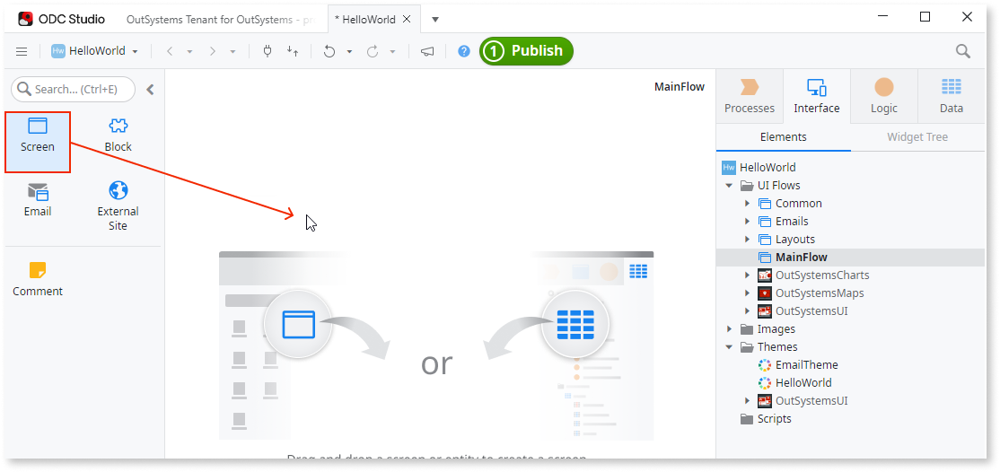
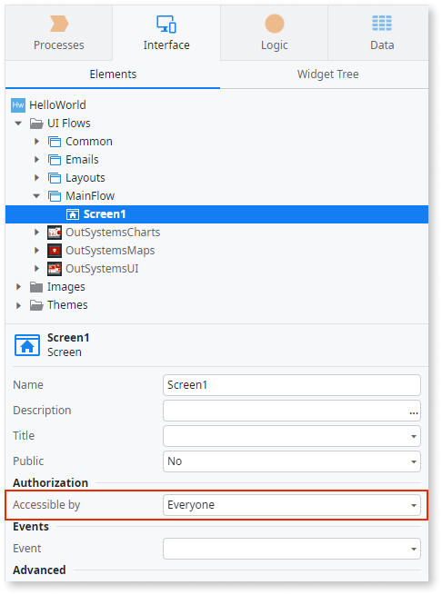

# Create your hello world app

This article demonstrates how you can create a "Hello, world!" app in ODC.

**Prerequisites**

* You have installed the ODC Studio
* You are part of an organization
* You have the development permissions

For more information on accessing ODC Studio and Portal, see [Getting started with ODC](intro.md).

## Create the app

Open ODC Studio and follow these steps to create your "Hello, world" app: 

1. Click **Create** (the + icon).
2. Select **App** and click **Continue**.
3. Select **Web app** and click **Continue**.
4. Enter the name of your app and click **Create app**.
5. From the toolbox, drag a Screen to the canvas.

     

     

     You can also open a new screen window by going to **Interface**, right-clicking **MainFlow**, and selecting **Add screen** in the help menu.

     

6. To create an empty screen, click **Create screen**.
    
    ODC Studio creates a screen with the name Screen1.

7. Click the title placeholder in the empty screen and enter `Hello, world!`.
8. Go to the **Interface** tab, double-click **MainFlow**, and select Screen1. 
9. Set the **Accessible by** screen property to **Everyone**.

    

10. Click the **1-Click Publish** button.
    
    ODC is now compiling, optimizing, and publishing your app in the development stage.

11. Click **Open in browser** to view your app.

