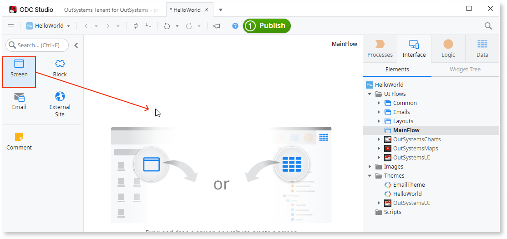
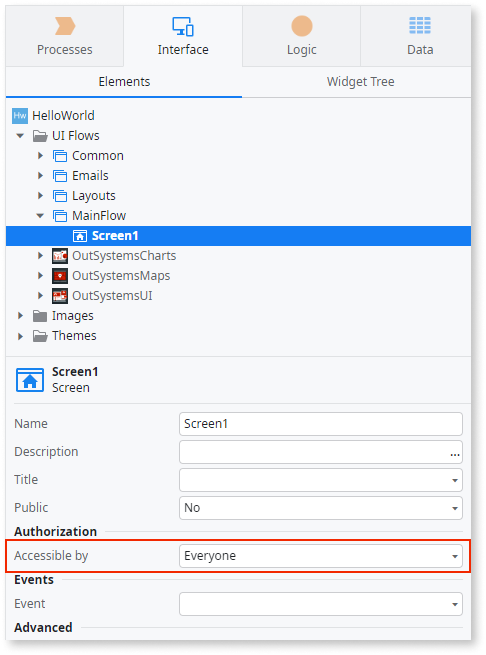

# Create your hello world app

A Hello, world! app is the simplest application a developer can build. It displays a single line of text and verifies that the tooling, the editor, and the deployment pipeline all work together. In ODC, that means a Web app with one screen showing the text Hello, world!.

In this tutorial you create and publish that app. ODC offers three paths to the same outcome, each at a different level of AI assistance:

* **Build with Mentor Web.** Generate the entire app from one natural-language prompt or an uploaded requirements document. Mentor Web produces, publishes, and opens the app for you.
* **Build with Mentor Studio.** Create an empty app shell in ODC Portal, then prompt Mentor Studio inside ODC Studio to add the screen and publish.
* **Build manually.** Assemble the same app in the visual editor, click by click. Use this path when you want to see where each element lives.

All three paths share the same prerequisites and end with the same published app.

## Prerequisites

To create your app, make sure you have:

* ODC Studio installed.
* Membership in an ODC organization.
* Development permissions in that organization.

For more information on accessing ODC Studio and Portal, refer to [Getting started with ODC](intro.md).

## Build with Mentor Web

Mentor Web takes a natural-language prompt or a requirements document and produces a complete Web app in one pass, including the data model, screens, logic, and publishing. For a Hello, world! app a single short prompt is enough.

1. In ODC Portal, select **Create app** > **Web app** > **Generate with Mentor**.

1. Enter a prompt such as: "Create a Hello, world! Web app with one public screen that displays the text Hello, world!"

1. Review the blueprint Mentor proposes. The blueprint lists the screens, data, and roles Mentor plans to generate. Adjust through follow-up prompts if anything is missing.

1. Confirm the blueprint. Mentor generates the app, publishes it to the Development stage, and opens it for review.

To start from a structured requirements document instead of a prompt, refer to [Use requirement documents](../agentic-development/mentor-web/requirements-doc.md). A document is the better input when the app has more than a handful of screens or specific business rules.

For the full Mentor Web walkthrough, including prompt patterns, blueprint editing, and how to continue work in ODC Studio, refer to [Create an app with AI in ODC Portal](../agentic-development/mentor-web/create-app.md). For background on how Mentor Web interprets input, refer to [AI app generation in Mentor Web](../agentic-development/mentor-web/how-it-works.md).

## Build with Mentor Studio

Mentor Studio is the AI assistant inside ODC Studio. Use this path when you want to learn the editor while still letting AI do the routine assembly: create an empty Web app shell in ODC Portal, then prompt Mentor Studio to add the screen and publish.

1. In ODC Portal, select **Create app** > **Web app** > **Continue in ODC Studio**. Confirm with **Continue**. The app details screen opens.

1. Enter the name of your app and select **Create app**. Use a name that contains at least one Latin letter so the URL path resolves correctly. For details, refer to [Application naming and URLs](../building-apps/app-naming.md). ODC Studio opens with an empty app.

1. Click the **Mentor** icon in the toolbar to open the Mentor panel.

1. Enter a prompt such as: "Add a screen titled Hello, world! with the Accessible by property set to Everyone, then publish."

1. Review the changes Mentor proposes. Select **View changes** to inspect what it edited before accepting.

    

    AI-generated code is non-deterministic. The same prompt produces different results across runs. If the screen title or layout doesn't match the prompt, send a follow-up such as "Rename the screen title to Hello, world!" instead of editing manually.

    

1. If Mentor didn't publish for you, click **1-Click Publish**, then **Open in browser** to view the app.

To extend the same app further with AI, for example asking for the user's name and personalizing the greeting, refer to [Modify an app with AI](../agentic-development/mentor-studio/modify-app.md). For background on Mentor Studio's workflow, refer to [AI development in Mentor Studio](../agentic-development/mentor-studio/how-it-works.md).

## Build manually

This is the manual route through the visual editor. Before generative AI, this was the only way to build an app in ODC: drag a screen, set the title, configure access, publish. Use this path when you want to learn where each element is located in ODC Studio.

<iframe src="https://player.vimeo.com/video/1034568771" width="750" height="422" frameborder="0" allow="autoplay; fullscreen" allowfullscreen="">Demo showing how to create a Hello world app in ODC Studio.</iframe>

Open ODC Studio and follow these steps to create your Hello, world! app:

1. In ODC Portal, select **Create app** > **Web app** > **Continue in ODC Studio**. Select **Continue** to confirm. The app details screen opens.

1. Enter the name of your app and select **Create app**. Use a name that contains at least one Latin letter so the URL path resolves correctly. For details, refer to [Application naming and URLs](../building-apps/app-naming.md).

1. From the toolbox, drag a screen to the canvas. The **New Screen** window opens.

    

    

    You can also open a new screen window by going to **Interface**, right-clicking **MainFlow**, and selecting **Add screen** in the help menu.

    

1. In the **New Screen** window, select **Empty**, and then **Create screen**. ODC Studio creates a screen named Screen1.

1. Click the title placeholder in the empty screen and enter `Hello, world!`.

1. Go to the **Interface** tab, double-click **MainFlow**, and select Screen1.

1. Set the **Accessible by** screen property to **Everyone**.

    

1. Click the **1-Click Publish** button. ODC compiles, optimizes, and publishes your app in the Development stage.

1. Click **Open in browser** to view your app.
