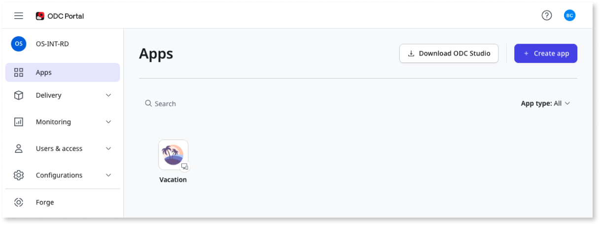

# Getting started with ODC

OutSystems Developer Cloud (ODC) is a cloud-native app development platform that provides a modular, scalable environment in which you develop and deploy your apps. With ODC you can build and deploy enterprise-grade, mission-critical apps in weeks. You can build web apps, web portals, mobile apps, and business workflows faster than with traditional development tools. You can then deploy your apps in a scalable, secure, and high-performance environment.

## Access the ODC Portal

Currently, OutSystems offers only a paid version of ODC. Please contact the OutSystems field team if you're interested in a commercial trial.

Open the email and locate the link to the ODC Portal.

Click the link to go to the login page.

The **ODC Portal** provides a unified experience that consolidates your app and user management experience in one place. The ODC Portal and ODC Studio work together, making it quick to get the tools you need to develop and deploy your apps.

From the ODC Portal, you have access to:

* **Apps** - use to access all your apps and libraries
* **Delivery** - use to deploy apps, view apps deployed to a specific stage, and their delivery status
* **Monitoring** - use to view all logs and activities
* **Users & access** - use to invite users, view a list of user, or delete, and deactivate users
* **Configurations** - use to configure emails and domains for each stage
* **Forge** - use to access a repository of apps and components developed by a community of ODC developers to create your own apps.

## Create an app

From the ODC Portal, when you click **Create app**, ODC automatically opens ODC Studio and displays some choices. You can select:

* **Apps** to create a new Web, Tablet, or Phone app from scratch
* **Library** to create a new library from scratch
* **Template** to create an App or Library based on a template

You create apps in the ODC Portal, and then you use ODC Studio to build out your app. In ODC you deploy to a **stage**. A stage, such as Development, is a step within your continuous delivery pipeline.

## Preview an app

Preview your app from ODC Studio or ODC Portal. You can choose different previews, depending on the app type you are developing.

In ODC Studio, every time you publish changes you can click the preview link in the **TrueChange** tab.

In ODC Portal, go to the app details and click **View app**. Web apps run in the browser. ODC shows the preview of the mobile app in the browser as well, and lets you see how your app looks with a different screen size or orientation. To preview the mobile app on a device, to see how the app works natively on the hardware, [create a mobile package](../building-apps/mobile/creating-mobile-package.md) and install it on your device.

## Access ODC Studio

Before you can use ODC Studio, download it from the ODC Portal. You can use the link on the top-right of the ODC Portal.

Once you install ODC Studio, you are ready to create an app. When you start the **Create App** process in ODC Portal, it triggers the opening of ODC Studio. You are now ready to develop your app.

In ODC Studio you use visual programming elements to build your apps faster. ODC Studio accelerates the speed of development because you can share such things as templates, elements, and themes. You can also use drag and drop to quickly create UIs, business processes, and business logic in your apps.

Within each type of app, there are pre-built screen templates you can use to speed up development. The templates come with a user interface and logic. You can also use Forge which provides you with different apps and plugins as a starting point.

To publish your app, click **1-Click publish**. By default your app publishes to the Development stage.

To find out more about how to get ODC for your organization, see [Develop applications that drive revenue, reduce costs, and control risk - at internet scale](https://www.outsystems.com/low-code-platform/developer-cloud/).
