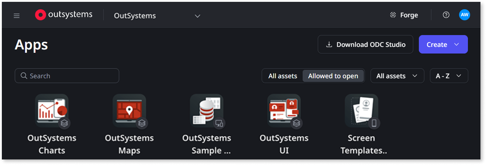
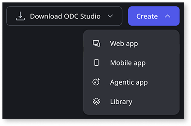
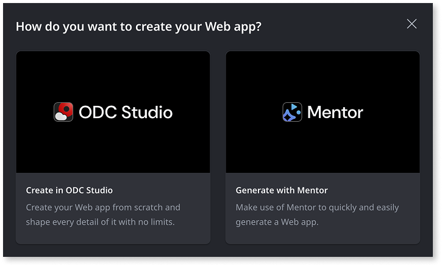
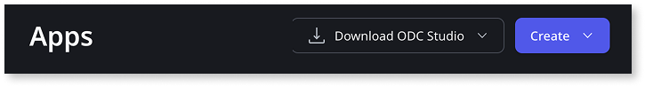
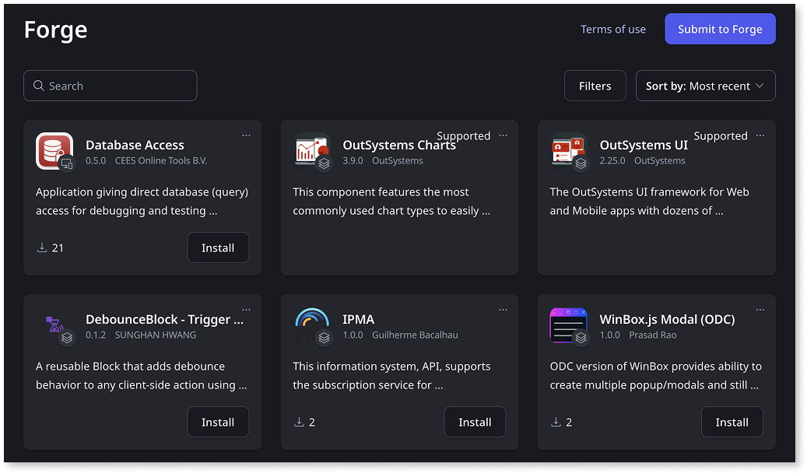

# Getting started

OutSystems Developer Cloud (ODC) is a cloud-native, AI-first app development platform. You describe the app you want and ODC generates a working Web app, Mobile app, Agentic app, or business workflow in minutes. AI-built apps are enterprise-grade by default: they inherit the platform's compiler, delivery pipeline, security, observability, governance, and scalable runtime. ODC takes you from idea to production in weeks, with the same standards applied whether you built with AI or by hand.

Two tools deliver the AI side. **Mentor Web** in ODC Portal generates a new app from a natural-language prompt. **Mentor Studio** inside ODC Studio extends and refines an open app through conversation. Both sit alongside the visual editor, so you choose AI, manual, or a mix at any point. For an overview of the AI path, refer to [Agentic development](../agentic-development/intro.md).

## Access the ODC Portal

When your organization acquires ODC, you receive an account email with a link to ODC Portal. Open the email and click the link to reach the login page.

**ODC Portal** provides a unified experience that consolidates all your SDLC experience in one place. The ODC Portal and ODC Studio work together, making it quick to get the tools you need to develop and deploy your apps.

From the ODC Portal, you have access to:

* **Create** - use to access all your apps and libraries and workflows
* **Deliver** - use to deploy apps, view apps deployed to a specific stage, and their delivery status
* **Monitor** - use to view all logs, traces and analytics
* **Analyze** - use to check and ensure code quality and app security
* **Integrate** - use to integrate your apps with other systems
* **Manage** - use to do all your user management and API permissions management
* **Configure** - use to make all your relevant configurations
* **Forge** - use to access a repository of apps and components developed by a community of ODC developers to create your own apps.

## Create an app

From the ODC Portal, when you click **Create**, ODC gives you the option to create:

* **Web app.** An app users run in a desktop or mobile browser.
* **Mobile app.** A native Android or iOS app you distribute through app stores, or a Progressive Web App served from your website.
* **Agentic app.** A backend app that uses AI at runtime to perform tasks, automate workflows, or handle multi-step interactions for other apps to consume.
* **Library.** A reusable element that shares code, themes, or data between apps.

For more on what each asset type does, refer to [Types of apps you can build](types-of-apps.md).

For a Web app you then pick the build path. ODC offers two:

* **Generate with Mentor Web.** Describe the app in natural language, and ODC produces a full-stack structure with a data model, screens, logic, and roles. The published app opens in the browser when generation finishes. Refer to [Create an app with AI in ODC Portal](../agentic-development/mentor-web/create-app.md) for the walkthrough.

* **Continue in ODC Studio.** Open an empty app in the visual editor and assemble screens, data, and logic by hand. **Mentor Studio** sits in the editor's toolbar. Open the panel and prompt for the parts you don't want to build by hand.

You create apps in the ODC Portal, then build them out in ODC Studio. In ODC you deploy to a **stage**. A stage, such as Development, is a step within your continuous delivery pipeline.

Templates give you a starting point for new apps. Use templates to define look and feel, share common functionality, or manage dependencies. To learn more about templates, refer to [Create a custom app template](../app-architecture/reuse-templates.md).

## Preview an app

Preview your app from ODC Studio or ODC Portal. You can choose different previews, depending on the app type you are developing.

In ODC Studio, every time you publish changes you can click **Open in browser** to see your live app.

In ODC Portal, go to the app details and click **View app**. Web apps run in the browser. ODC shows the preview of the mobile app in the browser as well, and lets you see how your app looks with a different screen size or orientation. To preview the mobile app on a device, to see how the app works natively on the hardware, [create a mobile package](../building-apps/mobile/creating-mobile-package.md) and install it on your device.

## Access ODC Studio

Before you can use ODC Studio, download it from the ODC Portal. You can use the link on the top-right of the ODC Portal.

After installing ODC Studio, you're ready to develop your apps. Starting the **Create App** process in ODC Portal opens ODC Studio automatically.

ODC Studio combines a **visual editor** with **Mentor Studio**, the AI assistant in the same canvas. You build by drag-and-drop using elements from the toolbox, by conversation through Mentor Studio in the toolbar, or by combining both. Mentor handles routine assembly while you focus on the logic that needs your judgment. Click the **Mentor** icon in the toolbar to open the Mentor panel and describe the change you want. Refer to [AI development in Mentor Studio](../agentic-development/mentor-studio/how-it-works.md) for the workflow.

Pre-built screen templates and OutSystems Forge speed up either path: templates provide UI and logic for most app types, and Forge offers a library of apps and plugins to use as a foundation.

To publish your app, click **1-Click publish**. By default your app publishes to the Development stage.

## Related resources

* [Types of apps you can build](types-of-apps.md).
* [Agentic development](../agentic-development/intro.md).
* [ODC Overview](https://learn.outsystems.com/training/journeys/odc-overview-576) online course.
* [ODC Studio Overview](https://learn.outsystems.com/training/journeys/odc-studio-overview-577) online course.
