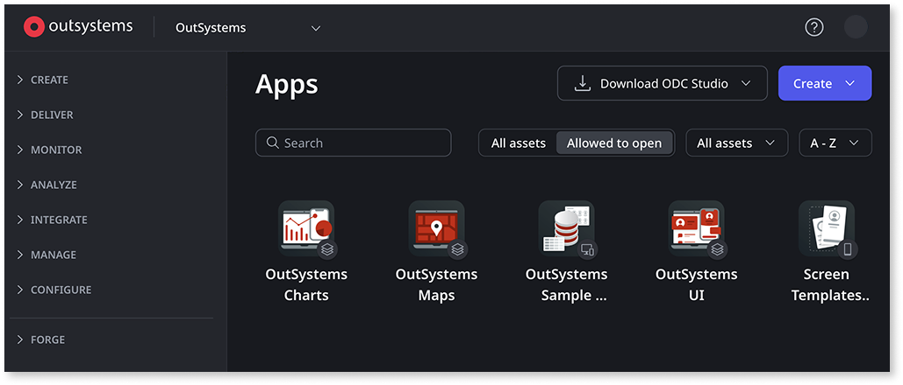
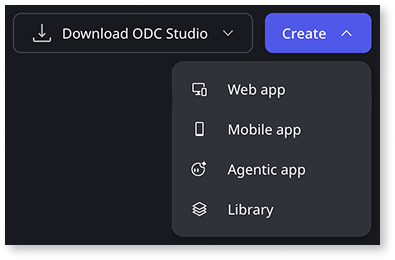

# Getting started

OutSystems Developer Cloud (ODC) is a cloud-native app development platform. It provides a modular, scalable environment for developing and deploying your apps. With ODC you can build and deploy enterprise-grade, mission-critical apps in weeks. You can build Web apps, Web portals, Mobile apps, Agentic apps, and business Workflows faster than with traditional development tools. You can then deploy your apps in a scalable, secure, and high-performance environment.

## Access the ODC Portal

When your company acquires ODC, you're registered as a user, generating an email from which you can start using ODC. To do this, open the email and locate the link to the ODC Portal. Then click the link to go to the login page.

**ODC Portal** provides a unified experience that consolidates all your SDLC experience in one place. The ODC Portal and ODC Studio work together, making it quick to get the tools you need to develop and deploy your apps.

From the ODC Portal, you have access to:

* **Create** - use to access all your apps and libraries and workflows
* **Deliver** - use to deploy apps, view apps deployed to a specific stage, and their delivery status
* **Monitor** - use to view all logs, traces and analytics
* **Analyze** - use to check and ensure code quality and app security
* **Integrate** - use to integrate your apps with other systems
* **Manage** - use to do all your user management and API permissions management
* **Configure** - use to make all your relevant configurations
* **Forge** - use to access a repository of apps and components developed by a community of ODC developers to create your own apps.

## Create an app

From the ODC Portal, when you click **Create**, ODC gives you the option to create:

* A **Web app**
* A **Mobile app**
* An **Agentic app**
* A **Library**

When you select a **Web app**, you have the option of how you want to create your app. You can:

* Create your Web app from scratch in ODC Studio.

* Generate with Mentor.

You create apps in the ODC Portal, and then you use ODC Studio to build out your app. In ODC you deploy to a **stage**. A stage, such as Development, is a step within your continuous delivery pipeline.

You can create templates, which you can use as a starting point to develop your apps. You can use templates to define the look and feel of your apps, put in place common functionality or to manage dependencies. To learn more about templates, see [create a custom app template.](../app-architecture/reuse-templates.md)

## Preview an app

Preview your app from ODC Studio or ODC Portal. You can choose different previews, depending on the app type you are developing.

In ODC Studio, every time you publish changes you can click **Open in browser** to see your live app.

In ODC Portal, go to the app details and click **View app**. Web apps run in the browser. ODC shows the preview of the mobile app in the browser as well, and lets you see how your app looks with a different screen size or orientation. To preview the mobile app on a device, to see how the app works natively on the hardware, [create a mobile package](../building-apps/mobile/creating-mobile-package.md) and install it on your device.

## Access ODC Studio

Before you can use ODC Studio, download it from the ODC Portal. You can use the link on the top-right of the ODC Portal.

Once you install ODC Studio, you are ready to create an app. When you start the **Create App** process in ODC Portal, it triggers the opening of ODC Studio. You are now ready to develop your app.

In ODC Studio you use visual programming elements to build your apps faster. ODC Studio accelerates the speed of development because you can share such things as templates, elements, and themes. You can also use drag and drop to quickly create UIs, business processes, and business logic in your apps.

You can speed up development using pre-built screen templates, which provide both UI and logic for most app types. Additionally, OutSystems Forge offers a wide variety of apps and plugins to use as a foundation for your project.

To publish your app, click **1-Click publish**. By default your app publishes to the Development stage.

## Related resources

* [ODC Overview](https://learn.outsystems.com/training/journeys/odc-overview-576) online course

* [ODC Studio Overview](https://learn.outsystems.com/training/journeys/odc-studio-overview-577) online course
