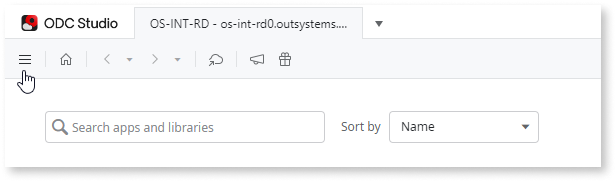
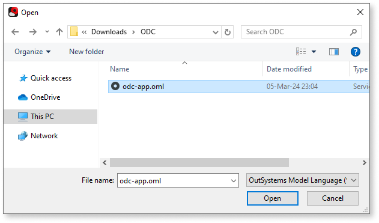

# How to open an oml file in ODC Studio

This article teaches you how to open an .oml file in ODC Studio. An .oml file is the code of an app. With it, you can publish it to an ODC organization.

Before starting, ensure you have ODC Studio connected to an ODC organization. The steps below describe how to open and publish an .oml file:

1. In ODC Studio's main window, select the menu on the top left.

    

1. Select **Open Files...**

    

1. In the following popup, **find and open the .oml file**.

    

1. The app now opens up in ODC Studio.

1. Click the **1-Click Publish** button to publish the app for the first time.

    
