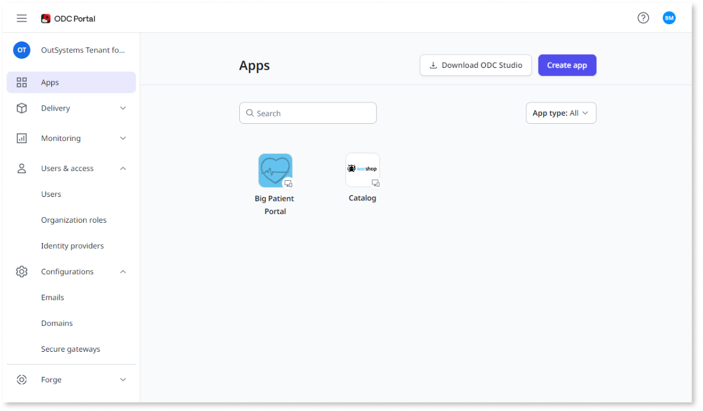
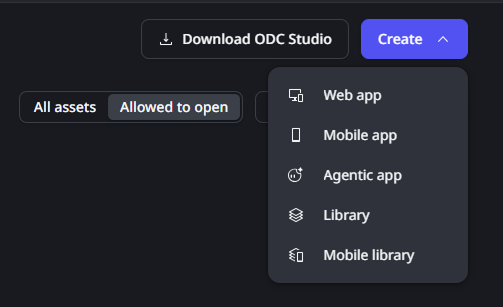
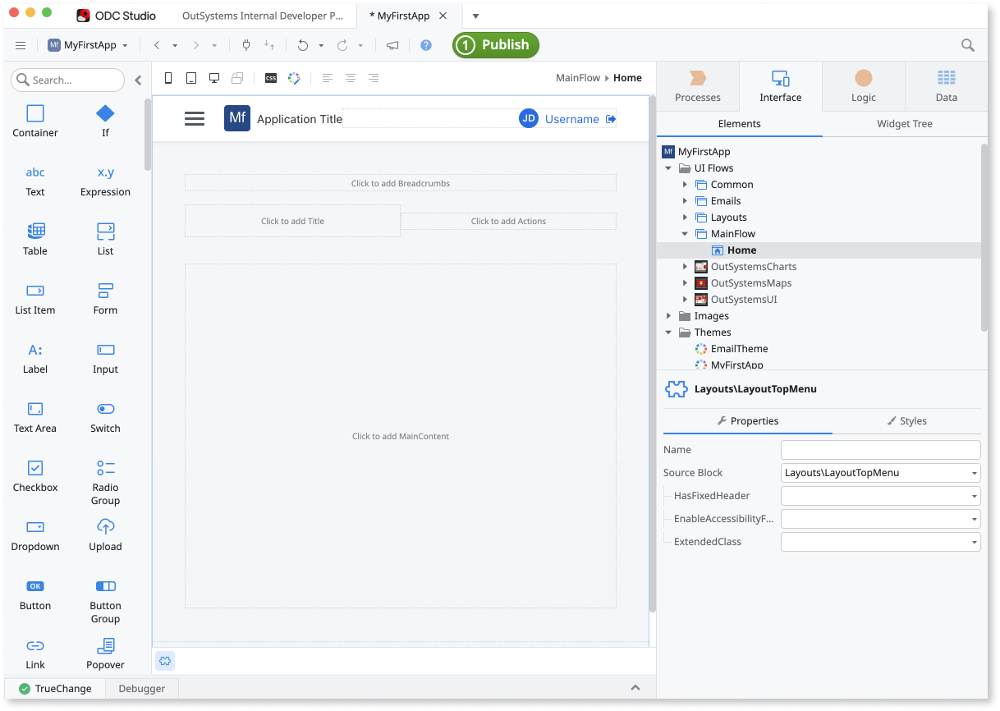
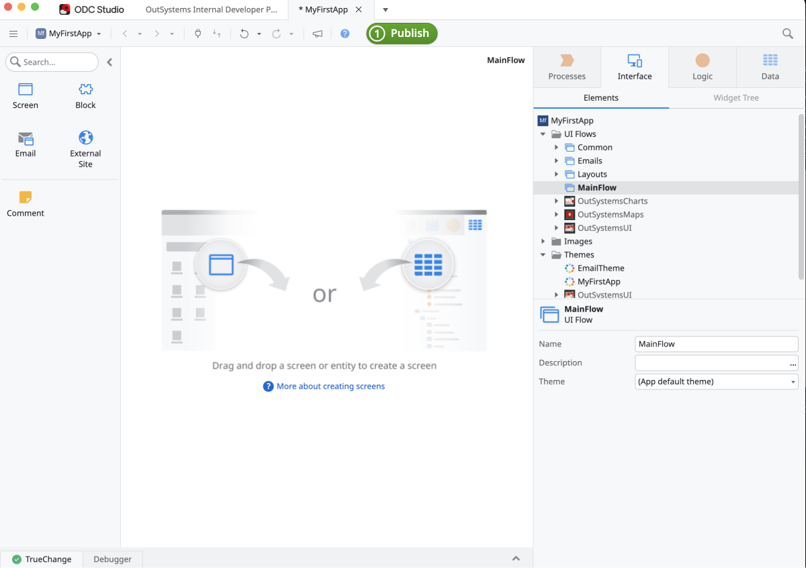
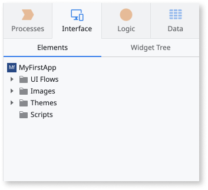
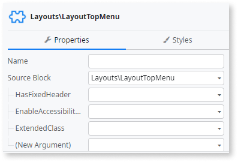

# UI overview of ODC Portal and ODC Studio 

OutSystems Developer Cloud (ODC) is a cloud-native, low-code development platform. It provides the tools you need to build, deploy, and evolve your apps quickly. ODC includes the ODC Portal and the ODC Studio, which together make it easy for you to complete all the tasks from one place when you build, deploy, and manage your apps. Having quick access to the tools you need accelerates the speed at which you build and deliver your apps. ODC also includes built-in accelerators that help guide you as you develop your app.

You can set the ODC Portal and ODC Studio to Dark or Light themes. The images in this document were taken with a light theme for clarity.

## ODC Portal

The ODC Portal is a unified console to manage, monitor, and deploy apps, and to manage users and their access. Once you sign in to ODC, the ODC Portal home page displays.

What displays depends on your role. The images for this document are taken by a person with a role that has full access. Your role may have less access to the tools and apps. The following image shows the home screen when you first sign in to the ODC Portal. 

Although the ODC Portal and ODC Studio have the same look, different options are available. For example, in the ODC Portal, the Navigation menu displays on the left, and in ODC Studio, the Toolbox displays on the left. 

The **top bar** in the Portal enables you to:

* Open and close the Navigation menu by clicking the hamburger icon
* View the name of your location (ODC Portal or ODC Studio)
* Access ODC documentation and support, and provide OutSystems with feedback by clicking the question mark icon
* Update your profile, change your password, change the theme from dark to light, and logout, by clicking your initials or image

Above the Navigation menu, the name of the tenant you're accessing displays. 

Each menu item on the **Navigation menu** provides functionality related to its name. ODC uses an accordion to display more or less information. When the arrow to the right of the menu name points up, that accordion is open. For example, **Users & access** and **Configuration** are open and show more options. When the arrow points down, such as for **Monitoring**, additional options don’t display. 

The **apps** you see when you first access the ODC Portal are only the apps to which you have access. When you select a menu option, the display in the middle changes. For example, if you select **Users & Access** > **Users**, then information related to users displays. In addition, the choices available at the top of the Portal canvas also change. All options that display relate to your choice from the Navigation menu. 

From the top right, you can select **Download ODC Studio** or **Create app**. When you click **Create app**, ODC Studio automatically opens.

To open an existing app or see the details, hover over the app to display the **ellipsis** (3-dots). Then select either **Open in ODC** or **View Details**. 

To create a new app from the ODC Portal, select **Create app**, and then choose either an App, a Library, or a template. Templates help speed up your development process. If you select an app, you can then choose the type of app (web, tablet, or phone). 

## The ODC Studio

The ODC Studio is an Integrated Development Environment (IDE), and it’s where you build and debug your app using OutSystems visual programming language. After you select an app, ODC Studio opens and displays the ODC Studio canvas. In the canvas, you can design, publish, and debug your apps and libraries. 

The **top row** identifies that you are in ODC Studio, the name of the tenant, and the name of your app. 

The **second** row shows the **hamburger** icon, the name of the app, and in the center, the **1-Click Publish** button. When you click the publish button, your app deploys, and the status displays in the **1-Click Publish** tab at the bottom of the screen. If an error exists, the **1-Click Publish** button becomes unavailable and displays with a red x. 

The **1-Click Publish** tab displays on the bottom of the screen display after you click the publish button.

The **Toolbox** on the left provides shortcuts to common elements you need when creating your app. The elements in the toolbox change depending on your actions. For example, if you are creating a flow, ODC Studio displays the elements you can use in your logic flow. If you're editing UI, the toolbox shows the widgets. Presenting information to you at the point of need helps accelerate your development. You can drag an element from the toolbox to the workspace. The following screenshot shows how the User Interface (UI) changes, for example, when creating an app. 

The **canvas** is in the middle. This is where you design and develop your apps logic and UI.

The **Development** tabs (**Process**, **Interface**, **Logic**, and **Data**) display on the right side of the UI. Each tab shows elements and properties related to your selection. What you select also determines what options are available in the toolbox and in the canvas. This makes it easier for you to complete a task. 

The section below the horizontal rule is the **Properties panel**.  The element you select, determines what properties display and are necessary for you to complete. 

At the bottom of your screen several tabs display providing additional information.

* The **TrueChange** tab displays the existing errors and warnings in your app. If you double-click a specific error or warning, ODC Studio takes you directly to that occurrence.
* The **Debugger** tab helps you to debug your app. Here you can start the debugger and see the content of your variables step by step.
*The **1-Click Publish** tab displays after the first time you click the **1-Click Publish** button. The status shows the publish process as it progresses. 
* The **Search Results** tab: lists the results of a search performed in the app. If you double-click a specific result, ODC Studio takes you directly to that occurrence. 
* The **Status bar** (right side) displays information about the user, the current environment, and when the app was last published.

To learn more about the ODC user interface, see the [ODC Studio Overview](https://www.outsystems.com/training/courses/233/odc-studio-overview/) training course.

