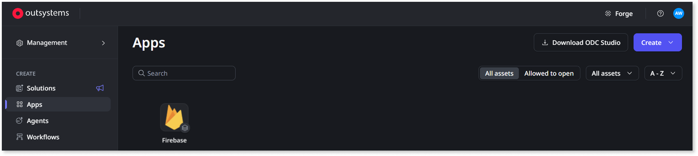
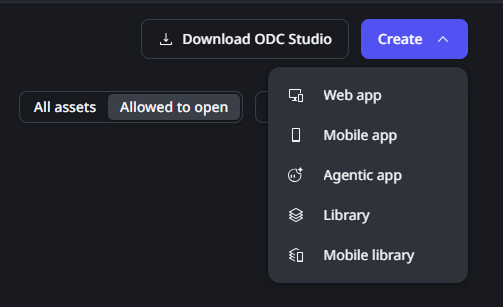
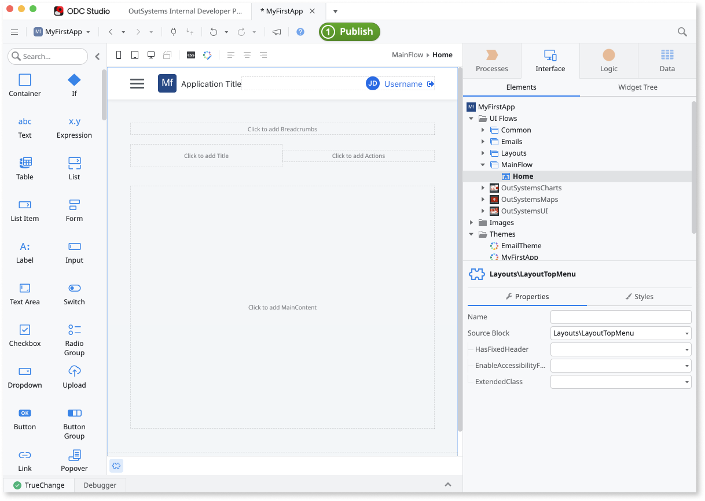
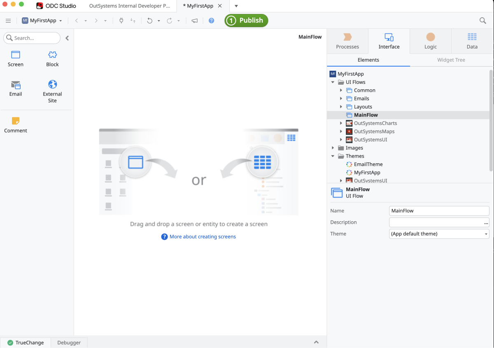
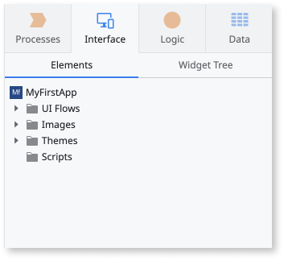
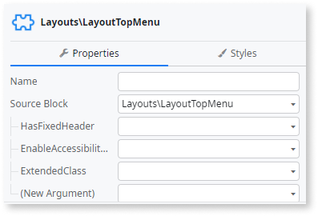

# UI overview of ODC Portal and ODC Studio

OutSystems Developer Cloud (ODC) splits the developer experience across two surfaces. The **ODC Portal** is where you create, deploy, and manage apps. The **ODC Studio** is where you build and debug them. Both are AI-first: Mentor Web generates apps in the Portal, and Mentor Studio extends them inside the Studio. AI-built apps inherit the same compiler, delivery pipeline, security, observability, and governance as any ODC app.

You can switch between Dark and Light themes in the ODC Portal and ODC Studio.

## ODC Portal

The ODC Portal is a unified console for managing, monitoring, and deploying apps, and for managing users and their access. It is also the entry point for **Mentor Web**, the AI tool that generates new apps from a natural-language prompt. After you sign in to ODC, the ODC Portal home page displays.

What displays depends on your role. The screenshots in this document come from a role with full access; your role may show fewer tools and apps. The following image shows the home screen when you first sign in to the ODC Portal.

You can access ODC Portal on both desktop and mobile. The experience isn't fully optimized for mobile. For full functionality and the best usability, use a desktop or laptop.

The **top bar** in the Portal enables you to:

* Open and close the Navigation menu by clicking the hamburger icon.
* View the name of your current location, either ODC Portal or ODC Studio.
* Access ODC documentation, support, and feedback by clicking the question mark icon.
* Update your profile, change your password, switch the theme, or sign out by clicking your initials or image.

Above the Navigation menu, the name of the tenant you're accessing displays.

Each menu item on the **Navigation menu** provides functionality related to its name. ODC uses an accordion to display more or less information. When the arrow to the right of the menu name points up, that accordion is open.

The **apps** you see when you first access the ODC Portal are only the apps to which you have access. When you select a menu option, the display in the middle changes. For example, if you select **Manage** > **Users**, then information related to users displays. In addition, the choices available at the top of the Portal canvas also change. All options that display relate to your choice from the Navigation menu.

From the top right, you can select **Download ODC Studio** or **Create app**. When you click **Create app**, ODC Studio automatically opens.

To open an existing app or view its details, hover over the app to display the **ellipsis** icon. Then select either **Open in ODC** or **View Details**.

To create a new app from the ODC Portal, select **Create app**, then choose a type: Web app, Mobile app, Agentic app, Library, or Mobile library. For a Web app you then pick the build path. **Generate with Mentor** opens Mentor Web for AI app generation, and **Continue in ODC Studio** opens the visual editor. Refer to [Create an app with AI in ODC Portal](../agentic-development/mentor-web/create-app.md) for the Mentor Web walkthrough.

The display name you enter converts to the app's URL path. For naming rules, refer to [Application naming and URLs](../building-apps/app-naming.md).

## ODC Studio

ODC Studio is an Integrated Development Environment (IDE) where you build and debug your apps. It combines a **visual editor** for hands-on assembly with **Mentor Studio**, the AI assistant that adds features, extends logic, explains code, and identifies technical debt through conversation. After you select an app, ODC Studio opens and displays the canvas. There you design, publish, and debug your apps and libraries, working by hand, through Mentor, or both. Refer to [Modify an app with AI](../agentic-development/mentor-studio/modify-app.md) for the Mentor Studio walkthrough.

The **top row** identifies that you are in ODC Studio, the name of the tenant, and the name of your app.

The second row shows the **hamburger** icon, the name of the app, and in the center, the **1-Click Publish** button. When you click the publish button, your app deploys, and the status displays in the **1-Click Publish** tab at the bottom of the screen. If an error exists, the **1-Click Publish** button becomes unavailable and displays with a red x.

The **1-Click Publish** tab appears at the bottom of the screen after you click the publish button.

The **Toolbox** on the left provides shortcuts to common elements you need when creating your app. The elements in the toolbox change depending on your actions. If you are creating a flow, ODC Studio displays the elements you can use in your logic flow. If you're editing UI, the toolbox shows the widgets. You drag elements from the toolbox to the workspace. The following screenshot shows how the User Interface (UI) changes when you create an app.

The **canvas** is in the middle. This is where you design and develop your app's logic and UI.

On the right side of the UI, you see four **Development** tabs: **Process**, **Interface**, **Logic**, and **Data**. Each tab shows elements and properties related to your selection. What you select also determines what options are available in the toolbox and in the canvas. This makes it easier for you to complete a task.

The section below the horizontal rule is the **Properties panel**. The element you select determines what properties display and which ones you complete.

At the bottom of your screen, several tabs show additional information:

* The **TrueChange** tab displays the existing errors and warnings in your app. Double-click an error or warning to jump to its location.
* The **Debugger** tab helps you debug your app. Start the debugger and inspect the content of your variables step by step.
* The **1-Click Publish** tab displays after the first time you click the **1-Click Publish** button. The status shows the publish process as it progresses.
* The **Search Results** tab lists the results of a search performed in the app. Double-click a result to jump to its location.
* The **Status bar** on the right side displays information about the user, the current environment, and when the app was last published.

## Related resources

* [Getting started](intro.md) for the platform overview and the AI-first build paths.
* [Agentic development](../agentic-development/intro.md) for how Mentor Web and Mentor Studio work.
* [ODC Studio Overview](https://www.outsystems.com/training/courses/233/odc-studio-overview/) online course.
