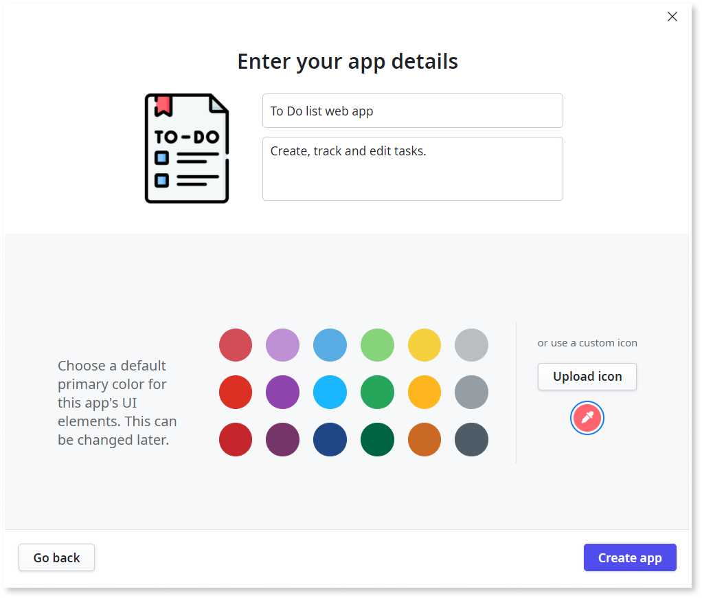
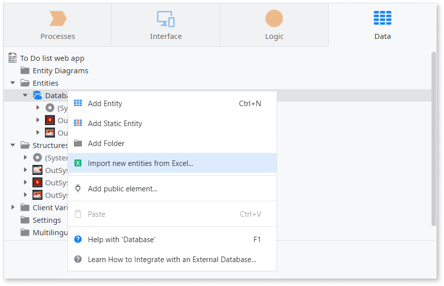
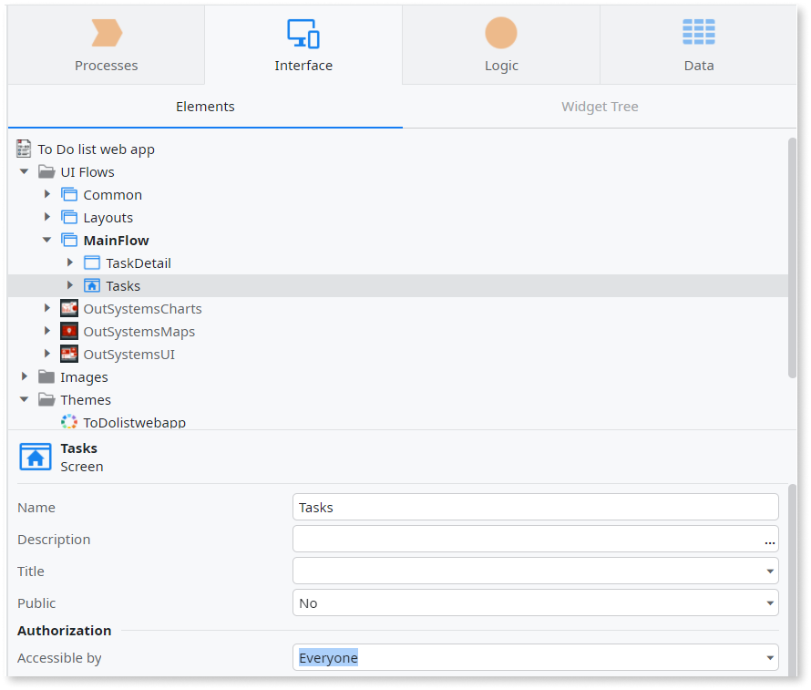
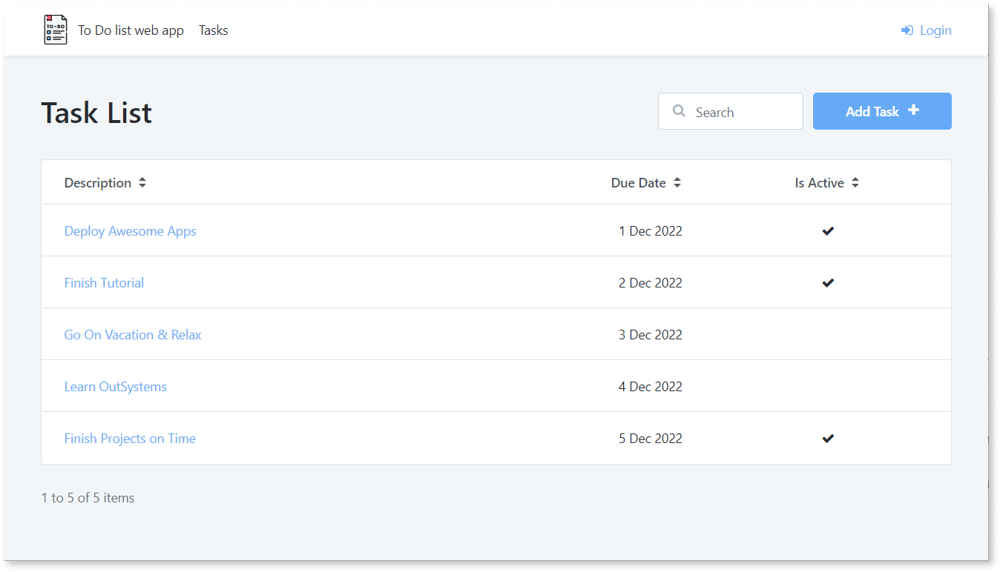

# Build a basic Web app

In this tutorial you'll build a basic **To Do list web app** from scratch. You can use your app to create, track and edit personal tasks. Building with ODC is fast; it should only take five minutes to go from scratch to a basic working app. 

## Prerequisites

To get started, you'll need:

* An OutSystems Developer Cloud (ODC) organization account.
* To download the [pre-built data model](images/task_data.xlsx). You'll use this file in step two.

## Get building

From ODC Portal, navigate to the **Apps** screen and click **Create app**. ODC Studio launches and the **What would you like to create?** window displays. Click **App > Web App**. Follow the steps below. 

### Step 1 - Define basic details

Name your app and add a description. Optionally define the color scheme and add a custom icon. Click the **Create app** button to continue. You can always fine-tune these details later on.

### Step 2 - Bootstrap data 

Click the **Data** tab on the right pane of ODC Studio. Right-click the Database folder and select **Import New Entities from Excel..**. Browse for the `task_data.xlsx` file (downloaded in Prerequisites section), select and click **Open**.

 ODC automatically bootstraps the data model and associated data into your app.

An entity is an element that allows you to persist and access information needed in your app. You now have an entity in your app called **Task**.

### Step 3 - Generate User Interface (UI)

Click the adjacent **Interface** tab and then double-click **MainFlow**. Verify **MainFlow** displays in the top right corner of the working canvas. Return to the **Data** tab and drag the **Task** entity onto the **MainFlow** canvas.

ODC automatically generates the UI of your app based on the data model.

A screen is a UI element that contains other UI elements that enable users to interact with your app. You now have two screens in your app: **Tasks** and **TaskDetail**.

### Step 4 - Set screen permissions

Click the **Tasks** screen on the **MainFlow** canvas. In the properties pane that displays, change the **Accessible by** setting to **Everyone**. Repeat this for the **TaskDetail** screen. This means anyone can access your app without the need to authenticate.

### Step 5 - Publish and view in browser

Click the green **1-Click-Publish** button in the top center of the workspace. Then click **Open in browser** to see the app in action. The app is running in the Development stage.

### Next steps.. 

You can take the basic app you've built and improve it in many ways. For example, you could add logic to delete tasks or add user authentication. Check out the resources below.

## Resources

There are lots of resources available to help you continue your ODC journey.

### Documentation

ODC documentation is here to help you build, publish, maintain, and troubleshoot your apps. The section you're reading now is a good starting point — check out the [links in the table of contents](https://success.outsystems.com/Documentation/outsystems-developer-cloud), or use the search to find something specific.

### Training

There are [free online courses](https://www.outsystems.com/training/courses/206/from-o11-to-outsystems-developer-cloud/) that teach how to use ODC.

### Community

The OutSystems community welcomes all. Join the community in the Forum, to share tips about working with OutSystems, get fresh ideas for your projects, or [talk about ODC with other developers](https://www.outsystems.com/forums/tag/6904/odc).
