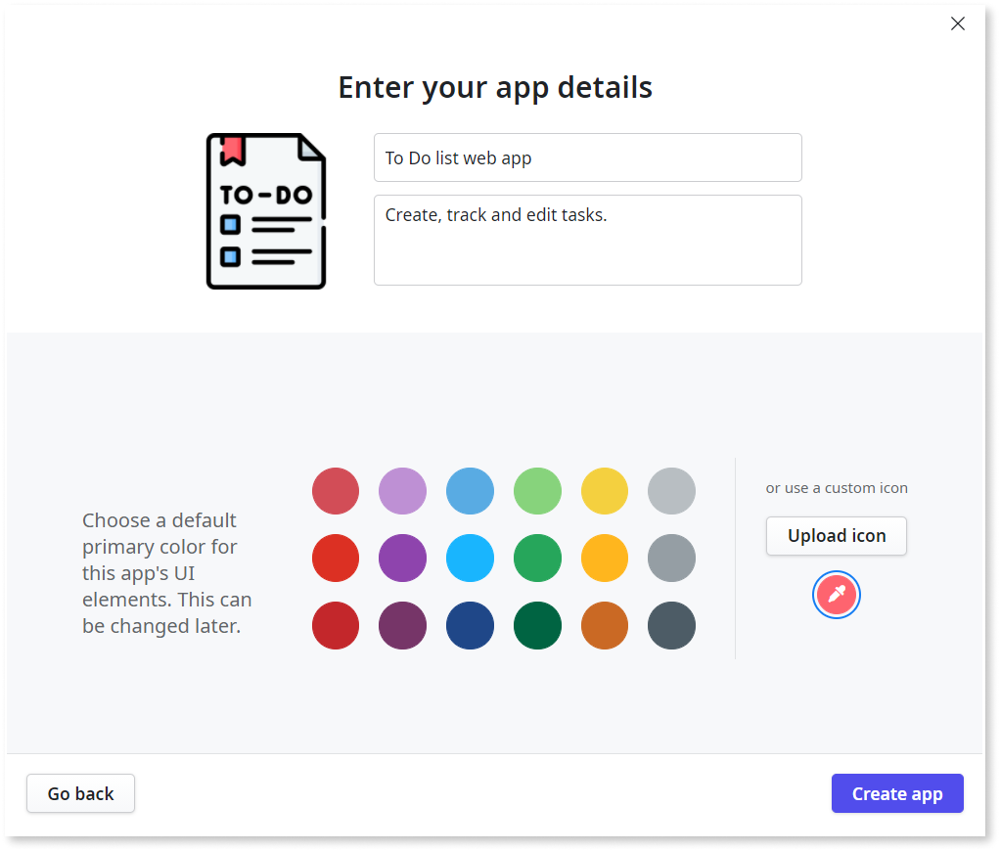
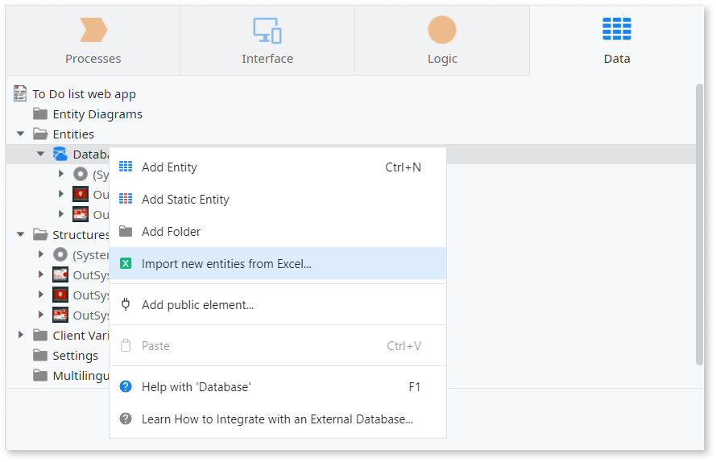
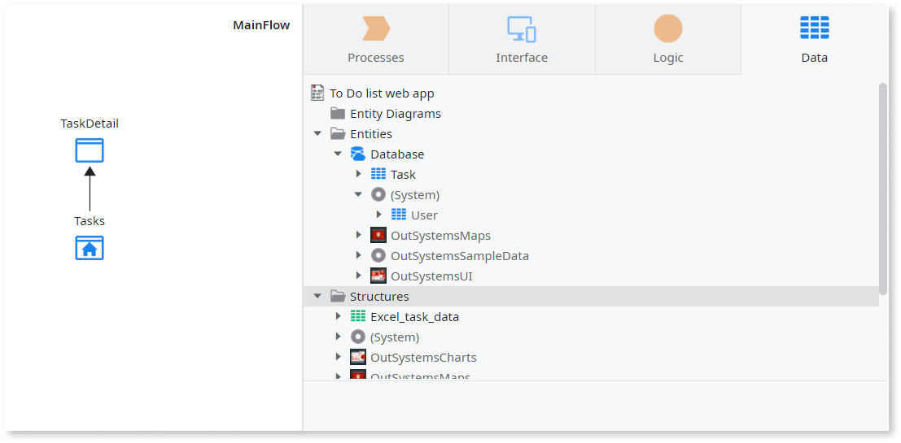
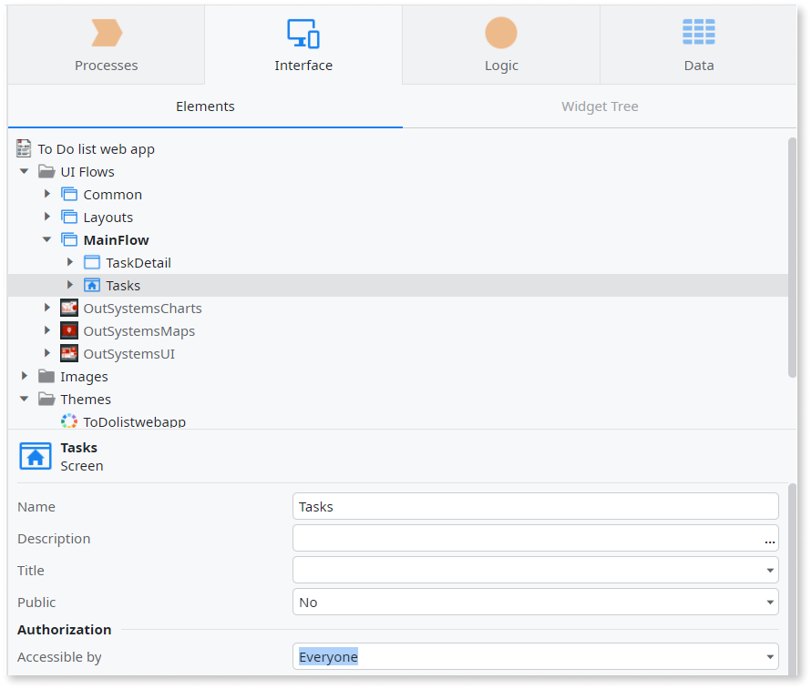
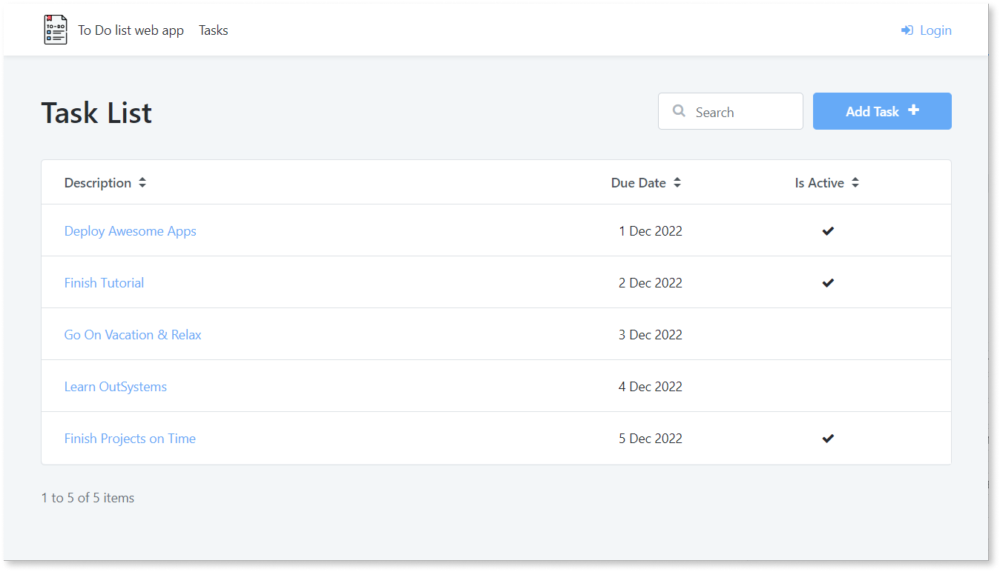

# Build a basic Web app

This tutorial walks you through the core ODC development loop: model the data, generate the screens, set access, publish, and view the result in a browser. The vehicle is a basic **To Do list Web app** for creating, tracking, and editing personal tasks. The same loop applies to every Web app you build in ODC, from a five-minute prototype to a production system.

ODC offers two paths to the same published app, at different levels of AI assistance:

* **Build with Mentor Web.** Generate the entire app from one natural-language prompt. Mentor produces the data model, the screens, the permissions, and the published app in a single pass.
* **Build manually.** Assemble entities, screens, and permissions step by step in ODC Studio. Use this path when you want to learn the manual data-import and screen-generation workflow.

Both paths share the same prerequisites and produce the same published Web app.

## Prerequisites

To build the app you need:

* An OutSystems Developer Cloud (ODC) organization account.
* For the manual path only: the [pre-built data model file](images/task_data.xlsx). Mentor Web does not need this file. It generates the data model from your prompt.

## Build with Mentor Web

Mentor Web takes a natural-language description and produces a working Web app in one pass, including the data model, screens, logic, and access rules.

1. In ODC Portal, select **Create app** > **Web app** > **Generate with Mentor**.

1. Enter a prompt such as: "Create a personal task management Web app. The app has one entity called Task with a title, a description, a due date, and a boolean for completion. Provide a list screen for browsing tasks and a detail screen for creating and editing tasks. Set both screens as Accessible by Everyone for testing."

1. Review the blueprint Mentor proposes. The blueprint lists the entity, the screens, and the access rules Mentor plans to generate. Adjust through follow-up prompts if anything is missing. For example: "add a created-at field to Task" or "show only incomplete tasks on the list screen by default".

    

    AI-generated code is non-deterministic. The same prompt produces different blueprints across runs. Review each blueprint before confirming, and iterate by follow-up prompt rather than by editing manually.

    

1. Confirm the blueprint. Mentor generates the app, publishes it to the Development stage, and opens it for review. Continue iterating in Mentor Web, or open the app in ODC Studio when you need fine-grained control.

For the full Mentor Web walkthrough, including prompt patterns, blueprint editing, and how to continue work in ODC Studio, refer to [Create an app with AI in ODC Portal](../agentic-development/mentor-web/create-app.md). To start from a structured requirements document instead of a prompt, refer to [Use requirement documents](../agentic-development/mentor-web/requirements-doc.md). For background on how Mentor Web interprets input, refer to [AI app generation in Mentor Web](../agentic-development/mentor-web/how-it-works.md).

## Build manually

This path walks you through the same To Do list app using only the visual editor. Use it when you want to see how ODC Studio handles Excel-based entity import and automatic screen scaffolding.

From ODC Portal, navigate to the **Apps** screen and click **Create app**. ODC Studio launches and the **What would you like to create?** window displays. Click **App > Web App**, then follow these steps.

### Step 1 - Define basic details

Name your app and add a description. Optionally define the color scheme and add a custom icon. Click the **Create app** button to continue. You can fine-tune these details later. The app's display name converts to the URL path. For naming rules, refer to [Application naming and URLs](../building-apps/app-naming.md).

### Step 2 - Bootstrap data

Click the **Data** tab on the right pane of ODC Studio. Right-click the Database folder and select **Import New Entities from Excel**. Browse for the `task_data.xlsx` file you downloaded in Prerequisites, select it, and click **Open**.

ODC automatically bootstraps the data model and associated data into your app.

An entity stores data your app reads and writes. Your app now has an entity called **Task**.

### Step 3 - Generate the user interface

Click the adjacent **Interface** tab and then double-click **MainFlow**. Verify **MainFlow** displays in the top right corner of the working canvas. Return to the **Data** tab and drag the **Task** entity onto the **MainFlow** canvas.

ODC automatically generates the UI of your app based on the data model.

A screen is the UI surface users interact with. Your app now has two screens: **Tasks** and **TaskDetail**.

### Step 4 - Set screen permissions

Click the **Tasks** screen on the **MainFlow** canvas. In the properties pane that displays, change the **Accessible by** setting to **Everyone**. Repeat this for the **TaskDetail** screen. This means anyone can access your app without authenticating.

### Step 5 - Publish and view in browser

Click the green **1-Click Publish** button in the top center of the workspace. Then click **Open in browser** to see the app in action. The app is running in the Development stage.

## Next steps

Extend the basic app with additional logic. For example, add a delete-task action, add user authentication, or send the same requirements to Mentor and compare the results. To continue iterating with AI, open the app in ODC Studio and use [Mentor Studio](../agentic-development/mentor-studio/modify-app.md) to add features through conversation. The resources below cover the broader ODC surface.

## Resources

### Documentation

Hands-on docs to pick up after this tutorial:

* [Building apps](../building-apps/intro.md). Reference for screens, logic, data, integrations, and the rest of the everyday development surface.
* [App architecture](../app-architecture/intro.md). How apps, libraries, themes, and templates compose into a portfolio.
* [Types of apps you can build](types-of-apps.md). Web, Mobile, and Agentic apps side by side, so you can choose the right type for your next build.
* [Create a custom app template](../app-architecture/reuse-templates.md). Turn the data model and screens you just built into a reusable starting point.
* [Deploy apps](../deploying-apps/deploy-apps.md). Move your app from the Development stage to production, with the same delivery pipeline every ODC app uses.

### Training

[Free online courses](https://learn.outsystems.com/training/journeys/web-developer-662/getting-started-with-odc/odc/523) teach the broader ODC development workflow.

### Community

Join the [OutSystems community forum](https://www.outsystems.com/forums/tag/6904/odc) to share tips, get fresh ideas, and talk about ODC with other developers.
