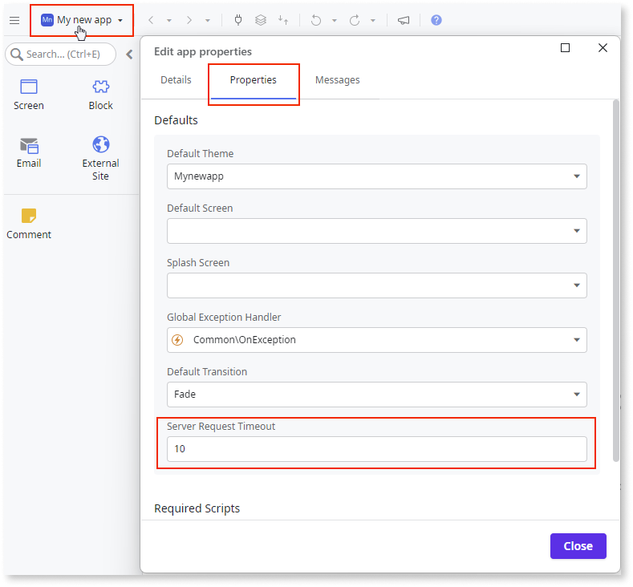

# OutSystems system requirements for ODC

This article provides recommendations for compatible tools and software versions that you can use with OutSystems Developer Cloud (ODC) Portal and ODC Studio.

To access ODC portal and connect to ODC Studio, ensure your local network allows access to `*.outsystems.dev` domains. For end-users to access ODC apps, their network must allow access to the `*.outsystems.app` domain or the [custom domain](../manage-platform-app-lifecycle/custom-domains.md) defined for each stage.
 
## ODC Portal

Use the most recent version of any of the following browsers:

* Edge
* Firefox
* Google Chrome
* Safari

## ODC Studio

Before you set up ODC Studio, make sure your computer meets the following requirements.

If you are working on a network where communications to the Internet are routed via an HTTP proxy, then refer to [How to configure HTTP proxy in ODC studio](configure-http-proxy.md) for configuration instructions.

### Minimum recommended hardware requirements

The following are the minimum recommended hardware requirements,however, keep in mind that many factors such as workload can affect performance.

* 1.8 GHz dual-core processor or better
* 2 GB of RAM (4 GB recommended)
* 1 GB of free disk space

### Operating systems

OutSystems supports the following Operating Systems. This list is subject to change. OutSystems supports Operating Systems for six months after the manufacturer's end-of-life date. For example, if your Operating System reaches its end-of-life on May 1, then OutSystems supports your operating system until November 1.

* macOS:
    * macOS Ventura since ODC Studio 1.4.10
    * macOS Sonoma since ODC Studio 1.4.10
    * macOS Sequoia since ODC Studio 1.5.0

* Windows:
    * Windows 11 (64-bit) since ODC Studio 1.3.15
    * Windows 10 (64-bit)

### Requirements for client-side debugging

To perform client-side debugging in ODC Studio using a desktop browser, use the most recent version of any of the following browsers:

* Google Chrome
* Microsoft Edge (only available for Windows)

## Software requirements for app users

The following sections specify the software requirements for Apps developed in ODC. 

**End User Requirements**:  Support for OutSystems browser continues for 6 months after end of support date announcement. This support applies to all end-users running OutSystems on that particular browser.

### Web apps

Use the most current version of the following browsers:

* Edge
* Firefox
* Google Chrome
* Safari

### Progressive web apps

* The default browser for the most current stable version of Android.
* The default browser for the most current stable version of iOS.

### Native mobile apps

For more information about the latest supported Android and iOS platform versions and the minimum requirements to generate mobile apps, refer to [Mobile Apps Build Service (MABS)](https://success.outsystems.com/support/release_notes/mobile_apps_build_service_versions/)

### Client-side traces

ODC supports the following client-side trace request limits: 

* Up to 400 trace requests every minute and 3500 requests daily per stage.

### Supported external data sources

The following versions of systems are supported to integrate with ODC:

* **Microsoft SQL Server**:

    * SQL Server 2014
    * SQL Server 2016
    * SQL Server 2017
    * SQL Server 2019
    * SQL Server 2022

* **Azure SQL**: 

    * Azure SQL Database
    * Azure SQL Managed Instance

* **PostgreSQL**:

    OutSystems supports self-managed, Aurora, and Azure provisions for PostgreSQL.

    * PostgreSQL 12
    * PostgreSQL 13
    * PostgreSQL 14
    * PostgreSQL 15
    * PostgreSQL 16

* **SAP**:

    * SAP ECC 5.0 or higher
    * SAP S/4HANA

* **Salesforce**

* **Oracle 19c**

For more information, refer to [Integrate with external data sources using Data Fabric](../integration-with-systems/external-databases/intro.md). 

### Supported external identity providers

ODC supports all IdPs that follow the OIDC standard. The following IdPs have been successfully tested to integrate with ODC apps:

* Linkedin
* Google
* Ping Federation Identity
* Facebook
* Apple
* Microsoft Entra ID (formerly known as Azure AD)
* Okta
* Keycloak

For more information, refer to [Configure authentication with external identity providers](../manage-platform-app-lifecycle/external-idps/intro.md). 

## Platform limits

The following table shows the limits of the ODC to keep in mind when you are building apps. Unless otherwise noted, each limit is stage-specific. These limits cannot be exceeded and may cause errors or a drop in performance if reached.

The general platform limits are:

| **Name**                                 | **Limit** | **Description** |
| ---------------------------------------- | --------: | ----------------------------------------------------------------------------------------------------------------------- |
| DB backup retention (days)               |        30 | The maximum number of days database backups are retained. |
| Expose REST API method timeout (seconds) |        60 | The maximum amount of time an Expose REST API method executes before timing out. |
| Max requests (per IP)                    |     5,000 | The maximum number of HTTP requests that can be made from a given IP address within a 5-minute window across all stages. |
| Service action timeout (seconds)         |       100 | The time a service action waits for a response before timing out. |
| Timer execution timeout (minutes)        |        60 | The maximum time a timer can execute. |
| Entity Action Execution duration (seconds) |        30 | The maximum execution duration of a single Entity Action in seconds. |
| Upload request size (MB)                 |      28.6 | The maximum file size allowed when uploading. |
| Maximum user session (hours)             |        12 | The maximum session duration after which the user will be asked to authenticate again. This value can't be changed and the duration is not extended while user is authenticated. |
| Invitation verification token (days)     |         7 | The maximum duration the verification token is valid for the user to complete their registration. |
| Self-registration verification token (minutes) |      15 | The maximum duration within which the user can complete the self-registration process. |

### Logs and traces

The logs and traces limits are:

| **Name**                                 | **Limit** | **Description** |
| ---------------------------------------- | --------: | ----------------------------------------------------------------------------------------------------------------------- |
| App log retention (days)                 |        28 | The maximum number of days that logs are retained (plus 21 days of additional backup retrievable via support ticket). |
| Log rate/minute (thousands)              |         2 | The maximum rate at which logs can be captured, in thousands per minute. |
| Trace retention (days)                   |        28 | The maximum number of days that traces are retained (plus 21 days of additional backup retrievable via support ticket). |
| Trace size (MB)                          |        15 | The maximum size of traces. Traces exceeding this are dropped. |
| Trace spans rate/minute (thousands)      |        50 | The maximum rate at which trace spans can be captured, in thousands per minute. |
| Client side trace requests every minute per stage  |        400 | The maximum number of client-side trace requests every minute. |
| Client side trace requests daily per stage  |           3500 | The maximum number of client-side trace requests daily. |

### Events

The event limits are:

| **Name**                                 | **Limit** | **Description** |
| ---------------------------------------- | --------: | ----------------------------------------------------------------------------------------------------------------------- |
| Concurrent events                        |       100 | The maximum number of events that can run concurrently per app. |
| Event duration (minutes)                 |         2 | The maximum duration of a handler of an event in minutes. |
| Events per queue                         |    10,000 | The maximum number of events that can be queued. Upon reaching the limit, an exception is thrown. |

### Custom code

The custom code limits are:

| **Name**                                 | **Limit** | **Description** |
| ---------------------------------------- | --------: | ----------------------------------------------------------------------------------------------------------------------- |
| Custom code execution duration (seconds) |        95 | The maximum time a single custom code function can execute. |
| Custom code memory (MB)                  |     1,024 | The maximum memory available for custom code functions while executing. |
| Custom code storage (MB)                 |       512 | The maximum amount of ephemeral storage available for custom code functions while executing. |
| Custom code payload size (MB)            |       5.5 | The maximum payload for inputs and outputs of a custom code action. |

### Workflows

The workflow limits are:

| **Name**                                 | **Limit** | **Description** |
| ---------------------------------------- | --------: | ----------------------------------------------------------------------------------------------------------------------- |
| Workflow activity max duration (seconds) |       120 | The maximum duration of a workflow activity. |

### AI Mentor

| **Name**                                    | **Limit** | **Description** |
| ------------------------------------------- | --------: | ----------------------------------------------------------------------------------------------------------------------- |
| App Generator max apps generated per day    |        20 | The maximum number of apps that can be generated in a day. |
| App Generator max apps generated per minute |         2 | The maximum number of apps that can be generated in a minute. |
| App Editor tab per user and app             |         1 | The maximum number of App Editor tabs that can be opened per user and app |

### Server request timeout

The maximum value of the **Server Request Timeout** property is 60 seconds for queries or actions initiated on the client side. The default value of the property is 10 seconds. You can change the default value in the app's property editor.

For queries or actions inside timer logic, the maximum timeout value is 60 minutes.
