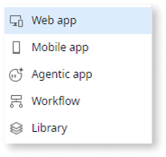
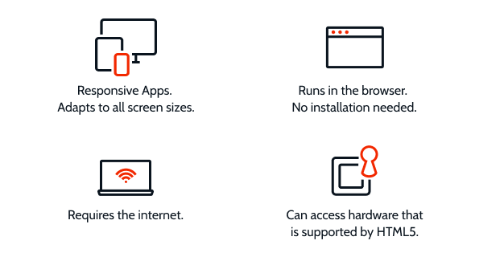
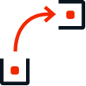
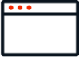
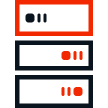
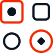

# Types of apps you can build

OutSystems Developer Cloud (ODC) supports several top-level asset types: Web apps, Mobile apps, Agentic apps, libraries, and workflows. You select the type when you create the asset. **Agentic development** through Mentor Web and Mentor Studio is the default build path for Web apps, and Mentor Studio extends to libraries and Agentic apps. The visual editor in ODC Studio is available for every type. For the full list of assets each AI tool supports, refer to [Agentic development](../agentic-development/intro.md).

* Select **Web app** if you want to create an app that users run mainly in a desktop browser.
* Select **Mobile app** if you want to create an app to submit to Apple App Store or Google Play. You can also distribute a mobile app as a downloadable package to a group of users or as a Progressive Web App (PWA).
* Select **Agentic app** if you want to build an app that uses AI at runtime to perform tasks, automate workflows, or handle complex, multi-step interactions.

The runtime type and the build approach are independent choices. An **Agentic app** is the runtime type: an app that calls AI when users run it. **Agentic development** is how you build apps with AI assistance from Mentor Web or Mentor Studio. The two are independent. You can build an Agentic app manually, or use agentic development to produce a Web app.

## What's a Web app?

In ODC, a Web app has a responsive interface that runs in the browser. The user experience is excellent across many types of devices and screen sizes.

When you develop a Web app:

* You can build apps using the client-side runtime and create responsive UX.
* Your apps run on a modern stack.

  

## What's a Mobile app?

In ODC, a Mobile app compiles to a native Android or iOS app. The same app adjusts to the device form factor at runtime, so you build once and ship to phone and tablet from a single source.

You can distribute a Mobile app in two ways:

* **Native app package.** A dedicated OutSystems cloud service generates native mobile builds for you to distribute in the app stores or internally to a group of users.
* **Progressive Web App (PWA).** Lightweight apps with the look and feel of native mobile apps. They're quick to distribute and install directly from your website, and they don't depend on the app stores.

## What's an agentic app?

In ODC, an Agentic app is a type of app that uses AI to act autonomously. These apps perform background operations and lack a user interface. Instead, Web or Mobile apps consume their capabilities to create intelligent, automated experiences.

## Comparison between Web, Mobile, and Agentic apps

Here is a table comparing the features of Web, Mobile, and Agentic apps.

| |**Web app**  |**Mobile app** |**Agentic app** |
|:-:|:-:|:-:|:-:|
|**Code Reusability**| Common logic for all devices and screen sizes.| Common logic for all supported native mobile platforms, and supported browsers for PWAs.| Web and Mobile apps can consume reusable logic.|
|**Runs in**| A browser. No installation is needed.| Native mobile apps run on Android and iOS devices. PWAs run on any device with a supported browser.| Runs on the server. Doesn't have a user interface.|
|**User Experience**| Responsive layout for all screen sizes and types.| Dedicated mobile UI patterns and experiences.| No direct user experience; provides capabilities to other apps.|
|**Access to device hardware**| HTML5 supported device capabilities.| Native mobile apps access a range of device capabilities through Cordova plugins. PWAs use dedicated plugins, which by design can access only hardware that the browser running the PWA allows.| Not applicable. Operates on the server-side.|
|**Offline capabilities**| No offline capabilities.| For storing offline data, native mobile apps use local storage and PWAs use browser storage.| No offline capabilities.|
|**Deployment and updates**| Updates are automatic when users refresh the browser page.| Native mobile apps can update automatically, and users need to install a new version only when you change the native shell. PWAs update automatically when the app detects a new version.| The server deploys updates, making them immediately available to consuming apps.|
|**Distribution**| Share the app link with users.| You can distribute native mobile apps in-house or through the app stores. Users can run a PWA directly from your website, and add the app icon to the device home screen.| Exposed and consumed as a Service Action by other apps within the ODC environment.|

## What's a library?

A library is a reusable top-level asset that other apps consume for UI components, logic, or themes. Libraries are stateless by design: they provide functionality without persisting data, which keeps apps modular and reduces duplication. ODC supports general-purpose libraries for web and mobile apps, and mobile libraries for native mobile capabilities. For details, refer to [Libraries](../building-apps/libraries/libraries.md).

## What's a workflow?

A workflow automates a business process: a repeatable sequence of activities, decisions, and human approvals that runs in response to events from your apps. You design workflows in the workflow editor, a visual web-based tool in ODC Portal. Workflows are a top-level asset type with their own independent lifecycle, alongside apps and libraries. For details, refer to [Workflows in ODC](../building-apps/workflows/workflows-in-odc.md).

## Related resources

* [Intro to OutSystems Development (ODC)](https://learn.outsystems.com/training/journeys/intro-to-outsystems-development-570) online course
