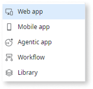
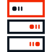

# Types of apps you can build

You can create different types of apps in OutSystems Developer Cloud (ODC).

* Select **Web app** if you want to create an app that users run mainly in a desktop browser.
* Select **Mobile app** if you want to create an app to submit to Apple App Store or Google Play. You can also distribute a mobile app as a downloadable package to a group of users or as a Progressive Web App (PWA).
* Select **Agentic app** if you want to build an app that uses AI to perform tasks, automate Workflows, or handle complex, multi-step interactions.

**Libraries** exist at the same level as apps and let you share code between apps. You can learn more about them in [App Architecture](../app-architecture/intro.md#libraries-in-odc).

## What's a Web app?

In ODC, a Web app has a responsive interface that runs in the browser. The user experience is excellent across many types of devices and screen sizes.

When you develop a Web app:

* You can build apps using the client-side runtime and create responsive UX.
* Your apps run on a modern stack.

  

## What's a Mobile app?

In ODC, a Mobile App is an app that compiles to a native mobile Android or iOS app.

You can develop for Android and iOS at the same time, as the underlying code is cross-platform. The default app templates of this type are **Phone app** and **Tablet app**.

There are two ways you can distribute a Mobile app:

* **Native app package** - A dedicated OutSystems cloud service generates native mobile builds for you, to distribute your app in the app stores or internally to a group of users.

* **Progressive Web App (PWA)** - PWAs are lightweight apps that have the look and feel of native mobile apps. They're quick to distribute and install directly from your website, as they don't depend on the app stores.

## What's an Agentic app?

In ODC, an Agentic app is a type of app that uses AI to act autonomously. These apps perform background operations and lack a user interface. Instead, Web or Mobile apps consume their capabilities to create intelligent, automated experiences.

## Comparison between Web, Mobile, and Agentic apps

Here is a table comparing the features of Web, Mobile, and Agentic apps.

| |**Web app**  |**Mobile app** |**Agentic app** |
|:-:|:-:|:-:|:-:|
|**Code Reusability**| Common logic for all devices and screen sizes.| Common logic for all supported native mobile platforms, and supported browsers for PWAs.| Web and Mobile apps can consume reusable logic.|
|**Runs in**| A browser. No installation is needed.| Native mobile apps run on Android and iOS devices. PWAs run on any device with a supported browser.| Runs on the server. Doesn't have a user interface.|
|**User Experience**| Responsive layout for all screen sizes and types.| Dedicated mobile UI patterns and experiences.| No direct user experience; provides capabilities to other apps.|
|**Access to device hardware**| HTML5 supported device capabilities.| Native mobile apps access a range of device capabilities through Cordova plugins. PWAs use dedicated plugins, which by design can access only hardware that the browser running the PWA allows.| Not applicable. Operates on the server-side.|
|**Offline capabilities**| No offline capabilities.| For storing offline data, native mobile apps use local storage and PWAs use browser storage.| No offline capabilities.|
|**Deployment and updates**| Updates are automatic when users refresh the browser page.| Native mobile apps can update automatically, and users need to install a new version only when you change the native shell. PWAs update automatically when the app detects a new version.| The server deploys updates, making them immediately available to consuming apps.|
|**Distribution**| Share the app link with users.|  You can distribute native mobile apps in-house or through the app stores. Users can run a PWA directly from your website, and add the app icon to the device home screen.| Exposed and consumed as a Service Action by other apps within the ODC environment.|

## Related resources

* [Intro to OutSystems Development (ODC)](https://learn.outsystems.com/training/journeys/intro-to-outsystems-development-570) online course
