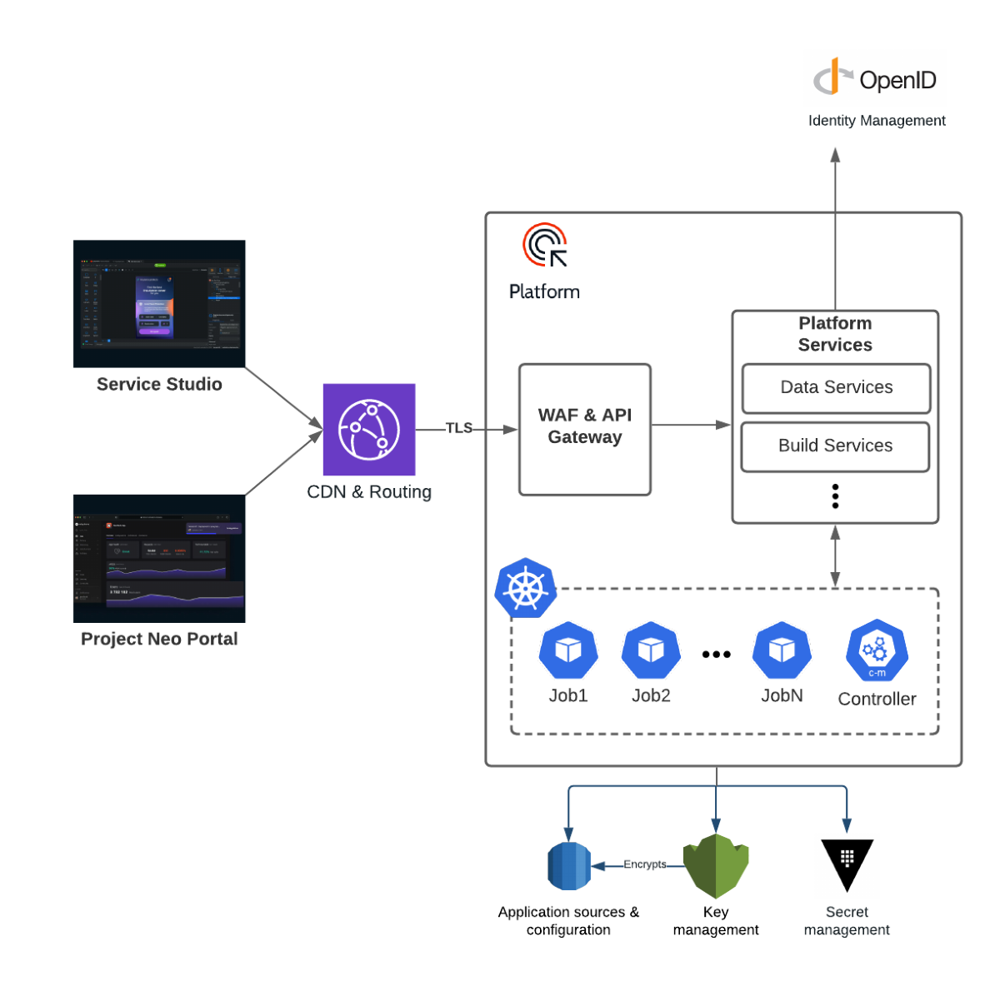
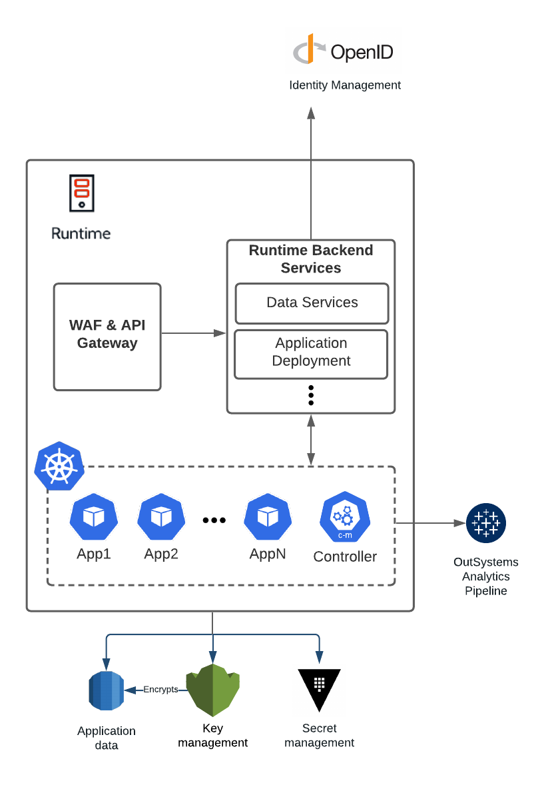

# Infrastructure architecture

Project Neo documentation is under construction. It's frequently updated and expanded. Leave your feedback and help us build the most useful content.

This article provides an overview of the
infrasturcture architecture of Project Neo.

## OutSystems overview
Project Neo is cloud-native. This means that the infrastructure of both the development **Platform**, for building and deploying applications, and **Runtime**, for hosting and running the deployed applications, live in the cloud. 

### Platform 
The development **Platform** comprises multiple services, each responsible for specific functions to facilitate the building and deployment of applications. All the Platform services benefit from a resilient microservices design with a web service interface. Developers, DevOps, and Architects interact with these services using tools such as Service Studio and the Project Neo Portal.

An example of a service is Build Services, triggered by a developer clicking the 1-Click Publish (1CP) button in Service Studio, which takes the visual language model developed in Service Studio (.oml file) and turns it into a compiled application to deploy. All the Platform services benefit from automatic recoveries and continuous upgrades, leveraging the cloud-native architecture.

### Runtime
In Project Neo the **Runtime** is independent of the Platform and comprises multiple **stages**, each independent of the other, that serve to host and run the deployed applications. The default Runtime setup is a Development stage, a Test stage, and a Production stage. Staging lets multiple teams deliver independently and in parallel, a canonical part of the **continuous integration** approach to software development.

Both the Platform and each of the Runtime stages have isolated, encrypted, and scalable databases and data stores.

## OutSystems cloud infrastructure
Project Neo's cloud-native infrastructure lives in Amazon Web Services (AWS) Virginia region.

### Key Technologies
The following is an overview of the best-in-class cloud technologies Project Neo uses.

#### Kubernetes
 The beating heart of both the Platform and each of the Runtime stages is the **Kubernetes cluster**. Powered by Amazon's Elastic Kubernetes Service (EKS), clusters are isolated but scalable and self-healing compute capacity.

For the Platform, each service has one or more jobs it creates in the cluster to process. So for Build Services, these jobs would include generating the compiled code from the OutSystems visual language model (.oml file), optimizing the compiled code, and then generating the compiled application. The cluster compute capacity is scalable, which means multiple developers can use Build Services or any other service concurrently without any degradation in the performance of the Platform. This lets multiple teams rapidly scale the development process independently of the deployed applications.

#### Containers
If you think of the jobs as finite tasks running in the Platform cluster to facilitate the building and deployment of applications, think of **applications** as running continuously in the clusters of the Runtime stages. In Kubernetes, applications are packaged into a **container**—a lightweight, standalone, executable package of software that includes everything needed to run an application: code, runtime, system tools, system libraries, and settings. In the example of the Build Services jobs, the "compiled application" generated is a container image. An instance of a **container image** is a container. Docker is the industry-standard technology that underpins the Linux containers in Project Neo.

Each application is deployed into a separate container, making the infrastructure resilient to noisy neighbors, individual resource-intensive application(s) degrading the performance of other applications in a given Runtime stage.

Containers running in the Production stage cluster are replicated across three Availability Zones to ensure High Availability for applications running in production. The controller of the cluster is responsible for load-balancing.

#### Data in the cloud
Service Studio and the Project Neo Portal connect to the API Gateway, which handles all the requests to the Platform services. The services then create the compute jobs in the cluster, that make calls to the databases and data stores through the Data Services service—think of this as a data access layer. The jobs communicate with Data Services through the cluster controller.

The following table lists and describes the databases and data stores of the Platform: 

| Data stored | Service used | Service description (via AWS) | Availability |
| - | - | - | - |
| Application version and dependency information. | Amazon Aurora | A PostgreSQL-compatible relational database built for the cloud. | High Availability through replication across three Availability Zones. |
| Current and historic application revisions, in the form of .oml files, stored as blob data. | S3 | An object storage service offering industry-leading scalability, data availability, security, and performance. | High Availability by default. |
| Configuration and metadata from Platform Build Services. | DynamoDB | A fully managed, serverless, key-value NoSQL database designed to run high-performance applications at any scale. | High Availability by default. |
| Current and historic application container images. | Elastic Container Registry (ECR) | A fully-managed Docker container registry that makes it easy to store, share, and deploy container images. | High Availability by default. |

Each Runtime stage has an isolated Amazon Aurora database that scales for both compute and storage. The Amazon Aurora database for each stage is High Availability through replication across three Availability Zones.

#### Services in action
In addition to storing the container image in the ECR, Build Services passes it to be deployed by the Application Deployment service on the specified Runtime stage. The Application Deployment service of the specified Runtime stage coordinates the deployment of the container into the cluster.

There is no theoretical limit to the number of applications that can be deployed to and run simultaneously in each stage. The compute capacity of the Kubernetes cluster is scalable. This lets each of your applications scale independently with segregated compute capacity.

The idea of "Build once, deploy anywhere"—the build process not making strong assumptions about the environment the application is to be deployed into—is a canonical part of the **continuous delivery** approach to software development.

### Traffic
Each customer infrastructure is isolated by namespace, ensuring complete network isolation. 

#### Internal
All requests between the isolated Platform and Runtime stages are over TLS through NATS. 

#### External
All requests into both the Platform and the Runtime stages go through a Content Delivery Network (CDN) and Web Application Firewall (WAF).

### Logging, Monitoring, and Analytics
Logs and metrics are collected from the cluster of the Runtime stages and passed to the OutSystems Analytics Pipeline.

Automatic monitoring by EKS replaces unhealthy containers running in the Runtime stage clusters.

Site Reliability Engineering on the Platform is supported by automated monitoring.
