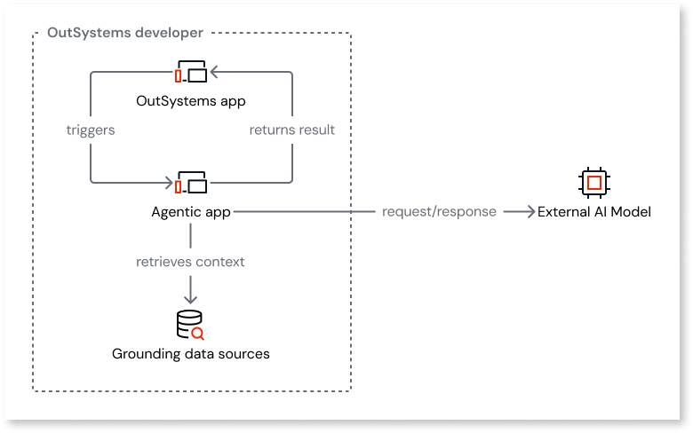

# AI integration

Integrating with external AI systems in ODC involves a set of distinct components. At the core of this integration is the connection to an **external AI model**, which provides the intelligence. An **agentic app** acts as the native interface to this external system, while **grounding data** serves as the business-specific payload sent to it.

This article describes the role of each component in the context of external system integration.

## AI models

An AI model is a third-party service that provides reasoning, language, and other cognitive capabilities. This is the core external system that your OutSystems AI-powered app integrates with.

AI models receive requests from your OutSystems app, process the information, and return a response. The entire integration pattern is designed to send data to and receive data from this external endpoint.

For more information about integrating AI models into your app, refer to [AI models and search services in ODC](../building-apps/build-ai-powered-apps/integrate-ai-models-logic-rag.md).

## Agentic apps

The agentic app is a native ODC component that you build to act as a structured interface for the AI model. It's not an external system itself, but rather the primary tool for communicating with one. It's an orchestrator built in ODC Studio that encapsulates the logic, inputs, and outputs for a specific AI-driven task.

The agentic app’s purpose is to manage all interactions with the external AI system. You use the agent to:

* Formulate the prompt or request to be sent to the AI model.

* Manage the request-response lifecycle.

* Process the data returned by the external system.

For more information about agentic apps, refer to [Agentic apps in ODC](../building-apps/build-ai-powered-apps/agentic-apps.md).

## Grounding data

Grounding data is the business-specific information that you send to the AI model to provide context. This collection of real-time, factual data acts as the payload for the external system. You can retrieve data from your app's entities or source this data from an [AI search service](../building-apps/build-ai-powered-apps/ai-models.md), a [Model Context Protocol (MCP) server](../building-apps/build-ai-powered-apps/tools/intro.md), or an external [REST API](consume_rest/intro.md).

This data is packaged within the agentic app to be included in the request sent to the external AI model to provide the external system with the necessary context to perform its task accurately. The **GetGroundingData** action inside the **AgenticFlow** action is the mechanism for preparing this payload. Without this payload, the calls to the external system are generic.

For more information about grounding data, refer to [Agentic apps in ODC](../building-apps/build-ai-powered-apps/agentic-apps.md#grounding).
