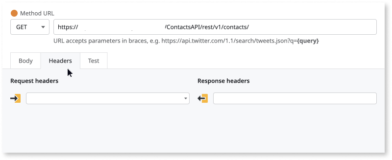
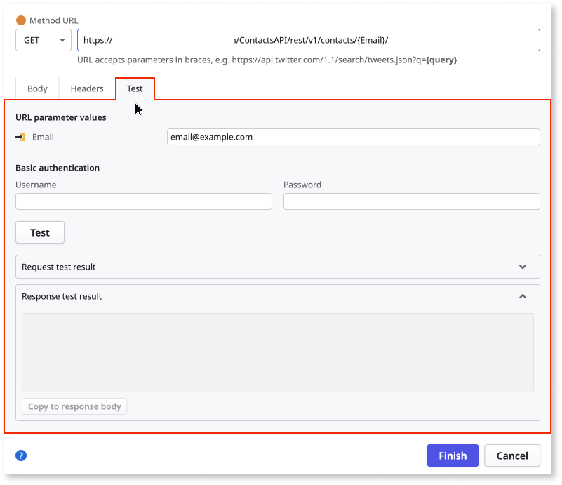
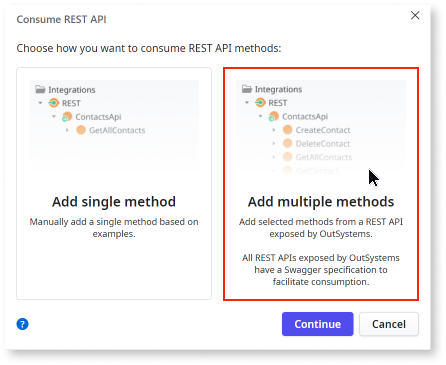
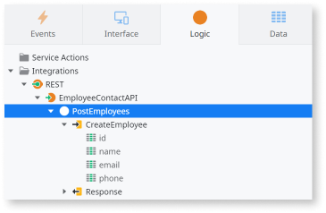

# Consume one or more REST API methods

Consuming [ODC REST APIs](../../reference/apis/public-rest-apis/overview.md) in you app lets you integrate external data and functionality into your OutSystems Developer Cloud (ODC) apps. This allows your apps to interact with services provided by third-party platforms, internal microservices, or APIs exposed by other ODC libraries or apps. Before starting the consumption process in ODC Studio, ensure you have the details from the target API's documentation, including its base URL, required authentication methods, and the structure of relevant request and response parameters.

OutSystems recommends that you use an ODC library to encapsulate the consumption of the API methods and expose them as separate server actions. This allows you to reuse the REST integration across multiple ODC apps and handle authentication, data mappings, and error processing only once.

In ODC Studio you can add several methods of a REST API or add only a single API method. For detailed information, refer to [Consuming REST APIs](https://learn.outsystems.com/training/journeys/consuming-rest-api-207/consuming-a-rest-api/odc/7996). For a quick guided video tour on using APIs, refer to [Consuming a REST API in 10 minutes with OutSystems](https://youtu.be/gNyWIeJYfG0).

To modify the request and response of an API, refer to the [customization section](simple-customizations.md).

## Add a single REST API method { #single-method }

You can consume a **single method** of a REST API, based on the example content provided for the request and response. For `POST` or `PUT` methods, you can specify the input parameters in the URL and the request structure in the body.

To consume a single REST API method, follow these steps:

1. In the **Logic** tab, open the **Integrations** folder.

1. Right-click on the **REST** element and select **Consume REST API**.

    

1. In the displayed dialog, choose **Add single method** and click **Continue**.

    

1. Choose the HTTP method and enter the **Method URL**. You can include parameters between braces in the URL for the method's input parameters.

    Examples:  
    `GET https://api.example.com/Portal/rest/Contacts/GetAll`  
    `GET https://api.example.com/Portal/rest/Contacts/Get?Id={Id}`  
    `POST https://api.example.com/Portal/rest/Contacts/Create`  

    Each input parameter defined between braces in the URL becomes an input parameter of the method.

    

    **Note:** Input parameters in URL query strings must follow a specific format. See [Using parameters in the URL query string](#using-params-query-string) for details.

    

1. If the REST API you are consuming requires specific headers or uses HTTP Basic Authentication, click the **Headers** tab and enter the details for request and response headers.

    

1. Enter the request and the response structures of the API. To enter these details, you can test the API and use the test result.

    Alternatively, you can add the JSON structure or plain text example directly in the **Request** and **Response** fields. 

    To test the API, click the **Test** tab. If you have parameters in your **Method URL**, you need to enter the parameter values to execute the test:

    

    For HTTP methods, such as `POST` or `PUT` enter the request structure in the **Body**.

    

1. Click **Test**. If the test is successful, you see the method's response in the Response area.

    Click **Copy to Response body** to fill in this response structure in **Response**. 

    For HTTP methods such as `POST` or `PUT`, click **Copy to Request body** to fill in this request structure to **Request**.

    
    
1. Check if the **Request** and **Response** information is correct in the **Body** tab and click **OK**:

    

Once you have successfully added the API method, ODC Studio automatically [creates structures and API method](#what-odc-studio-creates-when-you-import-a-rest-api) for the API. 

You can use the ODC portal to change the base URL at any time using the app configuration.

## Add several methods of a REST API { #all-methods }

You can consume multiple methods of a REST API, either all available methods or only the ones you select if that API is compliant with the [OpenAPI specification](https://swagger.io/specification/). REST APIs exposed by OutSystems are compliant with OpenAPI specification. You can import the OpenAPI specification either by providing a URL or by selecting a local file.

To add several methods of a REST API, follow these steps:

1. In the **Logic** tab, open the **Integrations** folder.

1. Right-click on the **REST** element and select **Consume REST API**.

    

1. In the displayed dialog, choose **Add multiple methods** and click **Continue**. .

    

1. Enter the URL where the OpenAPI specification is stored or upload the specification file from your local system and click **Add methods**.

    

    If you're importing an OpenAPI 3.0 specification file and the specification includes more than one base URL, choose the desired URL and click **Finish**.

    At any point, from the ODC portal, you can change the base URL using the app configuration.

    

1. Choose the REST API methods you want to consume and click **Finish**. By default, all methods are selected.

    

Once you have successfully imported the OpenAPI specification file, ODC Studio automatically [creates structures and API methods](#what-odc-studio-creates-when-you-import-a-rest-api).

The API methods with its corresponding input and output parameters are listed under **Logic > Integrations > REST**.

## What ODC Studio creates when you consume a REST API

When importing the REST API, ODC Studio does the following:

* Creates the REST API.
* Creates REST API methods with the corresponding input and output parameters
* Creates the [structures](rest-api-structures.md)) to hold the corresponding input and output parameters under a new tree element with the REST API name

    

* Maps the [REST Data Types into OutSystems Data Types](rest-api-structures.md#mapping-rest-data-types-to-outsystems-data-types)

    

## Configure API base URL and basic authentication

Once you have consumed the API in ODC Studio. You can modify the following details from the ODC Portal:

* Base URL that you entered while consuming the API. Once the app is deployed to a different stage, the base URL can be be modified for that stage. For example,when you are building or testing your app in a dev environment, you must connect to a version of the REST API that is specifically designated for dev purposes, rather than the production version. Once the app is deployed to production you can modify the base URL and connect to production API.
  
* Basic authentication details such as **username** and **password**. The authentication credentials can also be configured for every stage.

For ODC REST APIs, you can keep the same base URL.

To configure the base URL and basic authentication credentials, follow these steps:

1. Go to ODC Portal and select your app.

2. Click **Configuration > Consumed REST APIs**.

3. Edit the details and click **Save**.

The newly configured base URL and authentication details now applies to the API for that stege.

## Use a REST API Method in your app { #use }

OutSystems translates the methods exposed by a REST API into **OutSystems actions**, with the same semantics as any action created by you in ODC Studio.

You can now use the newly created methods in your application the same way you use any Server Action:

1. Go to the action flow where you want to use the REST API Method.
  
    

1. In the **Logic** tab, open the **Integrations** folder and the **REST** element.

1. Expand the REST API element and drag the REST API Method into your action flow.
  
    

1. Use the method's output parameters as you do for any other action.
  
    

## Using parameters in the URL query string { #using-params-query-string }

OutSystems supports using input parameters in URL query string as name/value pairs, like in `key={value}`, where `value` is an input parameter. The URL query string is the part of the URL after the `?` (question mark) character.

For example, you can use the following URLs:

* `http://apps.example.com/Orders/{id}/?show_details={ShowDetails}`

    Uses `id` outside the query string, as part of the URL.  
    Uses `ShowDetails` as the value of a query string parameter, following the allowed format (`key={value}`).

* `http://apps.example.com/Orders/?key1={value1}&key2={value2}`

    Uses `value1` and `value2` as input parameters, following the allowed format.  
    You can separate parameters in the query string using the `&` (ampersand) character.

Using input parameters in the query string following a different format, or as a way of defining the whole query string, is **not supported** in OutSystems.

For example, you can't use any of the following URLs because they're not currently supported:

* `http://apps.example.com/Orders/?{key}={value}`

    You can't use an input parameter (in this case, `key`) to define a query string parameter name.

* `http://apps.example.com/Orders/?key={value1},{value2}`

    You can't use several input parameters (in this case, `value1` and `value2`) to define a composed value for a query string parameter.

* `http://apps.example.com/Orders/?name={"last":{value1},"first":{value2}}`

    You can't use JSON structures as query string parameter values.

* `http://apps.example.com/Orders/?{QueryString}`

    You can't define a generic query string that's only defined at runtime using an input parameter.

## Related resources

* [Configure API authentication](intro.md#configure-api-authentication)
* [REST API Structures](rest-api-structures.md)
* [Handling REST API errors](handling-rest-errors.md)

