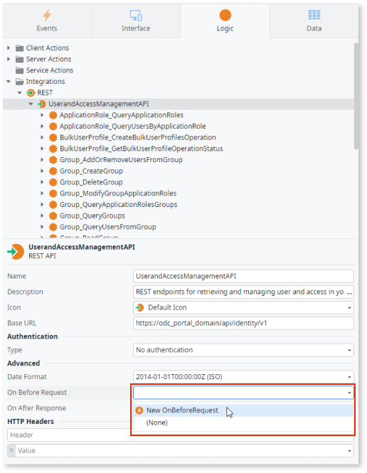
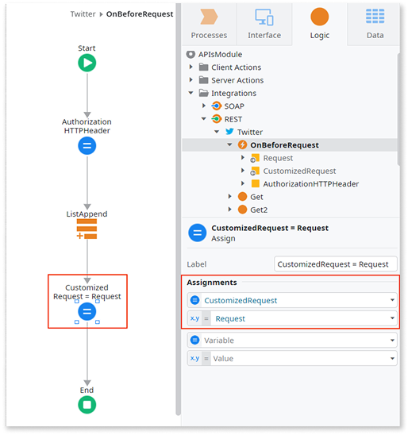
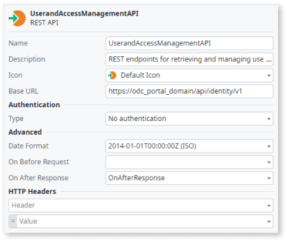
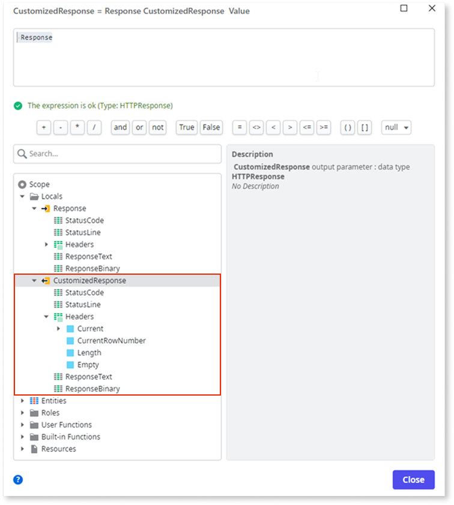

# Simple customizations

When consuming a REST API, you can add logic to customize the information sent in requests or received in responses. Use the following callbacks for this purpose:

**OnBeforeRequest**
:   Use to modify the information of the original request, such as the URL, the request text or the headers. 

**OnAfterResponse**
:   Use to modify the information of the original response, such as the status code or the response text. 

In these callbacks you can access the information from the original request or response, manipulate it and assign a modified value to the customized request or response.

In the [OutSystems Forge](https://www.outsystems.com/forge/) you can find several components providing an interface to third-party services using REST integration, such as the [Box Connector](https://www.outsystems.com/forge/component/586/box-connector/) or the [JIRA Connector](https://www.outsystems.com/forge/component/936/jira-connector/). These components provide information about how you can customize REST requests and responses.

Using this simple customization method you can add HTTP headers and/or change their values, but you can't remove existing headers. 

## Customize the request

To customize the request before it's sent, follow these steps:

1. Set the **On Before Request** property of the REST API to `New OnBeforeRequest`.
  
        

    The REST API now includes an **OnBeforeRequest** action.   

1. Double-click the newly created action to edit it. 

1. Add your own logic to customize the request. 

### Example use case: Adding a header for token-based authentication

Consider a REST API that uses token-based HTTP authentication, requiring consumers to include an authorization token in an HTTP header. After importing this REST API to your OutSystems application, use the **OnBeforeRequest** callback to add a new header with the token.

The following steps outline the callback logic flow for this example implementation:

1. Add a local variable with `HTTPHeader` data type to the **OnBeforeRequest** callback action.

1. Define a new HTTP header (name and value) using the local variable you created in the previous step.

    Example:  
    Name = `"Authorization"`  
    Value = `"Bearer " + AccessTokenVar`

1. Add this header to the list of request headers using the "ListAppend" action.
   The current request headers are in the **Request.Headers** attribute.

1. Set the **CustomizedRequest** output parameter to the modified **Request** using an **Assign** element.

## Customize the response

To customize the response after it has arrived:

1. Set the **On After Response** property of the REST API to `New OnAfterResponse` action.

    

    The REST API now includes an `OnAfterResponse` action.

1. Double-click the newly created action to edit it.

1. In the logic flow, double-click **Assign** and choose from the available attributes to customize the response.

    

    **StatusCode**
    :   The status code received from the API. The data type is `integer`.

    **StatusLine**
    :   The name of the status code received from the API. The data type is `Text`.

    **Headers**
    :   List of headers received from the API. The data type is  `HTTPHeader List`.

    **ResponseText**
    :   The response body in plain text format received from the API, such as JSON or XML. The data type is `Text`. For example, user details, such as name and email.
  
    **ResponseBinary**
    :   The response body in binary format received from the API, such as an image or a file. The data type is `Binary Data`. For example, the user's profile picture.

    

    Review the API documentation to understand the expected response formats before making the API call.

    

