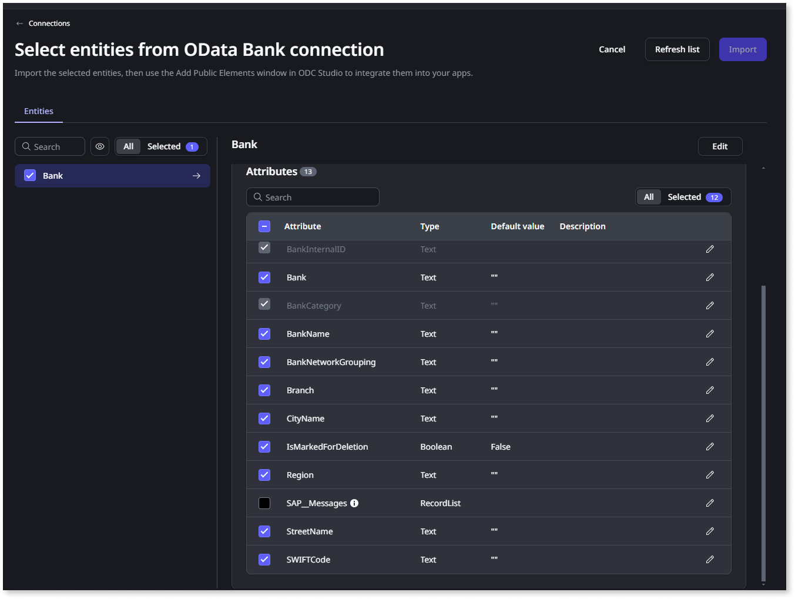
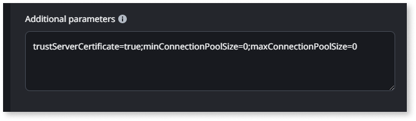

# Create connections to external data sources

To integrate with external data sources using [Data Fabric](intro.md), Administrators need to create the connections to the external data sources and AI search services in the ODC Portal. Then, in ODC studio, developers use the data through entities or server actions in their apps. 

The supported data sources are listed at [ODC system requirements](../../getting-started/system-requirements.md#supported-external-data-sources).

Administrators must:

* Set up configurations for each stage, such as development, QA, and production, to connect an app to an external database.
* Ensure the app and its connection information are in the same stage. Additionally, the database model must be the same in all the stages.

## Permission requirements

Before accessing data from an external database, verify that you have the correct access to the database and ODC. By default, only administrators can manage connections and select entities. Managing connections requires the following permissions:

* Configure Connections
* Connection management

External data connections can be created with read-only permissions or other permission restrictions. Entity CRUD actions (to create, update, or delete records) are always automatically created in ODC Studio regardless of the permissions of the database connection user. If you intend to use the full CRUD actions, ensure the database users carry the proper permissions.

## Private gateway

To access private data that is not available over the internet, connect to your external data source through a [private gateway](../../manage-platform-app-lifecycle/private-gateway.md). The connection process varies depending on the type of data source:

* Relational database:
    1. In the ODC Portal, open the connection configuration screen. Enter `secure-gateway` in the `Server`/`Host` field, and the secure gateway port in the `Port` field.
* SAP BAPI database:
    1. Run the Cloud Connector with the following command: `./outsystemscc --header "token: <token>" <secure-gateway-address> R:<local-port>:<sap-ip-address>:<remote-port>` . This directs traffic from `secure-gateway:<local-port>` to `<sap-ip-address>:<remote-port>`. 
    1. In the ODC Portal, open the SAP BAPI connection screen. Enter `/H/secure-gateway/S/<local-port>/H` in the `SAP route string` field. SAP validates the value of the Application Server field by comparing it to its known hostnames. To route requests through the Cloud Connector and still use a valid Application Server value, a [SAP Router](https://support.sap.com/en/tools/connectivity-tools/saprouter.html) is needed.
* Azure SQL Server Managed Instance:
    1. Proxy mode is required in this case, as it ensures a stable connection by routing all traffic through the Azure SQL Gateway.

## Create a new connection

To create a new database connection, go to the ODC Portal and follow these steps:

1. From the ODC Portal nav menu, select **Integrate** > **Connections**, and click the **Create connection** button.   The **select a provider** popup displays.
1. Select the required provider and click **Confirm**.
1. In the connection form, enter the required connection information.
    * If you're adding a database connection, refer to the [database connection parameters](#connection-parameters).
    * If you're adding an AI search service, refer to the AI [AI search service connnection parameters](#ai-search-service-connection-parameters).
1. After entering the information, click the **Test connection** button at the bottom of the form. If the test fails, a message displays. Make the necessary changes and test again. 
1. To apply to stages, you can choose one of the following.
    * Click **Apply to all stages** to use the same connection information in all stages.
    * Select the stage name to use connection information for a single stage.

To handle null values while integrating with external systems. Administrators must assign new values to represent null values in external databases. To learn more, refer to [handle null values](handle-null-values.md).

## Select entities for use in an app

After connecting to an external database, select the entity names and attributes available in ODC Portal. To select entities, go to the ODC Portal and follow these steps:

1. From the ODC Portal nav menu, select **Integrate** > **Connections**, and click **Select entities** to display the **Add entities** connection screen.  The connection screen displays the available entities retrieved from the database.

    

1. From the **Entity** name column, select the entities and attributes you want to use.
1. Click **Save** to confirm. 

Selected entities and attributes are now available as [public elements](../../building-apps/libraries/use-public-elements.md). In ODC Studio, developers can rename entities, allowing for clearer descriptions. For example, an entity initially named Product_id_version1 can be renamed to Product_id.

There is no limit to the number of entities you can add from the external database.

## Edit an existing connection

To edit an existing database connection, go to ODC Portal and follow these steps:

1. From the ODC Portal nav menu, select **Integrate** > **Connections** to display the list of connections.
1. From the list of connections, select the one to edit.

You can only change the name and description without testing your connection again. For more information about external data type mapping to OutSystems data type, refer to [External data type mapping.](external-data-type.md)

## Connection parameters

Administrators  must supply the following information to connect to the external connector. 

| Parameter | Description | Needs testing connection when edited | Notes |
|--|--|--|--|
| Connection name | The name of the connection | No |  |
| Description | Information about the database connection | No | Optional |
| Username | Username to access the database | Yes |  |
| Password | Password to access the database. | Yes |  |
| Server for SQL server and Azure SQL \ Host for Oracle server | Endpoint for your database connection | Yes | For Private Gateway, enter `secure-gateway` |
| Port | The port number to connect to the database | Yes | ODC has a default port number that an admin can change. For a private gateway, enter the port configured in the connector. |
| Database for SQL server and Azure SQL \ Service name for Oracle server | Name of the database | Yes |  |
| Additional parameters | Additional parameters for a database connection | Yes | For more information, see [additional parameters](#additional-parameters) |
| SAP Server domain | SAP server/host address| Yes |  |
| SAP Client | If the SAP system has multiple clients, you must provide a client number. Leave the input blank if you connect to the default client | Yes | Optional |
| Manual entry | To manually enter the Service URL| Yes | If you select "Manual entry" for a private gateway, then the domain must be `secure-gateway:<port>/..`|
| Basic authentication type | Basic is a simpler authentication method than OAuth | Yes | |
| Sandbox connection | Sandbox enables a partial or full copy of production data to test the connector. | Yes | |
| Schema | Optional schema name for PostgreSQL connections | Yes | If provided, it specifies the default schema to be used. |
| Application Server | Hostname of the SAP application server where the remote function calls are executed. | Yes |  |
| System ID | Three-letter identifier of the SAP installation to which to connect. | Yes | |
| Instance Number | Two-digit identifier of the SAP instance to which to connect. | Yes | |
| SAP route string | A route string describes the connection path between ODC and SAP BAPI | Yes | |

### Additional parameters
 
You can use advanced parameters to add additional parameters for a database connection. If there is more than one parameter, separate each parameter with a semi-colon (;). Different databases may require different parameters, for example:

* For **SQL Server**, and **Azure SQL** to select the desired schema on the database, enter `currentSchema=<schema-name>`. For **Oracle** to select the desired schema on the database, enter `current_schema=<schema-name>`
* To establish a connection with the **SQL Server** and allow the client to bypass certificate validation, add the `trustServerCertificate=true` parameter to the additional parameters.
* You can configure connection pool size for all available relational database connectors. Changing the connection pool size can significantly impact performance.
    * `minConnectionPoolSize`: Default value of 0.
    * `maxConnectionPoolSize`: Default value of 400, as it was the best performer in OutSystems performance tests.
* The `statsRefreshFrequencyMinutes` parameter, available for all connectors, allows you to adjust how often statistics are refreshed. This adjustment helps Data Fabric connectors maintain optimal query performance. If your external system has a limited number of API requests, it's advisable to increase the refresh frequency. The default value for this parameter is 15 minutes, with a minimum allowable value of 5 minutes. An example of the use of this parameter is: `statsRefreshFrequencyMinutes=30`.
* For **Salesforce**, include `ArchiveMode=True` in the additional parameters to enable fetching deleted and archived records in queries. By default, the archive mode is disabled. Enabling this mode allows queries to retrieve more data, but handle it with caution, as it may impact performance.

## AI search service connection parameters

The following parameters are required when configuring connections for different external search services in the ODC Portal.

### Azure AI search parameters

The table outlines the parameters necessary to configure an Azure AI Search connection.

|                |                                                                   |
| -------------- | ----------------------------------------------------------------- |
| **Parameter**  | **Description**                                                   |
| **URL**        | The REST API endpoint of your Azure AI Search service.            |
| **Index name** | The name of the index you have created in Azure AI Search.        |
| **API key**    | The API key for authenticating with your Azure AI Search service. |
| **Query type** | The syntax used for querying your Azure AI Search index.          |

### Amazon Kendra parameters

The table outlines the parameters necessary to configure an Amazon Kendra connection.

|                |                                                                    |
| -------------- | ------------------------------------------------------------------ |
| **Parameter**  | **Description**                                                    |
| **URL**        | The REST API endpoint for your Amazon Kendra service.              |
| **Index ID**   | The ID of the Kendra index you want to connect to.                 |
| **Access key** | The AWS access key ID for an IAM user with Kendra permissions.     |
| **Secret key** | The AWS secret access key associated with the provided access key. |

### Custom search service parameters

The table outlines the parameters necessary to configure a connection to a custom search service.

|                   |                                                                    |
| ----------------- | ------------------------------------------------------------------ |
| **Parameter**     | **Description**                                                    |
| **Endpoint**      | The URL of your custom-built search service API endpoint.          |
| **Headers Name**  | The name of the authentication header required by your custom API. |
| **Headers Value** | The value of the authentication header for your custom API.        |

## Considerations when integrating external systems

Consider the following when integrating an external system.

* .NET does not support the Julian calendar for Oracle and Salesforce, and the minimum supported timestamp value is -62135596800000. To avoid .NET breaking, send the maximum value between the original timestamp and the minimum supported to convert dates like 0001-01-01 to 0001-01-03.
* Importing Views in ODC Studio only generates `Create<EntityName>` and `DeleteAll<EntityAction>` actions. Since Views don't have primary keys, ODC doesn't generate other entity actions. Inserting a record in a View works only when the View comprises 1 table in the database. When View comprises more than 1 table, you may get an error.
* When a database user lacks the necessary permissions to access the table that a Foreign Key (FK) points to, the Foreign Key is treated as a regular column. This can result in errors during the insertion or updating of records. To prevent such issues, it is advisable to ensure that the user can access all the tables required by the application.
* In a composite key scenario in ODC Studio, entities have only one attribute marked as the Identifier, while the remaining primary keys are treated as regular attributes. As a result, it's crucial to handle entity actions such as Update or Delete with caution. An incorrect update or delete action could result in updating or deleting unintended records in external systems, as these actions rely solely on the single Identifier. For the SAP OData connector, the behavior differs: in a composite key scenario, ODC does not designate any attribute as the Identifier.

Azure SQL

For Azure SQL Managed Instances:

* As a prerequisite, you might need to create a user database following this format: `username@instance-name`. The username can be any value of your choosing. The `instance-name` can be found in your Microsoft Azure SQL environment. The `host` property contains the `instance-name`.

    As an example, if your `host` is `example12345.exampledns.database.windows.net`, the `instance-name` is `example12345`.

* When creating the Azure SQL connection in ODC Portal, insert the same username format (`username@instance-name`) on the username input.
* When creating the Azure SQL connection in ODC Portal, in Additional Parameters input you might need to add `encrypt=true;trustServerCertificate=true;`.

Oracle

* The `DiffMinutes` and `DiffSeconds` built-in functions for Oracle only allow max intervals between dates:

    * Seconds: 31 years, 9 months, 9 days, 1 hour, 46 minutes, and 39 seconds
    * Minutes: 1901 years, 4 months, 29 days, 10 hours, 39 minutes, and 59 seconds
            
* Oracle treats empty strings as NULL values. When inserting or updating a nullable text attribute with a value, Oracle stores NULL regardless of the Null Behavior configuration.

PostgreSQL

For PostgreSQL connections, you may encounter issues in Text data type columns when inserting an empty value, and the connection is configured to overwrite null values with default values. OutSystems recommends you set a different default value to columns of these data types, such as for Time: 00:00:00 or for Float: 0. The following data types are impacted:

* Time
* Numeric (Any, >8)
* Numeric (>28, Any)
* Decimal (Any, >8)
* Decimal (>28, Any)
* Float4
* Float8
* Float8_range
* Real
* Double precision
* XML
* JSON
* UUID
* Pg_lsn
* Enum

Salesforce

* Entities and attributes for Salesforce are displayed using their API names, such as CustomObject_c, instead of Field Labels or Field Names, such as CustomObject.
* Custom attributes and their data types in Salesforce have different mapping than the built-in attributes. For more information, see [salesforce custom columns mapping](#salesforce-custom-columns-mapping).
* Salesforce doesn't support leading and trailing white spaces. Salesforce removes those white spaces. While inserting an empty string, Salesforce inserts NULL instead.
* Salesforce is case-insensitive, and `ToUpper`/`ToLower` built-in functions don't have the expected behavior in aggregates.
* When sorting queries by ID, the Salesforce API orders the Id attribute in a case-sensitive manner, which differs from the expected case-insensitive sorting of other attributes. While regular attributes are sorted in the standard order (A, a, B, b, C, c), the Id attribute is sorted with uppercase letters first, followed by lowercase letters (A, B, C, a, b, c).
* Regarding Salesforce queries and performance, sorting can significantly affect performance. If you anticipate a lot of records, OutSystems recommends performing any required sorting in your app rather than in the aggregate.
* When joining Salesforce entities, it's recommended to use parent-child relationships or primary key and foreign key attributes. [Salesforce query language](https://developer.salesforce.com/docs/atlas.en-us.soql_sosl.meta/soql_sosl/sforce_api_calls_soql.htm) doesn't support relationship queries using other attributes. If this guideline is not followed, the join condition can't be pushed to Salesforce, potentially causing performance issues.

SAP OData

* Always [enable server-side pagination in SAP](https://help.sap.com/docs/successfactors-platform/sap-successfactors-api-reference-guide-odata-v2/server-side-pagination) to ensure integrations work correctly.
* SAP OData APIs convert null values to empty strings when inserting or updating VARCHAR columns. To fetch null or empty strings, ODC recommends filtering VARCHAR columns using a condition like `Entity.TextAttribute = ' '` and do not rely on OutSystems null's built-in functions.
* SAP throws a `RAISE_SHORTDUMP` exception when requesting the row count for some VIEWS on the first request.
* Regarding SAP OData queries and performance, sorting can significantly affect performance. If you anticipate a lot of records, OutSystems recommends performing any required sorting in your app rather than in the aggregate.
* The CreateOrUpdate entity action is not available for any entity.
* Deep updates and deletes are not available. However, you can use the Update and Delete entity actions to update or delete records individually, as long as those actions are available for the given entities.
* Bulk insert/update entity action is unavailable for any entity due to SAP's lack of UPSERT support.  
* Some Update entity actions may fail if SAP requires the **If-Match** header. 
    * For example, an error message `_The Data Service Request is required to be conditional. Try using the 'If-Match' header.`
* Composite keys: SAP entities can have composite primary keys.
    * Entities and entity actions: The entity won't have a primary key if there is a composite key. ODC won't mark any key as a primary key. Hence, you don't get the Update entity action. Also, the Create entity action has no output parameter ID.
    * Deep insert server action: The server action provides an output parameter for each PK. The data types and the names of these parameters are based on the original input structure.
* In SAP, computed attributes are categorized into the following types with distinct behaviors:
    * Primitive Data Types: 
        * Read/Write Operations: These attributes support both read and write operations.
        * Potential Issues: Writing data to these attributes may cause runtime errors due to conflicts with SAP business rules.
    * Complex Data Types:
        * Read Operations: Reading data from complex attributes is not supported.
        * Write Operations: Writing to complex attributes is allowed but may result in runtime errors caused by SAP business rules. For example, an error `\[/IWBEP/CM\_V4\_COS/028] Complex property \&lt;attribute_name&gt; is computed and not changeable`.
* SAP v4 entities do not support NULL values. You can override the default value at the attribute level. Users must manually delete the default value during input in the app to prevent NULL values from being written to SAP.

