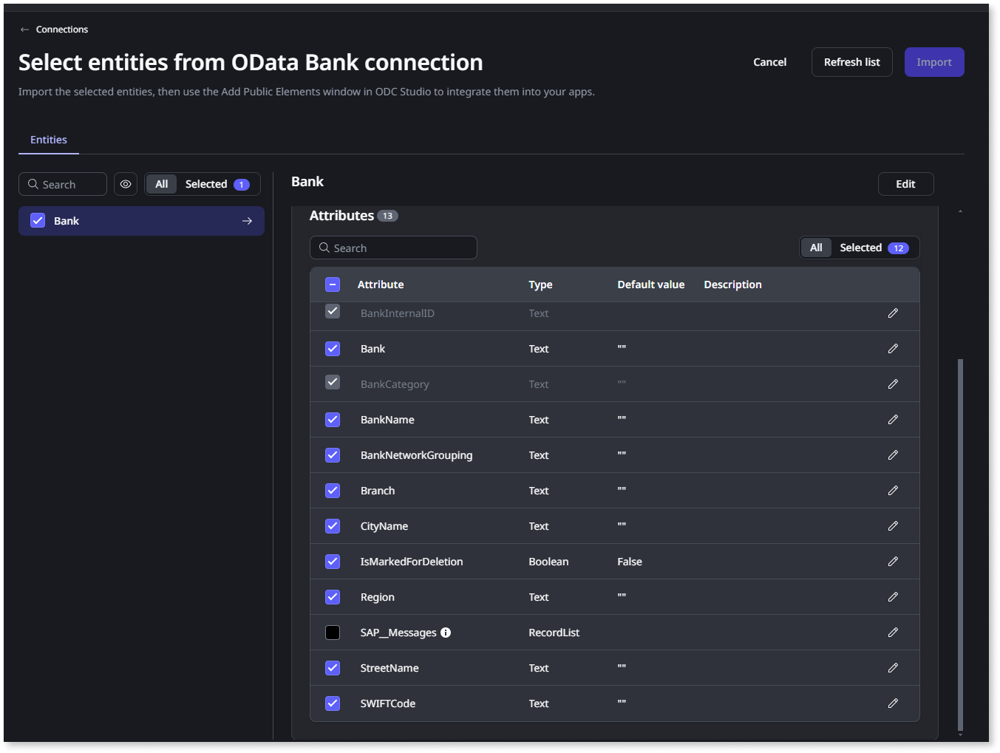
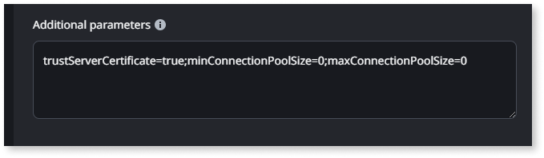

# Create connections to external data sources

To integrate with external data sources using [Data Fabric](intro.md), Administrators need to create the connections to the external data sources and AI search services in the ODC Portal. Then, in ODC Studio, developers use the data through entities or server actions in their apps.

The supported data sources are listed at [ODC system requirements](../../getting-started/system-requirements.md#supported-external-data-sources).

<div class="info" markdown="1">

In a multi-portfolio organization, connections are portfolio-scoped. Configure a connection separately for each portfolio's stages.

For more information, refer to [Configuration management with multiple portfolios](../../manage-platform-app-lifecycle/portfolios/portfolios-configurations.md).

</div>

Administrators must:

* Set up configurations for each stage, such as development, QA, and production, to connect an app to an external database.
* Ensure the app and its connection information are in the same stage. Additionally, the database model must be the same in all the stages.

## Permission requirements

Before accessing data from an external database, verify that you have the correct access to the database and ODC. By default, only administrators can manage connections and select entities. Managing connections requires the following permissions:

* Configure Connections
* Connection Management

External data connections can be created with read-only permissions or other permission restrictions. Entity CRUD actions (to create, update, or delete records) are always automatically created in ODC Studio regardless of the permissions of the database connection user. If you intend to use the full CRUD actions, ensure the database users carry the proper permissions.

## Private gateway

To access private data that is not available over the internet, connect to your external data source through a [private gateway](../../manage-platform-app-lifecycle/private-gateway.md). The connection process varies depending on the type of data source:

* All data sources:
    1. In the ODC Portal, open the connection configuration screen. First, toggle on the `Private gateway` and then enter the port number in the `Private gateway port` field.
* SAP BAPI database:
    1. Run the Cloud Connector with the following command:

        ```
        ./outsystemscc --header "token: TOKEN" SECURE_GATEWAY_ADDRESS R:LOCAL_PORT:SAP_HOST:REMOTE_PORT
        ```

        Replace the following:

        * `TOKEN`: Token value used by Cloud Connector.
        * `SECURE_GATEWAY_ADDRESS`: Address of the secure gateway endpoint.
        * `LOCAL_PORT`: Local port used by the secure gateway.
        * `SAP_HOST`: IP address or hostname of the SAP host.
        * `REMOTE_PORT`: Port used by the SAP service.
    1. To route requests through the Cloud Connector and still use a valid Application Server value, a [SAP Router](https://support.sap.com/en/tools/connectivity-tools/saprouter.html) is needed.
* Azure SQL Server (all instances):
    1. Proxy mode is required, as it ensures a stable connection by routing all traffic through the Azure SQL Gateway.
* Oracle Real Application Clusters (RAC):
    1. Oracle Real Application Clusters (RAC) is supported through the Private Gateway when using Oracle Connection Manager (CMAN) in Traffic Director Mode as an intermediary proxy between ODC and Oracle Single Client Access Name (SCAN).
    1. Run the Cloud Connector with the following command:

        ```
        ./outsystemscc --header "token: TOKEN" SECURE_GATEWAY_ADDRESS R:LOCAL_PORT:CMAN_ADDRESS:REMOTE_PORT
        ```

        Replace the following:

        * `TOKEN`: Token value used by Cloud Connector.
        * `SECURE_GATEWAY_ADDRESS`: Address of the secure gateway endpoint.
        * `LOCAL_PORT`: Local port used by the secure gateway.
        * `CMAN_ADDRESS`: IP address or hostname of the Oracle CMAN host.
        * `REMOTE_PORT`: Port used by the Oracle CMAN.

## Create a new connection

To create a new database connection, go to the ODC Portal and follow these steps:

1. From the ODC Portal navigation menu, select **Integrate** > **Connections**, and click the **Create connection** button. <br/> The **select a provider** popup displays.
1. Select the required provider and click **Confirm**.
1. In the connection form, enter the required connection information.
    * If you're adding a database connection, refer to the [database connection parameters](#connection-parameters).
    * If you're adding an AI search service, refer to the [AI search service connnection parameters](#ai-search-service-connection-parameters).
1. After entering the information, click the **Test connection** button at the bottom of the form. If the test fails, a message displays. Make the necessary changes and test again.
1. To apply to stages, you can choose one of the following.
    * Click **Apply to all stages** to use the same connection information in all stages.
    * Select the stage name to use connection information for a single stage.

To handle null values while integrating with external systems. Administrators must assign new values to represent null values in external databases. To learn more, refer to [handle null values](handle-null-values.md).

## Select entities for use in an app

After connecting to an external database, select the entity names and attributes available in ODC Portal. To select entities, go to the ODC Portal and follow these steps:

1. From the ODC Portal navigation menu, select **Integrate** > **Connections**. Identify the connection you want to edit, and select **Import**. <br/>The connection screen displays the available entities retrieved from the database.

    

1. From the **Entity** name column, select the entities and attributes you want to use.
1. Click **Save** to confirm.

Selected entities and attributes are now available as [public elements](../../building-apps/libraries/use-public-elements.md). In ODC Studio, developers can rename entities for clearer descriptions. For example, you can rename an entity initially named Product_id_version1 to Product_id.

<div class="info" markdown="1">

There is no limit to the number of entities you can add from the external database.

</div>

## Edit an existing connection

To edit an existing database connection, go to ODC Portal and follow these steps:

1. From the ODC Portal navigation menu, select **Integrate** > **Connections** to display the list of connections.
1. From the list of connections, select the one to edit.

You can only change the name and description without testing your connection again. For more information about external data type mapping to OutSystems data type, refer to [External data type mapping.](external-data-type.md)

<div class="info" markdown="1">

For existing connections, when objects are changed or new ones introduced, it's necessary to refresh the connection to fetch the new metadata. In the ODC Portal, click **Import** on the connection and then **Refresh list**.

</div>

## Connection parameters

Administrators must supply the following information to connect to the external connector.

| Parameter | Description | Needs testing connection when edited | Notes |
| -- | -- | -- | -- |
| Connection name | The name of the connection | No | |
| Description | Information about the database connection | No | Optional |
| Username | Username to access the database | Yes | |
| Password | Password to access the database | Yes | |
| Server for SQL server and Azure SQL \ Host for Oracle server | Endpoint for your database connection | Yes | For Private Gateway, enter `secure-gateway`. |
| Port | The port number to connect to the database | Yes | A default port number is shown that can changed. If you're using Private Gateway, enter the port configured in the Cloud Connector. |
| Database for SQL server and Azure SQL \ Service name for Oracle server | Name of the database | Yes | |
| Additional parameters | Additional parameters for a database connection | Yes | For more information, see [additional parameters](#additional-parameters) |
| SAP Server domain | SAP server/host address | Yes | |
| SAP Client | If the SAP system has multiple clients, you must provide a client number. Leave the input blank if you connect to the default client | Yes | Optional |
| Manual entry | To manually enter the Service URL | Yes | If you select "Manual entry" for a private gateway, then the domain must be `secure-gateway:PORT/..`. Replace `PORT` with your private gateway port. |
| Basic authentication type | Basic is a simpler authentication method than OAuth | Yes | |
| Sandbox connection | Sandbox enables a partial or full copy of production data to test the connector. | Yes | |
| Schema | Optional schema name for PostgreSQL connections | Yes | If provided, it specifies the default schema to be used. |
| Application Server | Hostname of the SAP application server where the remote function calls are executed. | Yes | |
| System ID | Three-letter identifier of the SAP installation to which to connect. | Yes | |
| Instance Number | Two-digit identifier of the SAP instance to which to connect. | Yes | |
| SAP route string | A route string describes the connection path between ODC and SAP BAPI | Yes | |

### Additional parameters

You can use advanced parameters to add additional parameters for a database connection. If there is more than one parameter, you can use `;` semi-colon as a separator for SQL Server connections or the `&` character for other connections. Hover over the info icon to confirm. Different databases may require different parameters, for example:

* For **SQL Server** and **Azure SQL**, to select the desired schema on the database, enter `currentSchema=SCHEMA_NAME`. For **Oracle** to select the desired schema on the database, enter `current_schema=SCHEMA_NAME`. Replace `SCHEMA_NAME` with the schema name.
* To establish a connection with the **SQL Server** and allow the client to bypass certificate validation, add the `trustServerCertificate=true` parameter to the additional parameters.
* You can configure connection pool settings for all available relational database connectors. Changing the connection pool settings can significantly impact performance.
    * `testOnBorrow` controls when and how often the health of pooled connections is tested to verify connectivity to the database.
        * When `true`, connections are tested every time they are borrowed from the pool, this increases the reliability of query execution but decreases performance.
        * When `false`, pooled connections are tested periodically while they are idle in the pool, this decreases the reliability of query exuection but increases performance.
        * Default value of `false` because it offers improved performance and connectivity to databases tends to be reliable
    * `minIdleMinutes` is the minimum amount of time in minutes that a connection must remain idle for in the pool before it may be closed
        * Default value of `10` minutes because databases are often configured to close idle connections/sessions after a period of inactivity
    * `maxLifetimeMinutes` is the maximum amount of time in minutes that a connection may be used for
        * After this time has elapsed, the connection is not used to execute any new queries and is eventually closed
        * Default value of `0` which means that connections are open indefinitely provided that they are healthy and do not remain idle for longer than `minIdleMinutes`
    * `maxConnectionPoolSize` is the maximum number of connections that can be open (in use or idle) at any given time
        * Default and maximum supported value of 400, as it was the best performer in OutSystems performance tests
    * `minConnectionPoolSize` is the number of connections that must always be available (idle) in the pool
        * Default value of `0` which means that all idle connections will eventually be closed after an extended period of inactivity
        * Must be less than or equal to `maxConnectionPoolSize`
* The `statsRefreshFrequencyMinutes` parameter, available for all connectors, allows you to adjust how often statistics are refreshed. This adjustment helps Data Fabric connectors maintain optimal query performance. If your external system has a limited number of API requests, it's advisable to increase the refresh frequency. The default value for this parameter is 15 minutes, with a minimum allowable value of 5 minutes. An example of the use of this parameter is: `statsRefreshFrequencyMinutes=30`.
* For **Salesforce**, include `ArchiveMode=True` in the additional parameters to enable fetching deleted and archived records in queries. By default, the archive mode is disabled. Enabling this mode allows queries to retrieve more data, but handle it with caution, as it may impact performance.
* For **SAP OData**, set `Pagesize=PAGE_SIZE` in the additional parameters to control the maximum number of rows returned per page when fetching data from SAP OData. Replace `PAGE_SIZE` with the number of rows you want per page. A larger page size improves performance but increases memory use per page.

    If you don't specify `Pagesize`, OutSystems applies a default of `1000` to help keep each response within the maximum allowed body size (10 MB). Very large page sizes produce responses above that limit and may result in a `Bad gateway` error.
* For **SAP OData**, if your server uses a self-signed certificate, add the `SSLServerCert=*` parameter to the additional parameters to bypass certificate validation. This parameter also applies to the metadata requests used to retrieve navigation properties (for example, during deep insert), so catalog discovery completes successfully instead of failing with a certificate verification error.



## AI search service connection parameters

The following parameters are required when configuring connections for different external search services in the ODC Portal.

### Azure AI search parameters

The table outlines the parameters necessary to configure an Azure AI Search connection.

| **Parameter** | **Description** |
| --- | --- |
| **URL** | The REST API endpoint of your Azure AI Search service. |
| **Index name** | The name of the index you have created in Azure AI Search. |
| **API key** | The API key for authenticating with your Azure AI Search service. |
| **Query type** | The syntax used for querying your Azure AI Search index. |

### Amazon Kendra parameters

The table outlines the parameters necessary to configure an Amazon Kendra connection.

| **Parameter** | **Description** |
| --- | --- |
| **URL** | The REST API endpoint for your Amazon Kendra service. |
| **Index ID** | The ID of the Kendra index you want to connect to. |
| **Access key** | The AWS access key ID for an IAM user with Kendra permissions. |
| **Secret key** | The AWS secret access key associated with the provided access key. |

### Custom search service parameters

The table outlines the parameters necessary to configure a connection to a custom search service.

| **Parameter** | **Description** |
| --- | --- |
| **Endpoint** | The URL of your custom-built search service API endpoint. |
| **Headers Name** | The name of the authentication header required by your custom API. |
| **Headers Value** | The value of the authentication header for your custom API. |

## Considerations when integrating external systems

Consider the following when integrating an external system.

* .NET does not support the Julian calendar for Oracle and Salesforce, and the minimum supported timestamp value is -62135596800000. To avoid .NET breaking, send the maximum value between the original timestamp and the minimum supported to convert dates like 0001-01-01 to 0001-01-03.
* Importing Views in ODC Studio only generates `CreateENTITY_NAME` and `DeleteAllENTITY_ACTION` actions.

    Where:

    * `ENTITY_NAME`: Name of the entity.
    * `ENTITY_ACTION`: Name of the entity action.

    Since Views don't have primary keys, ODC doesn't generate other entity actions. Inserting a record in a View works only when the View comprises one table in the database. When View comprises more than one table, you may get an error.
* When a database user lacks the necessary permissions to access the table that a Foreign Key (FK) points to, the Foreign Key is treated as a regular column. This can result in errors during the insertion or updating of records. To prevent such issues, it is advisable to ensure that the user can access all the tables required by the application.
* In a composite key scenario in ODC Studio, entities have only one attribute marked as the Identifier, while the remaining primary keys are treated as regular attributes. As a result, it's crucial to handle entity actions such as Update or Delete with caution. An incorrect update or delete action could result in updating or deleting unintended records in external systems, as these actions rely solely on the single Identifier. For the SAP OData connector, the behavior differs: in a composite key scenario, ODC does not designate any attribute as the Identifier.

Some external systems have additional, vendor-specific considerations.

* **Azure SQL:** For more information, refer to [Azure SQL connection considerations](considerations-azure-sql.md).
* **MySQL:** For more information, refer to [MySQL connection considerations](considerations-mysql.md).
* **Oracle:** For more information, refer to [Oracle connection considerations](considerations-oracle.md).
* **PostgreSQL:** For more information, refer to [PostgreSQL connection considerations](considerations-postgresql.md).
* **Salesforce:** For more information, refer to [Salesforce connection considerations](considerations-salesforce.md).
* **SAP OData:** For more information, refer to [SAP OData connection considerations](considerations-sap-odata.md).
