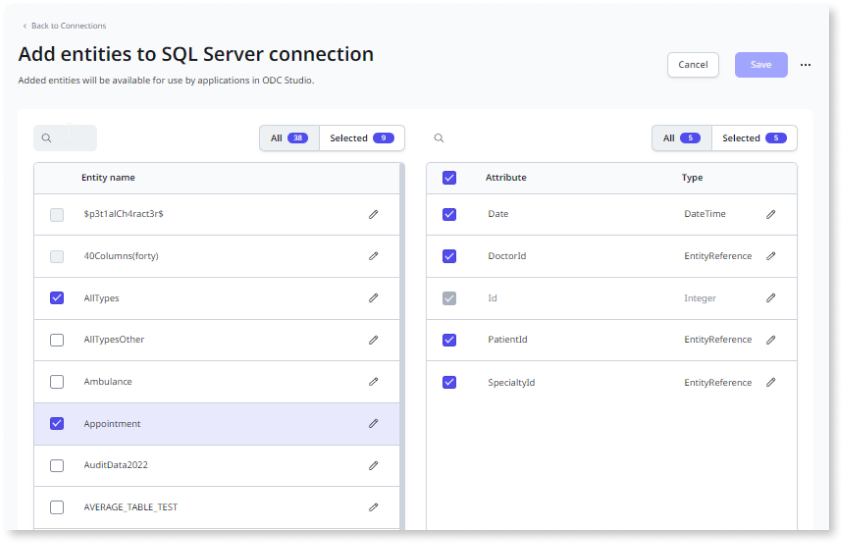
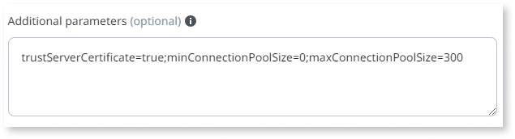

# Integrate with external data sources

OutSystems Developer Cloud (ODC) enables developers to integrate external data into their apps. First, from the ODC Portal, admins create connections to the supported databases and select the entities. Then, in ODC studio, developers use the data as entities in their apps.

Administrators must set up configurations for each stage, such as development, QA, and production, to connect an app to an external database.

Administrators ensure the app and its connection information are in the same stage. Additionally, the database model must be the same in all the stages.

There is no limit to the number of entities you can add from the external database.

In ODC, you can now mash up data from different entities and distinct data sources in an aggregate. To learn more, refer to [data mashup](../../building-apps/data/fetch-data/data-mash.md).

ODC offers [private gateways](../../manage-platform-app-lifecycle/private-gateway.md) to connect your apps to private data and services that are inaccessible through the internet. Since an external database is usually hosted in a private network, using a private gateway ensures security.

You can use [data fabric](../../manage-platform-app-lifecycle/platform-architecture/intro.md#data-fabric) to processes all your external system data uniformly, with no persistent storage within Data Fabric or ODC architecture.

## Supported systems

OutSystems supports the following versions of systems:

    

        Microsoft SQL server
    

    

        <ul>
            <li>SQL Server 2014</li>
            <li>SQL Server 2016</li>
            <li>SQL Server 2017</li>
            <li>SQL Server 2019</li>
            <li>SQL Server 2022</li>
        </ul>
    

    

        Azure SQL
    

    

        <ul>
            <li>Azure SQL V12</li>
        </ul>
    

    

        Oracle server
    

    

        <ul>
            <li>Oracle 19c</li>
        </ul>
    

    

        PostgreSQL Server
    

    

        <ul>
            <li>PostgreSQL 12</li>
            <li>PostgreSQL 13</li>
            <li>PostgreSQL 14</li>
            <li>PostgreSQL 15</li>
            <li>PostgreSQL 16</li>
        </ul>
    

    

        Salesforce
    

    

        <ul>
            <li>Salesforce</li>
        </ul>
    

OutSystems supports self-managed, Aurora, and Azure provisions for PostgreSQL.

## Permissions requirements

Before accessing data from an external database, verify that you have the correct access to the database and ODC. By default, only administrators can manage connections and select entities. Managing connections requires the following permissions:

* Configure Connections
* Connection management

External database connections can be created with read-only permissions or other permission restrictions. Entity CRUD actions (to create, update, or delete records) are always automatically created in ODC Studio regardless of the permissions of the database connection user. If you intend to use the full CRUD actions, ensure that the database users carries the proper permissions.

## Create a new connection

To create a new database connection, go to the ODC Portal and follow these steps:

1. From the ODC Portal nav menu, select **Resource** > **Connections**, and click the **Create connection** button.   The **select a provider** popup displays.
1. Select the required provider and click **Confirm**.
    * If you select SAP, then select the **SAP Service** as **SAP Service Catalog**, and click **Show available services**.  All available services display.
    * If you select Salesforce, select **connect to** as **Production**, and **Authentication type** as **OAuth** authentication type, and click **Authenticate**.  The Salesforce login page displays.
1. In the connection form, enter the required database connection information. To learn more, refer to the [connection parameters](#connection-parameters).

    

    To use private gateways to connect to your external databases, enter `secure-gateway` in the Server/Host field and the secure gateway port value in the Port field.

    

1. After entering the information, click the **Test connection** button at the bottom of the form. 

    

    If the test fails, a message displays. Make the necessary changes and test again. 

    

1. To apply to a stage, an admin can choose one of the following.
    * Click Apply to all stages to use the same connection information in all stages.
    * Select the stage name to use connection information for a single stage.

## Select entities for use in an app

After connecting to an external database, select the entity names and attributes available in ODC Portal. To select entities, go to the ODC Portal and follow these steps:

1. From the ODC Portal nav menu, select **Resource** > **Connections**, and click **Select entities** to display the **Add entities** connection screen.  The connection screen displays the available entities retrieved from the database.

    

1. From the **Entity** name column, select the entities and attributes you want to use.
1. Click **Save** to confirm. 

Selected entities and attributes are now available as [public elements](../../building-apps/libraries/use-public-elements.md). In ODC Studio, developers have the flexibility to rename entities, allowing for clearer descriptions. For example, an entity initially named 'Product_id_version1' can be renamed to 'Product_id'.

## Edit an existing connection

To edit an existing database connection, go to ODC Portal and follow these steps:

1. From the ODC Portal nav menu, select **Resource** > **Connections** to display the list of connections.
1. From the list of connections, select the one to edit.

You can only change the name and description without testing your connection again.

## Connection parameters

Administrators  must supply the following information to connect to the external connector. 

| Parameter | Description | Needs testing connection when edited | Notes |
|--|--|--|--|
| Connection name | The name of the connection | No |  |
| Description | Information about the database connection | No | Optional |
| Username | Username to access the database | Yes |  |
| Password | Password to access the database. | Yes |  |
| Server for SQL server and Azure SQL \ Host for Oracle server | Endpoint for your database connection | Yes | For Private Gateway, enter `secure-gateway` |
| Port | The port number to connect to the database | Yes | ODC has a default port number that an admin can change. For a private gateway, enter the port configured in the connector. |
| Database for SQL server and Azure SQL \ Service name for Oracle server | Name of the database | Yes |  |
| Additional parameters | Additional parameters for a database connection | Yes | For more information, see [additional parameters](#additional-parameters) |
| SAP Server domain | SAP server/host address| Yes |  |
| SAP Client | If the SAP system has multiple clients, you must provide a client number. Leave the input blank if you connect to the default client | Yes | Optional |
| Manual entry | To manually enter the Service URL| Yes | If you select "Manual entry" for a private gateway, then the domain must be `secure-gateway:<port>/..`|
| Basic authentication type | Basic is a simpler authentication method than OAuth | Yes | |
| Sandbox connection | Sandbox enables a partial or full copy of production data to test the connector. | Yes | |
| Schema | Optional schema name for PostgreSQL connections | Yes | If provided, it specifies the default schema to be used. |

### Additional parameters
 
You can use advanced parameters to add additional parameters for a database connection. If there is more than one parameter, separate each parameter with a semi-colon (;). Different databases may require different parameters, for example:

* For the **SQL Server** and **Azure SQL** to select the desired schema on the database, enter `currentSchema=<schema-name>`. For PostgreSQL, you can also use the `Schema` parameter.
* For **Oracle** to select the desired schema on the database, enter `current_schema=<schema-name>`
* To establish a connection with the SQL Server and allow the client to bypass certificate validation, add the `trustServerCertificate=true` parameter to the additional parameters.
* You can configure connection pool size for all available relational database connectors. Changing the connection pool size can significantly impact performance.
    * minConnectionPoolSize: Default value of 0.
    * maxConnectionPoolSize: Default value of 400, as it was the best performer in Outsystems performance tests.

## Data type mapping

To handle null values while integrating with external systems. Administrators must assign new values to represent null values in external databases. To learn more, refer to [handle null values](handle-null-values.md).

| SQL Server and Azure SQL | Oracle | SAP OData | Salesforce | PostgreSQL |OutSystems Data Type |
|--|--|--|--|--|--|
Char Varchar Text Nchar Nvarchar Ntext Xml Decimal(Any,> 8) Numeric(Any,>8)  Real Float UniqueIdentifier Time Datetimeoffset | Char Varchar Varchar2 Clob Long Nchar NVarchar2 Nclob Number(Any,> 8) Float RowId URowId | Varchar UUID| UUID VARCHAR FLOAT Time| Varchar NVarchar Text Varbit Character Char Bpchar Time Numeric(Any, >8) Numeric(>28, Any) Decimal(Any, >8) Decimal(>28, Any) Float4 Float8 Float8_range Real Double precision XML JSON UUID Pg_lsn Enum |Text|
Tinyint Smallint Int Decimal(1-9,0) Numeric(1-9,0) | Number(2-9,0) | Int | Int | Smallint Integer Int Int2 Int4 Numeric Numeric(1-9, 0) Decimal(1-9, 0) Smallserial Serial Serial4 |Integer |
Bigint Decimal(10-18,0) Numeric(10-18,0) | Number(10-18,0) | | | Bigint Int8 Bigserial Serial8 Decimal(10-18, 0) Numeric(10-18, 0) |Long Integer |
Decimal(19-28,0-8) Decimal(1-18,>1-8) Numeric(19-28,0-8) Numeric(1-18,>1-8) Money Smallmoney | Number(19-28,0-8) Number(1-18,1-8) | Decimal| Decimal | Numeric(1-28, 1-8) Decimal(1-28, 1-8) Numeric(19-28, 0) Decimal(19-28, 0) Money | Decimal |
Bit | Number(1,0) | Bit| Bit | Bit Boolean Bool |Boolean |
Date | | Date | Date | Date |Date|
Datetime DateTime2 Smalldatetime | Date Timestamp | Time Timestamp  | DateTime | Timestamp | DateTime |
Image Binary Varbinary | Blob Raw Long Raw | | | Bytea |Binary Data |
Sql_variant Geometry HierarchyId Geography Rowversion Timestamp | Interval day to second Interval year to month Bfile Binary_float Binary_double XmlType VARRAY OBJECT (structured) | | | BIT VARYING BOX CIDR CIRCLE COMPOSITE (user defined types and other composite types) INET INTERVAL LINE LSEG MACADDR MACADDR8 PATH POINT POLYGON TSQUERY TSVECTOR TXID_SNAPSHOT all of the ARRAY types | Currently not supported and won't appear in ODC Portal.|
Other data types | Other data types | Other data types |Other data types | Other data types |No official support; attributes may not appear in the ODC Portal or may exhibit unexpected behavior. |

## Salesforce custom columns mapping

Although Salesforce supports multiple data types in the built-in tables, the following mapping are for the custom columns:

| Salesforce data type| OutSystems Data Type |
|--|--|
TINYINT SMALLINT INT BIGINT FLOAT DECIMAL DOUBLE NUMERIC VARCHAR BIT BINARY UUID Time | Text |
Boolean |Boolean |
Date | Date |

## Considerations when integrating external database

Consider the following when integrating an external database.

* Data Preview and runtime queries with Unicode characters aren't supported.
* SQL elements don't support external entities.
* .NET does not support the Julian calendar for Oracle and Salesforce, and the minimum supported timestamp value is -62135596800000. 
    * To avoid .NET breaking, send the maximum value between the original timestamp and the minimum supported to convert dates like 0001-01-01 to 0001-01-03.
* Importing Views in ODC Studio only generates `Create<EntityName>` and `DeleteAll<EntityAction>` actions. Since Views don't have primary keys, ODC doesn't generate other entity actions. 
    * Inserting a record in a View works only when the View comprises 1 table in the database. When View comprises more than 1 table, you may get an error.

    

        Oracle
    

    

        <ul>
            <li>The `DiffMinutes` and `DiffSeconds` built-in functions for Oracle only allow max intervals between dates:</li>
            <ul>
                <li>Seconds: 31 years, 9 months, 9 days, 1 hour, 46 minutes, and 39 seconds</li>
                <li>Minutes: 1901 years, 4 months, 29 days, 10 hours, 39 minutes, and 59 seconds</li>
            </ul>
            <li>Oracle treats empty strings as NULL values. When inserting or updating a nullable text attribute with a value, Oracle stores NULL regardless of the Null Behavior configuration</li>
        </ul>
    

    

        SAP OData
    

    

        <ul>
            <li>SAP OData APIs convert null values to empty strings when inserting or updating VARCHAR columns. To fetch null or empty strings, ODC recommends filtering VARCHAR columns using a condition like `Entity.TextAttribute = ' '` and do not rely on OutSystems null's built-in functions.</li>
            <li>SAP OData only supports read-only entity actions in ODC Studio.</li>
            <li>SAP throws a `RAISE_SHORTDUMP` exception when requesting the row count for some VIEWS on the first request.</li>
        </ul>
    

    

        Salesforce
    

    

        <ul>
            <li>Entities and attributes for Salesforce are displayed using their API names, such as CustomObject_c, instead of Field Labels or Field Names, such as CustomObject.</li>
            <li>Custom attributes and their data types in Salesforce have different mapping than the built-in attributes. For more information, see [salesforce custom columns mapping.](#salesforce-custom-columns-mapping)</li>
            <li>Salesforce doesn't support leading and trailing white spaces.</li>
            <ul>
                <li>Salesforce removes those white spaces. While inserting an empty string, Salesforce inserts NULL instead.</li>
            </ul>
            <li>Salesforce is case-insensitive, and `ToUpper`/`ToLower` built-in functions don't have the expected behavior in aggregates.</li>
        </ul>
    

    

        PostgreSQL
    

    

        <ul>
            <li>For PostgreSQL connections, you may encounter issues in Text data type columns when inserting an empty value, and the connection is configured to overwrite null values with default values. OutSystems recommends you set a different default value to columns of these data types, such as for Time: 00:00:00 or for Float: 0. The following data types are impacted:</li>
            <ul>
                <li>Time</li>
                <li>Numeric (Any, >8)</li>
                <li>Numeric (>28, Any)</li>
                <li>Decimal (Any, >8)</li>
                <li>Decimal (>28, Any)</li>
                <li>Float4</li>
                <li>Float8</li>
                <li>Float8_range</li>
                <li>Real</li>
                <li>Double precision</li>
                <li>XML</li>
                <li>JSON</li>
                <li>UUID</li>
                <li>Pg_lsn</li>
                <li>Enum</li>
            </ul>
        </ul>
    

