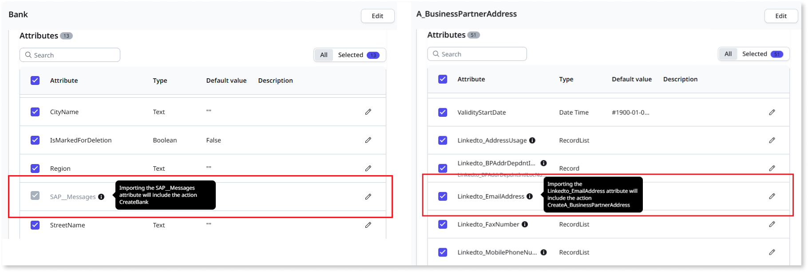
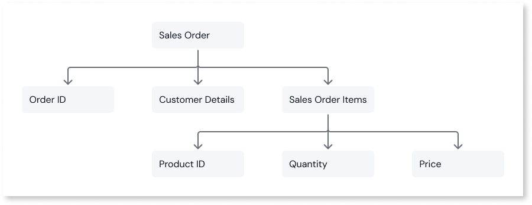
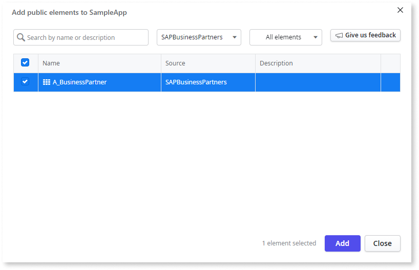
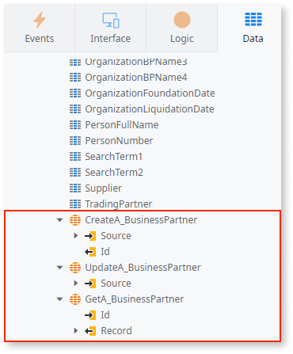
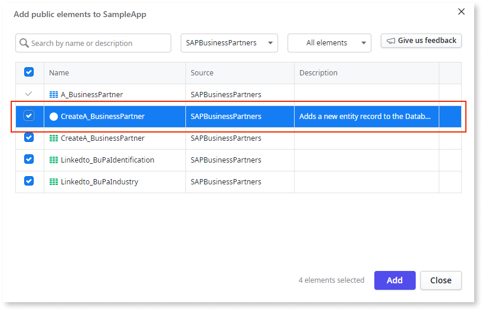
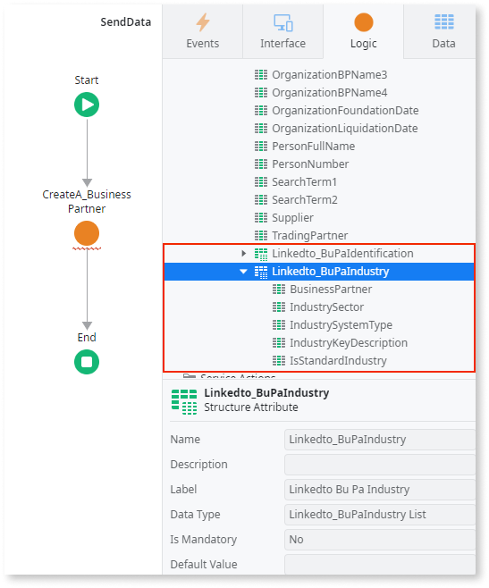

# Write data to SAP OData external connection

In OutSystems Developer Cloud (ODC), you can write data to an external SAP OData data source using the following methods:

* Entity actions for non-hierarchial data: If you don't select hierarchical attributes in the ODC Portal, ODC generates default entity actions that interact with the entity's collection endpoint. 
* Custom server actions (deep insert actions): If you select hierarchical attributes in the ODC Portal, ODC creates custom server actions to handle hierarchical data. These actions allow you to insert an entity and its related entities in a single request.

ODC generates a deep insert action for each entity with hierarchical attributes (navigation properties) selected in the ODC Portal. ODC also generates server actions when attributes with complex data (Record or Record List attributes) types are selected in the ODC Portal. If you select a complex data type without any navigation properties, the server action only inserts data into the corresponding entity.

Navigation properties define the relationships between entities and describe the paths linking an entity to its related entities. Each navigation property is linked to an association defining the relationship between entities. 

When you add a connection and select entities in the ODC Portal, deep insert actions for these entities become available as public server actions. When building apps, you can use these public actions in ODC Studio to handle deep inserts.

For example, consider the following hierarchical data structure:  

* Sales Order: Represents the overall order, including attributes such as Order ID, Customer Details, Order Date, and Sales Order Items.
* Sales Order Items: Represents individual products in the order, including attributes such as  Product ID, Quantity, Price, and Line Item Total.

When creating a sales order, you must also create its related sales order items. Deep insert actions ensure the sales order and its associated items are inserted in a single transaction. Deep insert is useful for managing complex relationships or inserting multiple related entities simultaneously.

Deep insert actions maintain atomicity and consistency by treating all changes in a single request as a transaction. If any part of the request fails, all changes are rolled back, ensuring no partial updates occur. This ensures that either all related entities are successfully created or none are created.

## Entity actions

To create entity actions for external SAP OData connection, follow these steps:

1. From the ODC Portal navigation menu, go to **Integrate** > **Connections**, and click **Import.**  The  **Add entities connection** screen is displayed.
1. From the **Entity name** column, select the non-navigation property attributes you want to use.
1. Go to the ODC Studio and click **Add** **public elements.**   The add public element pop-up is displayed.
1. Select the external source public element, and click **Add**.

Adding the external data source as a public element enables you to use entity actions with the external data source.

If your external entity contains a composite key, the entity doesn't have any primary key. In these cases, ODC Studio doesn't mark any key as a primary key. This means the Update entity action is not generated, and the Create entity action contains no output parameter ID.

## Deep insert

To create custom server actions for external SAP OData connection, follow these steps:

1. From the ODC Portal navigation menu, go to **Integrate** > **Connections**, and click **Import.** **The Add entities connection** screen is displayed.
1. From the **Entity name** column, select at least one navigation property attribute you want to use.
1. Go to the ODC Studio and click **Add** **public elements.** The add public element pop-up is displayed.
1. Select the external source public element, and click **Add**.

    

1. Add the server action to your logic.

    

The input parameter record contains all the children's hierarchical attributes you selected in the ODC Portal.

The deep insert server action returns the ID of the primary record inserted. If the table in SAP has composite primary keys (PKs), the server action provides an output parameter for each PK. These output parameters match the data types and names of the original input structure.  

Since the deep insert action is automatically generated and available as a public element, the Create entity action is unavailable for the external entity in the **Data** tab. You can use the Update and Delete entity actions as long as they are available in SAP for the given entities.

For more information about considerations while working with SAP OData, refer to [Considerations when integrating external systems](intro.md#considerations-when-integrating-external-systems).
