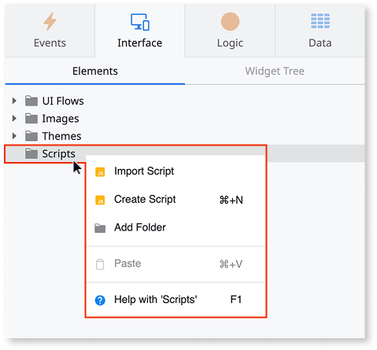
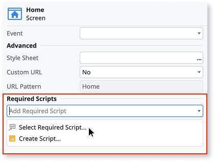

# Use JavaScript Code from an External Library

Applies to Mobile Apps and Reactive Web Apps only

OutSystems doesn't recommend using JavaScript libraries that directly manipulate the DOM, such as jQuery. Such libraries can break Reactive and Mobile apps and make them difficult to maintain.

Before using JavaScript code from an external library or contained in a `.js` file, do the following:

1. Import or create a script under the **Scripts** tree folder. This script may reside in the app (that is, it was created using the context menu options "Create Script" or "Import Script", when right-clicking the "Scripts" folder), or can be a reference to a script defined in a library.

    

1. In the **Interface** tab, select the screen/block where you want to add the JavaScript code, and its properties select the script in the **Required Scripts** property:

    

The script added as a required script is evaluated in the global scope.
Thus, you can use functions and objects initialized in this script in any JavaScript element of the screen/block.

## Loading of JavaScripts

The JavaScript imported as a required script is loaded with every other base script necessary for the app to launch.
Since the execution of the app is blocked until all defined JavaScripts are loaded, the defined scripts is available in **On Application Ready** system event.

The block required scripts and screen required scripts are loaded before the corresponding element is rendered.

## Execution of JavaScripts

In runtime, JavaScript in O11 apps is executed in a specific order depending on where it was added. The order is as follows:

1. Module required scripts

1. Block required scripts

1. Screen required scripts
