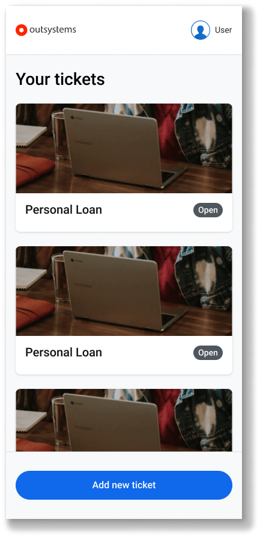
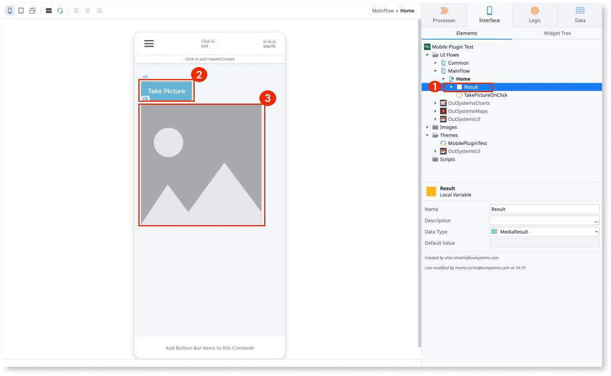
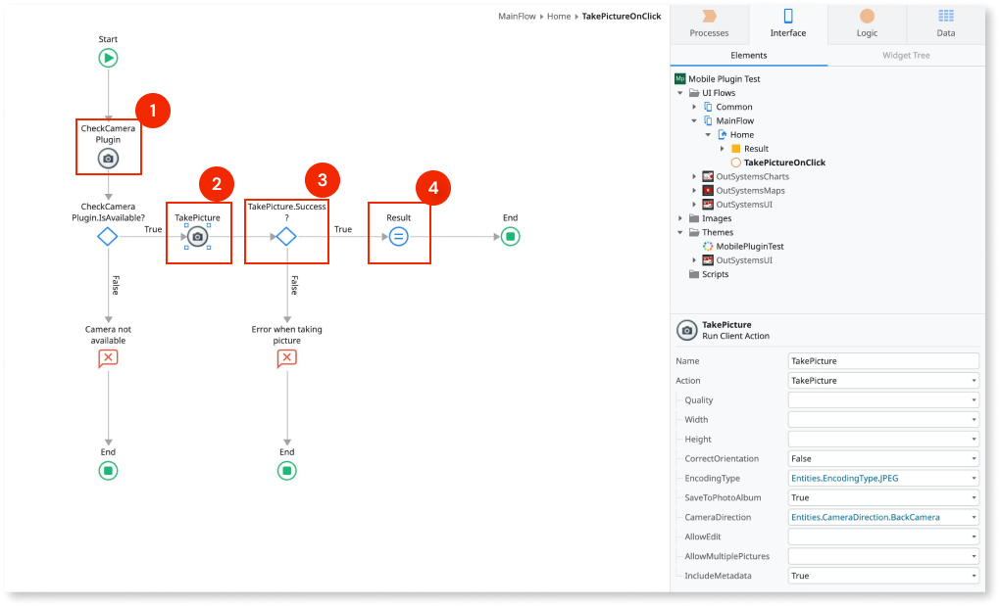
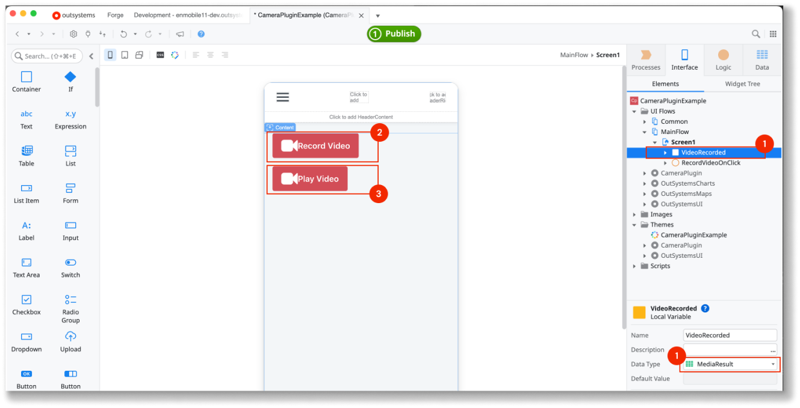
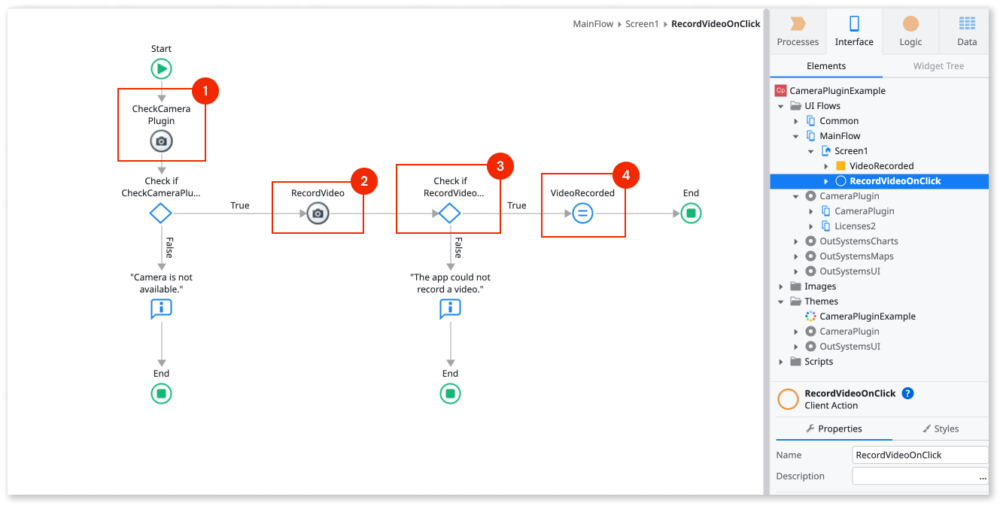
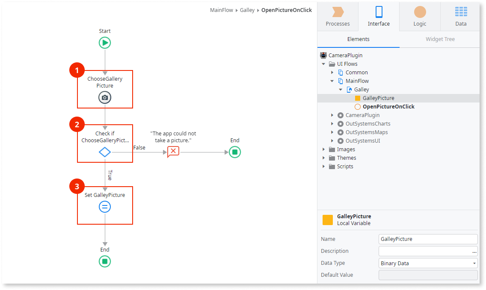
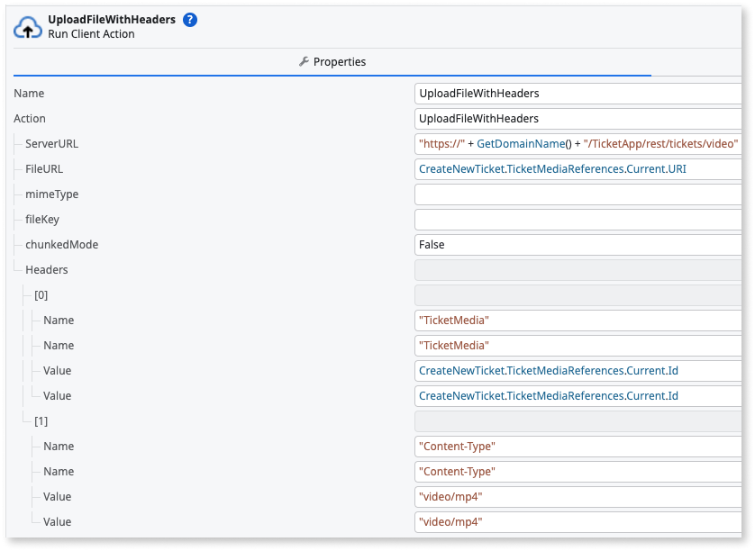
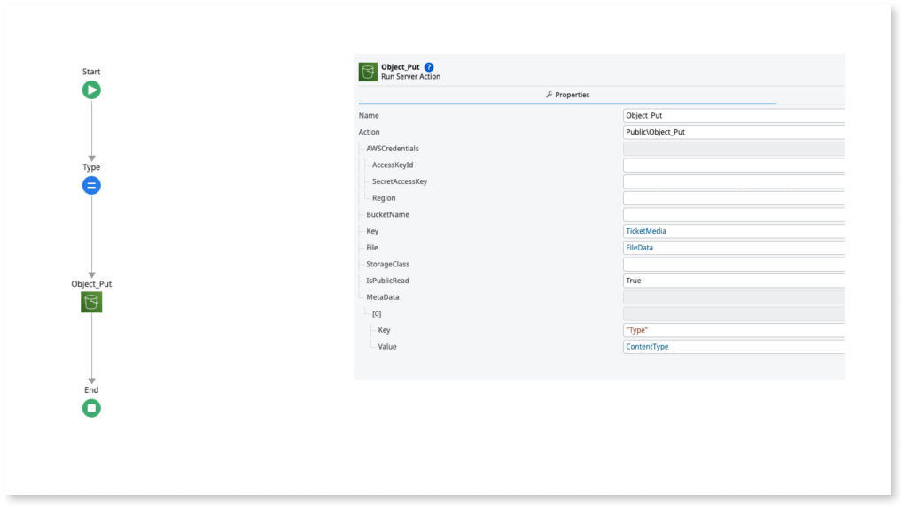
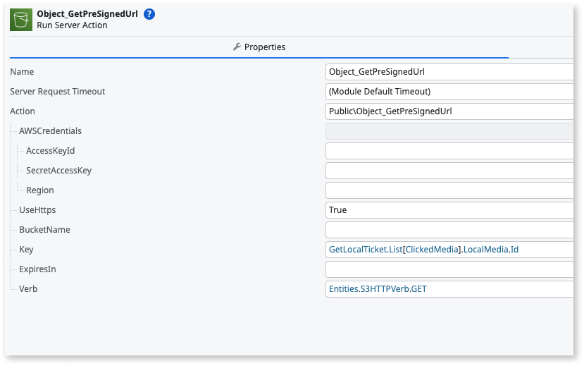
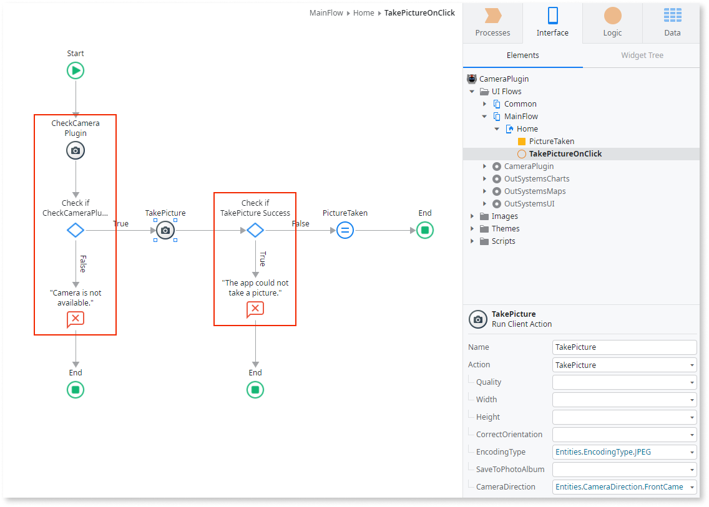

# Camera Plugin version 1

This article documents Camera Plugin version 1.x. For information about version 2.x and later, refer to the [Camera Plugin version 2 article](intro.md). To migrate from version 1.x to 2.x, refer to the [migration article](camera-migration-guide-1-to-2.md).

Use the Camera plugin to let users take pictures and capture video with their mobile devices.
This plugin works with both native mobile apps and progressive web apps (PWAs).

For more information about installing and referencing a plugin in your app, refer to [Mobile plugins](../intro.md).

## Add necessary permissions (property list keys) for the plugin — iOS only

To use the Camera plugin on iOS, provide descriptions for the following property list keys:

* **NSCameraUsageDescription**
* **NSPhotoLibraryUsageDescription**
* **NSPhotoLibraryAddUsageDescription**
* **NSMicrophoneUsageDescription**

The plugin provides default values for these descriptions. You set your own descriptions using the extensibility settings: **CameraUsageDescription**, **NSPhotoLibraryUsageDescription**, **NSPhotoLibraryAddUsageDescription**, and **NSMicrophoneUsageDescription**. Set these in the **Mobile distribution** tab on your app's detail page in the Portal.

## Demo app

Install the **Camera Sample App** from Forge and open the app in ODC Studio.
The demo app contains logic for common use cases to examine and recreate in your apps.
For example, the demo app shows how to:

* Take a picture.
* Capture a video.
* Select media from the gallery.
* Edit a picture taken with the camera or selected from the gallery.
* Edit the picture displayed in the app.

## Take a picture

To let users take a picture and have a good user experience:

* [Create a user interface](#user-interface-picture)
* [Create logic to take a picture](#logic-picture)
* [Handle errors](#handle-errors)

### Create a user interface {#user-interface-picture}

To set up the user interface for taking a picture, follow these steps:

1. Create a variable with the data type **MediaResult**. This variable holds the image data.
1. Add a Button or another widget to run the action that takes the picture.
1. Add an **Image** widget to show the image thumbnail after using the camera. Set **Type** to **Binary Data** and **Image Content** to the content of **MediaResult.Thumbnail**.

### Create logic to take a picture {#logic-picture}

To take a picture using the Camera plugin, configure the app logic that connects user actions to the device camera. The following steps outline how to enable the camera, specify options, and receive the captured image.

Find all available actions for the Camera plugin by navigating to the **Logic** tab of ODC Studio, and going to **Client Actions** > **CameraPlugin**.

1. Use the **CheckCameraPlugin** action to verify if the plugin is available.
    * If the plugin is not available, display an error message to the user.
1. If the plugin is available, use the **TakePicture** action to open the camera and let the user take a picture.
    * In the **TakePicture** action, set parameters such as quality, width, and camera direction (back or front) based on your app's requirements.
1. Check if **TakePicture.Success** is **True**.
1. If successful, assign the value of **TakePicture.MediaResult.Thumbnail** to a variable of the **Binary Data** data type to handle the captured image.

## Record a video

Applies to native mobile apps only. Not available in PWAs.

To let users record a video and have a good user experience:

* [Create a user interface](#user-interface-video)
* [Create logic to record a video](#logic-video)
* [Handle errors](#handle-errors)

### Create a user interface {#user-interface-video}

To set up the user interface for recording a video, follow these steps:

1. Create a variable with the data type **MediaResult**. This variable holds the video data.
1. Add a Button or another widget to run the action that captures a video.
1. Add the **PlayVideo** widget to play the video after using the camera. Set it to the variable you created.

The **PlayVideo** widget plays recorded or locally stored videos on a device.
To display videos from other sources, use the [**Video**](../../../building-apps/ui/patterns/interaction/video.md) widget.

Video files stored in the cache are deleted when the app closes.
If you set the URI parameter to a cached video file, the video might already be deleted.

### Create logic to record a video {#logic-video}

To capture and manage video recordings in your app, set up logic that checks for plugin availability, initiates the recording, and stores the resulting media.

To create logic to record a video, follow these steps:

1. Use the **CheckCameraPlugin** action to verify if the plugin is available.
    * If the plugin is not available, display an error message to the user.
1. If the plugin is available, use the **RecordVideo** action to open the camera and let users capture a video.
    * In the **RecordVideo** action, set the parameters for saving the recorded media to the device's gallery.
1. Check if **RecordVideo.Success** is **True**.
1. If successful, assign **RecordVideo.MediaResult** to a variable of the **MediaResult** data type to handle the video data.

## Select media from the gallery

**ChooseFromGallery** is available in native mobile apps only.

Until PWA support is available, use the **DEPRECATED_ChooseGalleryPicture** action.

The **ChooseFromGallery** action lets users choose a media file from the device gallery, either a picture, a video, or both.

To select media from the gallery, follow these steps:

1. Use the **ChooseFromGallery** action to open a media browser and let users select a media file.
1. Verify **ChooseFromGallery.Success** is **True**. For more information about error handling, refer to [Handle errors](#handle-errors).
1. After users select the image, retrieve the binary data from **ChooseFromGallery.MediaResult.**.

## Upload media assets from URIs

Use the video and picture URIs returned in the **MediaResult** variable, together with the **FileTransfer** plugin, to upload media files to a server. Then use the hosted URLs to view the media files in your app.

In the following example, the **UploadFileWithHeaders** client action from the **FileTransfer** plugin uploads a video file to the app's REST endpoint `rest/tickets/video`.

Upload the video file to an S3 bucket inside the REST endpoint, then use the video's presigned URL with the **Video** widget to play the uploaded video.

## Image quality and app responsiveness

When you set the image quality to 100% or use the PNG format, your app handles a large amount of image data.
Users experience slower response times after taking an image with the highest quality settings.
The more data the app handles, the less responsive it becomes on low-end devices.

When setting the image quality, consider the use case for your app.
The following table shows examples of quality settings for common use cases.

| Example use case | Image quality          | Notes                                                     |
| ---------------- | ---------------------- | --------------------------------------------------------- |
| Profile image    | JPEG 60% (default)     | Sufficient quality for a profile image.                   |
| Insurance claims | JPEG 85% - 100% or PNG | High quality lets users examine all details in the image. |

Changing the image quality setting applies only to .JPEG files.

## Handle errors

The app with the Camera plugin runs on many Android and iOS devices with different hardware and configurations.
To ensure a good user experience and prevent the app from crashing, handle the errors within the app.

The following table lists the actions and variables that handle errors.

| Variable | Action | Description |
| - | - | - |
| **IsAvailable** | **CheckCameraPlugin** | True if the camera plugin is available in the app. |
| **Success** | **TakePicture** | True if there aren't errors while taking a picture. |
| **Success** | **ChooseGalleryPicture** | True if there aren't errors while opening a picture from the gallery. |
| **Success** | **EditPicture** | True if there aren't errors while editing a picture. |
| **Success** | **RecordVideo** | True if there aren't errors while recording a video. |
| **Success** | **ChooseFromGallery** | True if there aren't errors while opening a media file from the gallery. |
| **Success** | **PlayVideo** | True if there aren't errors while playing a video. |

Use these actions with **If** nodes to check for errors and control how the app works.

## Reference

The following sections contain additional reference information about the plugin.

For reference on available client actions and structures, refer to the [Camera Plugin version 1 reference article](./camera-ref-version-1.md).

### Actions

The Camera plugin uses a Cordova plugin. For more information, refer to [cordova-plugin-camera](https://github.com/OutSystems/cordova-plugin-camera).

The following table lists the available actions.

|Action|Description|Available in PWA|
|-|-|-|
|**CheckCameraPlugin**|Checks if the plugin is available in the app.|Yes|
|**TakePicture**|Opens the camera on the user's device.|Yes|
|**RecordVideo**|Opens the camera on the user's device.|No**|
|**ChooseFromGallery**|Opens the gallery on the user's device.|No*|
|**EditPicture**|Opens an edit interface to edit the picture.|Yes|
|**PlayVideo**|Opens a native video player to play local files.|No|
|**ChooseGalleryPicture**|Opens the gallery on the user's device.|Yes|

(*) Under development.

(**) When **SaveToGallery** is set to True, the value of the returned URI points to the gallery file on Android. On iOS, it points to a temporary file, stored in the cache.

## Picture options

Change the properties of the **TakePicture** action to adjust how the app handles the images.

| Property | Description |
| ---------------------- | ------------------------------------------------------------------------------------------------------------------------------- |
| **Quality** | The quality of the picture, in percentage. Refer to the section about [quality and app responsiveness](#image-quality-and-app-responsiveness). |
| **Width** | The width of the picture in pixels. |
| **Height** | The height of the picture in pixels. |
| **CorrectOrientation** | If **True**, the plugin fixes the orientation if users take a photo and rotate the device. Applies to native mobile apps only. |
| **EncodingType** | Select the **JPEG** or **PNG** format. |
| **SaveToPhotoAlbum** | If **True**, the app saves the image to the device. |
| **CameraDirection** | Select the front or back camera as the default when taking a new picture. |
| **AllowEdit** | If **True**, an Edit step is added after the take or choose picture step. |
| **AllowMultiplePictures** | PWA only. Enables taking multiple pictures. Add the **CameraPlugin** theme to your app to ensure this feature works. |

The properties of the **TakePicture** action apply to native mobile apps only. In PWAs, the app takes pictures with the default camera settings. These settings depend on the device's browser.

## Video options

Change the properties of the **RecordVideo** action to adjust how the app handles the video.

|Property|Description|
|-|-|
|**SaveToGallery**|If **True**, the app saves the video to the device.|

## MABS compatibility

The following table shows the compatibility of the Camera plugin with the Mobile Apps Builds Service (MABS).

| Plugin version   | Compatible with MABS version | Notes |
| ---------------- | ---------------------------- | ----- |
| 1.3.3 and later  | MABS 12.0 and later.         |       |
| 1.1.4 to 1.3.2   | MABS 11.x.                   |       |

## PWA functionality

In PWAs, the camera plugin has the following limitations compared to native mobile apps:

* The **RecordVideo** and **PlayVideo** client actions and blocks aren't available. Video capture and playback are available in native mobile apps only.
* The **EditURIPicture** client action and block aren't available. Use **EditPicture**.
* The **ChooseFromGallery** client action and block aren't available. Use the **DEPRECATED_ChooseGalleryPicture** action.
* The **MediaResult** data structure only offers **Type** and **Thumbnail** attributes. **URI** and **Metadata** are available in native mobile apps only. Use **Thumbnail** to retrieve the image captured by the camera.

## Known issues and workarounds

The following sections describe known issues and possible workarounds.

### Taking multiple pictures doesn't work in PWAs

In PWAs, taking multiple pictures requires browser stream capabilities.
To ensure the app has access to the stream, add the theme **CameraPlugin** as an element to your app.
**Keep the theme as a dependency even when the IDE reports it as not used by the app**.

### Taking multiple pictures doesn't work on some PWA devices

On some devices, the workaround described in the previous section shows a defective UI.
There's no workaround for this issue.

### Crashes on iOS 13.2 and 13.3

**Applies to PWAs.**

In iOS 13.2 and 13.3, the camera stops working because of the [WebKit 206219 bug](https://bugs.webkit.org/show_bug.cgi?id=206219).
If the camera stops working, swipe the open app up in App Switcher and reopen the app.

### Pictures appear rotated

**Applies to PWAs.**

In some Chrome versions, the picture displays rotated in the **Image** widget.
There's no workaround for this issue.

### CameraDirection setting has no effect

**Applies to Android only.**

In some versions of Android, the app ignores the **CameraDirection** setting.
Users change the camera direction (back or front) after the camera app opens.

### Resolution and quality settings apply to app images only

**Applies to native apps only.**

When you change the resolution or quality setting, the plugin applies it only to the image the app uses.
The device ignores the settings when saving the images in the device gallery.
The size of the image in the gallery depends on the device hardware.

### ChooseFromGallery doesn't allow selection on Android 13

**Applies to Android only.**

In Android 13, users can't select content from the device's gallery when using **ChooseFromGallery**.
When targeting Android 13, build apps using MABS 9 or later.

## Related resources

* [Camera Plugin version 2](intro.md)
* [Camera Plugin migration article from version 1 to 2](camera-migration-guide-1-to-2.md)
* [Camera Plugin version 1 reference article](camera-ref-version-1.md)
