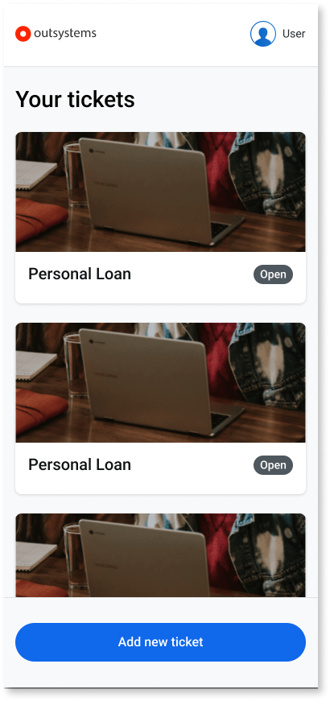
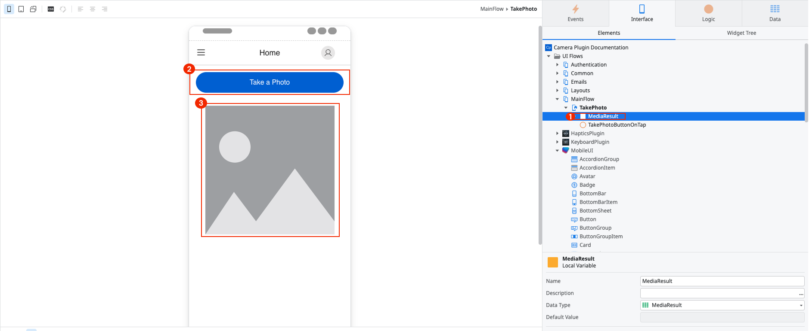
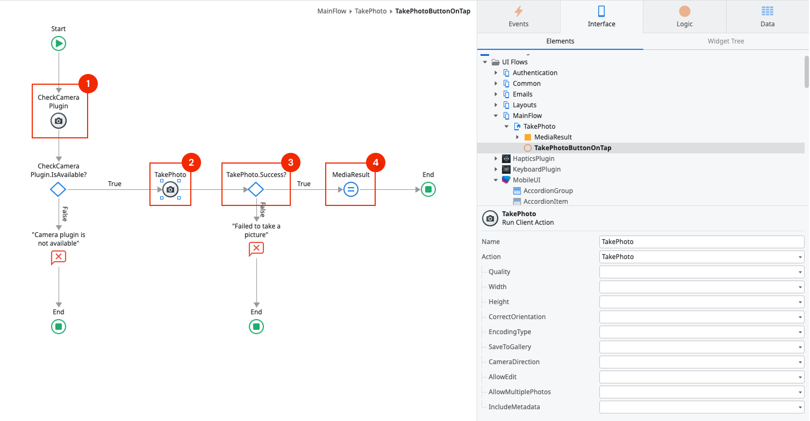
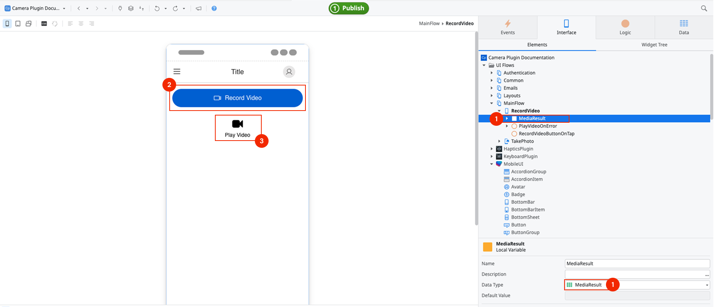
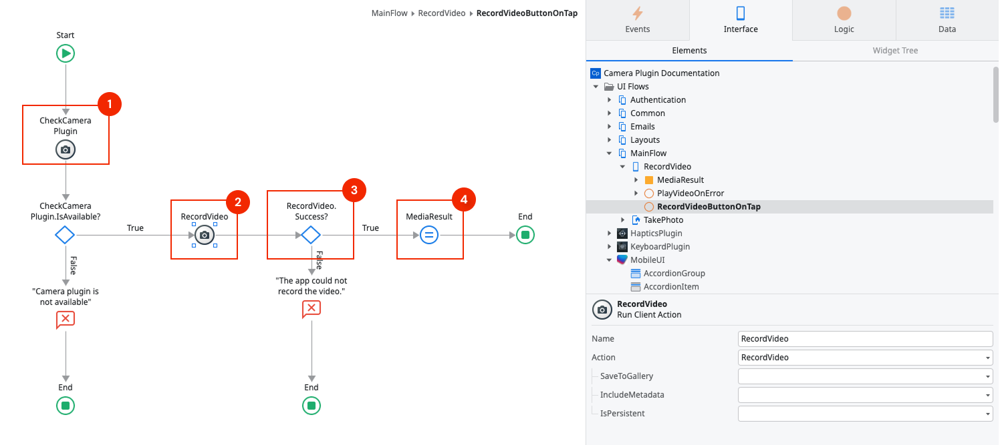
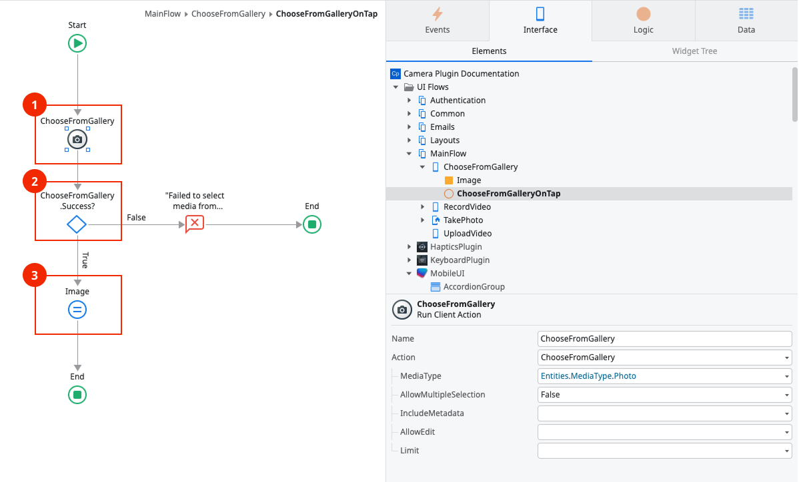
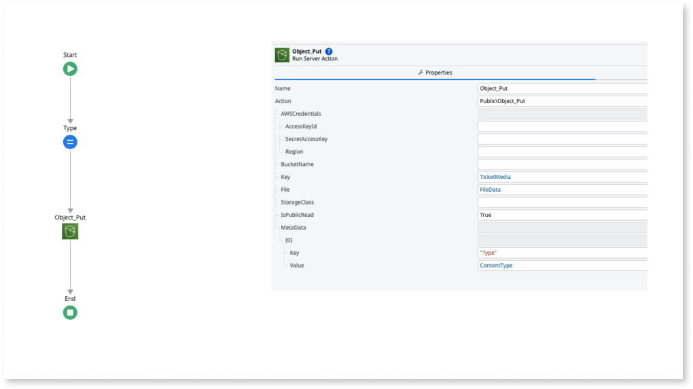
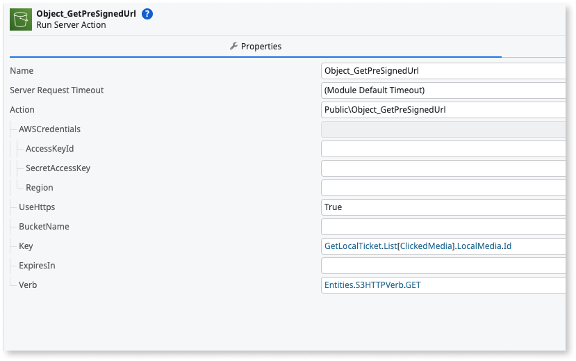
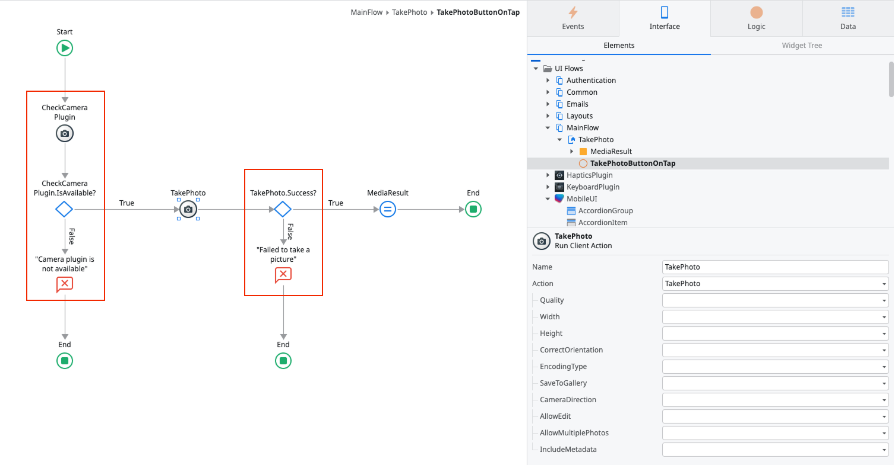

# Camera Plugin

The Camera plugin allows users to take pictures and capture videos with their mobile devices. This plugin works with both native mobile apps and progressive web apps (PWAs).

For more information about how to install and reference a plugin in your app, see [Mobile plugins](../intro.md).

## Demo app

Install the **Camera Sample App** from Forge and open the app in ODC (OutSystems Developer Cloud) Studio. The demo app contains logic for common use cases which you can examine and recreate in your apps. For example, the following demo app shows how to:

* Take a picture
* Capture a video
* Select media from the gallery
* Edit a picture taken with the camera or a picture selected from the gallery
* Edit the picture displayed in the app

    

## Taking a picture 

To allow users take a picture:

* Create a user interface
* Create logic to take a picture
* Create logic to handle errors

### Creating a user interface

1. Create a variable with the data type **MediaResult**. 
    This variables holds the image data.
1. Use a Button or another widget to run the action that takes the picture.
1. Use an **Image** widget to show the image thumbnail after using the camera, by setting Type to Binary Data and Image Content to the content of **MediaResult.Thumbnail**.

    

### Creating logic to take a picture

You can find all of the available actions for the Camera plugin by navigating to the **Logic** tab of ODC Studio, and going to **Client Actions** > **CameraPlugin**.

1. To prevent errors, it's best practice to first check if the plugin is available with the action **CheckCameraPlugin**. If the plugin isn't available to the app, display an error to the user. 
1. Otherwise, allow users take a picture by opening the camera with the **TakePicture** action. In the **TakePicture** action, you can set the parameters for quality, width, back of front camera, and more.
1. Check if taking pictures on the device works by verifying that the value of **TakePicture.Success** is **True**. 
1. If it does, handle the picture data in **TakePicture.MediaResult.Thumbnail** by assigning it to a variable of the **Binary Data** data type.

    

## Recording a video 

To allow users record a video:

* Create a user interface
* Create logic to record a video
* Create logic to handle errors

### Creating a user interface

1. Create a variable with the data type **MediaResult**.
   This variable holds the video data.
1. Use a Button or another widget to run the action that captures a video. 
1. Use the **PlayVideo** widget to play the video after using the camera by setting it to the variable you created.

The **PlayVideo** widgt is a widget used to play videos on a device. The video can either have just been recorded or locally stored in the device's gallery. If you want to display videos from other sources you must use the Video widget.
[**Video**](https://success.outsystems.com/documentation/outsystems_developer_cloud/building_apps/user_interface/patterns/interaction/video/) widget.

Video files stored in the cache are deleted when the app closes. When setting the URI parameter for a video file stored in the cache, be aware that the video you're trying to play may have been already deleted.

### Creating logic to record a video

1. To prevent errors, it's best practice to  check if the **CheckCameraPlugin** action is available for the plugin. If the plugin isn't available for the app, display an error to the user.
1. Otherwise, allow users to capture a video by opening the camera with **RecordVideo** action. In the **RecordVideo** action, you can set the parameters for saving the recorded media to the device’s gallery.
1. Check if recording videos on the device works by verifying that the value of **RecordVideo.Success** is **True**.
1. If yes, handle the picture data in **RecordVideo.MediaResult** by assigning it to a variable of the **MediaResult** data type.

    

## Selecting media from the gallery 

You can allow users to choose a media file from the device gallery, either a picture, a video, or both, using the **ChooseFromGallery** action. 

1. The action **ChooseFromGallery** opens a media browser to let users select a media file.
1. [Check for errors](#handling-errors) by verifying that **ChooseFromGallery.Success** is **True**.
1. After users select the image, the binary data of the image is in the variable **ChooseFromGallery.MediaResult.**.

    

## Uploading media assets from URIs

In conjunction with the **FileTransfer** plugin, you can use video and picture URIs returned in the **MediaResult** to upload these media files to a server and further use their hosted URLs to view them in your app.
For example, below we use the **FileTransfer** plugin **UploadFileWithHeaders** client action to upload a video file to the app’s rest endpoint **rest/tickets/video**.

Inside the rest endpoint, you can then upload the video file to an S3 bucket. Afterwards, you can get the video's presigned URL and use it with the **Video** widget to play the uploaded video

## Image quality and app responsiveness

When you set the image quality to 100% or use the PNG format, your app handles a large amount of image data. Users might notice a delay after taking an image with the highest quality settings. The more data the app has to handle, the less responsive it can become on low-end devices.

When setting the image quality, consider the use case for your app. Refer to the following table for some example use cases.

| Example use case | Image quality          | Notes                                                     |
| ---------------- | ---------------------- | --------------------------------------------------------- |
| Profile image    | JPEG 60% (default)     | Sufficient quality for a profile image.                   |
| Insurance claims | JPEG 85% - 100% or PNG | High quality lets users examine all details in the image. |

Changing the image quality setting only applies to .JPEG files.

## Handling errors

An app with the Camera plugin can run on many Android or iOS devices with different hardware and configurations. To ensure a good user experience and prevent the app from crashing, handle the errors within the app.

The following is the list of actions you can use to handle the errors.

|Variable|Action|Description|
|-|-|-|
|**IsAvailable** **CheckCameraPlugin**| True if the camera plugin is available in the app.|
|**Success**|**TakePicture**|True if there aren't errors while taking a picture.|
|**Success**|**ChooseGalleryPicture**|True if there aren't errors while opening a picture from the gallery.|
|**Success**|**EditPicture**| True if there aren't errors while editing a picture.|
|**Success**|**RecordVideo**|True if there aren't errors while recording a video.|
|**Success**|**ChooseFromGallery**|True if there aren't errors while opening a media file from the gallery.|
|**Success**|**PlayVideo**|True if there aren't errors while playing a video.|

You can use these actions with the **If** nodes to check for errors and control how the app works.

## Reference

The following sections describe the plugin in more detail.

### Actions

The following is a reference list of actions you can use for the Camera plugin. The Camera plugin uses a Cordova plugin. For more inforamtion, see [cordova-plugin-camera](https://github.com/OutSystems/cordova-plugin-camera).

|Action|Description|Available in PWA|
|-|-|-|
|**CheckCameraPlugin**|Checks if the plugin is available in the app.|Yes|
|**TakePicture**|Opens the camera on the user's device.|Yes|
|**RecordVideo**|Opens the camera on the user's device.|No**|
|**ChooseFromGallery**|Opens the gallery on the user's device.|No*|
|**EditPicture**|Opens an edit interface to edit the picture.|Yes|
|**PlayVideo**|Opens a native video player to play local files.|No|
|**ChooseGalleryPicture**|Opens the gallery on the user's device.|Yes|

(*) Under development.

(**) When **SaveToGallery** is set to True, the value of the returned URI points to the gallery file on Android. On iOS, it points to a temporary file, stored in the cache.

## Picture options

Change the properties of the **TakePicture** action to adjust how the app handles the images.

| Property               | Description                                                                                                                    |
| ---------------------- | -------------------------------------------------------------------------------------------------------------------------------|
| **Quality**            | The quality of the picture, in percentage. See the section about[Quality and app responsiveness](#image-quality-and-app-responsiveness).         |
| **Width**              | The width of the picture in pixels.                                                                                           |
| **Height**             | The height of the picture in pixels.                                                                                          |
| **CorrectOrientation** | If **True**, the plugin fixes the orientation if users take a photo and rotate the device. Applies to native mobile apps only. |
| **EncodingType**       | Select the **JPEG** or **PNG** format.                                                                                         |
| **SaveToPhotoAlbum**   | If **True**, the app saves the image to the device.                                                                            |
| **CameraDirection**    | Select the front or back camera as the default when taking a new picture.                                                      |
| **AllowEdit**          | If **True**, an Edit step is added after the take or choose picture step.                                                      |
| **AllowMultiplePictures**| PWA only. Enables taking multiple pictures. Add the **CameraPlugin** theme to your app to ensure this feature works.        |      

The properties of the **TakePicture** action apply to native mobile apps only. In PWAs, the app takes pictures with the default camera settings. These settings depend on the device's browser.

## Video options

Change the properties of the **RecordVideo** action to adjust how the app handles the video.

|Property|Description|
|-|-|
|**SaveToGallery**|If **True**, the app saves the video to the device.|

### MABS compatibility

The following table shows the compatibility of the Camera plugin with the Mobile Apps Builds Service (MABS).

| Plugin version  | Compatible with MABS version | Notes |
| --------------- | ---------------------------- | ----- |
| 1.0.0 and later | MABS 9.0 and later.          |       |

## Known issues and workarounds

A list of known issues and possible workarounds.

### Taking multiple pictures not working in PWAs

In PWA, taking multiple pictures requires use of the browser stream capabilities. To ensure the app has access to the stream, add the theme **CameraPlugin** as an element to your app. **Keep the theme as dependency** even when the IDE reports it as not used by the app.

### In PWA, taking multiple pictures isn't working in some devices

In some devices, the workaround mentioned above shows a defective UI. Currently, there's no workaround for this issue.

### Crashes on iOS 13.2 and 13.3 

**Applies to PWAs.**

In iOS 13.2 and 13.3, the camera may stop working because of the [WebKit 206219 bug](https://bugs.webkit.org/show_bug.cgi?id=206219). If the camera stops working, swipe the open app up in App Switcher and reopen the app. WebKit is working on the fix.

### Pictures appear rotated

**Applies to PWAs.**

In some Chrome versions, the picture displays rotated in the **Image** widget. Currently, there's no workaround for this issue.

### CameraDirection setting has no effect 

**Applies to Android only.**

In some versions of Android, the app ignores the **CameraDirection** setting. Users can change the camera direction (back or front) once the camera app opens.

### The resolution and quality settings apply to app images only

**Applies to native apps only.**

When you change the resolution or quality setting, the plugin applies it to the image the app uses only. The device ignores the settings when saving the images in the device gallery. This means that the size of the image in the gallery depends on the device hardware.

### ChooseFromGallery won't allow items to be selected

**Applies to Android only.**

In Android 13, when using **ChooseFromGallery**, users are unable to select content from the device's gallery. When targeting Android 13, users should build their apps using MABS9 or later.
