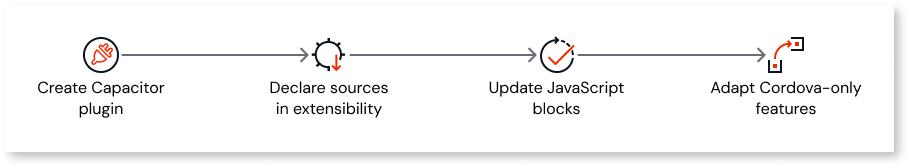

# Implement a dual‑stack plugin

<div class="info" markdown="1">

OutSystems is progressively rolling out mobile libraries.

</div>

A dual-stack plugin is an OutSystems plugin that contains both Cordova and Capacitor plugin implementations. Based on the app's framework, the plugin automatically selects the appropriate native code. This approach ensures that the plugin is compatible with both Cordova and Capacitor apps while enabling you to leverage Capacitor's modern capabilities without breaking existing Cordova-based apps.

This article explains how to adapt the existing OutSystems plugin to support both Capacitor and Cordova plugin implementations.

To implement a dual-stack plugin, follow these steps:

  

1. [Create a Capacitor plugin](build-capacitor-plugin.md) with the same functionality as your existing Cordova plugin.

1. Update your [OutSystems plugin's extensibility configuration](#step-2-declare-both-sources-in-the-extensibility-configuration-modify-extensibility) to reference both implementations.

1. Modify your [JavaScript logic](#step-3-update-your-javascript-blocks-update-javascript) to detect the runtime framework and call the appropriate plugin.

1. Handle any [framework-specific differences](#step-4-adapt-cordovaonly-features-if-present-adapt-cordova-features) in configuration or features.

## When to build a dual‑stack plugin

Choose a dual-stack implementation when:

* You want to use Capacitor APIs that have no Cordova equivalent.
* You need better performance or [capabilities](https://capacitorjs.com/) that Capacitor offers for your use case.
* You want to gradually phase out Cordova support while maintaining backward compatibility and plan to add Capacitor-only features in future versions.
* Your compatibility logic becomes complex and separate implementations reduce long‑term risk.

If the plugin functionality is straightforward and has minimal Cordova-specific dependencies, consider adapting the [Cordova plugin for Capacitor compatibility](../migrate-cordova-plugin.md).

## Prerequisites

Before you begin, ensure that you have an OutSystems plugin that wraps a Cordova plugin.
For example, you have a Cordova plugin to scan QR Codes: `cordova.plugin.qrcode`.

## Step 1: Create a Capacitor plugin {#create-capacitor-plugin}

Implement a Capacitor plugin with the same functionality and JavaScript API (for example, a shared `scanQRCode` method name) as your existing Cordova plugin. Most of the native code (Java and/or Kotlin for Android, Objective-C and/or Swift for iOS) from the Cordova plugin can be reused for Capacitor. For more details, refer to [Build a Capacitor plugin from scratch](build-capacitor-plugin.md).

<div class="info" markdown="1">

OutSystems recommends that you publish the Capacitor plugin to the [npm registry](https://www.npmjs.com/). Alternatively, if you have the plugin hosted in a GitHub repository, you can reference it directly.

</div>

For example, you create a new Capacitor plugin named `QrCode`, and publish it in npm with id `@my-org/qr-code-capacitor`.

## Step 2: Declare both sources in the extensibility configuration {#modify-extensibility}

Update your existing [OutSystems plugin’s extensibility](../../../building-apps/mobile/extensibility-configurations/extensibility-lib-reference.md) so that MABS 12 builds can pull either Cordova or Capacitor sources, and keep the legacy `plugin` block for MABS 11. Because app users may configure MABS 12 to run either Cordova or Capacitor, declare both under `buildConfigurations`.

For example, for the QrCode plugin:

```json
{
  "buildConfigurations": {
    "cordova": {
      "source": { "npm": "@my-org/cordova.plugin.qrcode@1.2.0" }
    },
    "capacitor": {
      "source": { "npm": "@my-org/qr-code-capacitor@1.0.0" }
    }
  },
  "plugin": { "identifier": "@my-org/cordova.plugin.qrcode@1.2.0" }
}
```

If your Capacitor or Cordova plugin is hosted on GitHub and tagged, reference the tag in the extensibility configuration:

```json
"npm": "https://github.com/<org>/<repo>#<tag>"
```

 For example:

```json
"npm":"https://github.com/<org-name>/<capacitor-plugin-repo-name>#1.0.0"
```

<div class="info" markdown="1">

You use a single OutSystems plugin for both frameworks. The consumer app can remain unchanged as long as the OutSystems plugin exposes the same public client actions. The OutSystems plugin routes calls internally based on the runtime framework.

</div>

## Step 3: Update your JavaScript blocks {#update-javascript}

In your OutSystems plugin’s client actions logic, update your JavaScript blocks that reference the Cordova plugin with the following logic:

* If you’re on a Capacitor app, call the Capacitor plugin.
* Otherwise, call the Cordova plugin.

For example, if both Cordova and Capacitor plugins have a `scanQRCode` method:

```javascript
if (typeof(Capacitor) !== 'undefined') {
  // Capacitor app — use Capacitor plugin
  window.CapacitorPlugins.QrCode.scanQRCode();
} else {
  // Cordova app — use Cordova plugin
  cordova.plugins.qrcode.scanQRCode();
}
```

<div class="info" markdown="1">

Alternatively, you can use the ODC [Common Plugin](../common-plugin/intro.md) and its `GetNativeMobileFramework` client action to detect the current framework at runtime. By using this action, you can implement separate JavaScript blocks for the Cordova and Capacitor calls within your OutSystems logic, ensuring that the correct native implementation is invoked for each platform.

</div>

## Step 4: Adapt Cordova‑only features (if present) {#adapt-cordova-features}

Some Cordova functionalities, such as plugin hooks and certain features in `plugin.xml`, aren't directly supported by Capacitor. If your plugin uses these features, perform additional changes to ensure compatibility. For detailed information, refer to [Changes required for Capacitor compatibility](../migrate-cordova-plugin.md#changes-required-for-capacitor-compatibility-changes-required-for-capacitor-compatbility)

## Related resources

Explore these resources to learn more about using plugins in Capacitor apps:

* [Adapt Cordova plugin for compatibility with Capacitor](../migrate-cordova-plugin.md)
  
* [Build a Capacitor plugin from scratch](build-capacitor-plugin.md)
