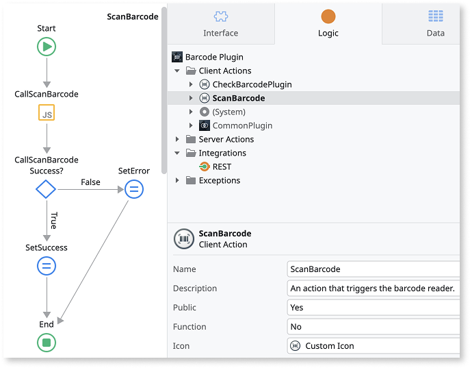
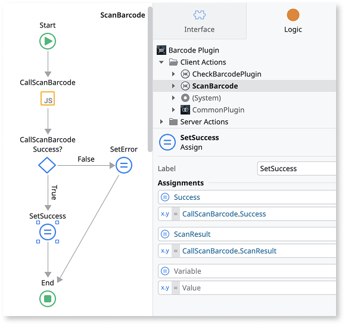

# Integrate Capacitor plugin into a mobile app

<div class="info" markdown="1">

OutSystems is progressively rolling out mobile libraries.

</div>

To use a Capacitor plugin in an app, you must create a [mobile library](../../../building-apps/libraries/libraries.md#mobile-libraries-mobile-libraries) that acts as a wrapper for the plugin. You can then include this mobile library in the app where the plugin's functionality is required. In this article, the [@capacitor/barcode scanner plugin](https://capacitorjs.com/docs/apis/barcode-scanner) is used as an example to explain how to integrate a plugin into an ODC app and use its functionality to scan a code.

You can either [build a Capacitor plugin](build-capacitor-plugin.md) from scratch or use [officially supported](https://capacitorjs.com/docs/plugins) Capacitor plugins.

Here are the steps involved in integrating a plugin into an ODC app:

## Step 1: Create a mobile library

Create a mobile library that acts as a wrapper for the plugin. In this example, **Barcode Plugin** library is created.

## Step 2: Define extensibility configurations

Define the [extensibility configurations](../../../building-apps/mobile/extensibility-configurations.md) in the mobile library to reference the plugin package and include the plugin permissions. For detailed information about the schema, refer to [Library (plugin) extensibility configuration JSON schema](../../../building-apps/mobile/extensibility-configurations/extensibility-lib-reference.md).

<div class="info" markdown="1">

When you build your mobile app, all Capacitor plugins such as official Capacitor plugins, third-party Capacitor plugins from npm and your custom-built Capacitor plugins referenced in your mobile library's extensibility configuration are automatically bundled and are made available globally through `window.CapacitorPlugins`.

</div>

In this example, configure extensibility configurations for the **Barcode Plugin** mobile library to:

* Reference the @capacitor/barcode-scanner NPM package.
* Include the necessary plugin permissions for iOS and Android platforms.

```json

{
    "buildConfigurations": {
        "capacitor": {
            "source": {
                // Reference the Barcode Scanner NPM package and version
                "npm": "@capacitor/barcode-scanner@2.0.3"
            }
        }
    },
    "pluginConfigurations": {
        "permissions": {
            "ios": {
                // iOS requires usage descriptions for camera access, referencing the extensibility setting
                "NSCameraUsageDescription": {
                    "description": "$extensibilitySettings.CameraUsageDescription"
                }
            },
            "android": [
                // Android requires the camera permission to be declared
                "android.permission.CAMERA"
            ]
        }
    }
}
```

In the example, an extensibility setting `CameraUsageDescription` is used to set the value for `description`.

OutSystems recommends using [extensibility settings](../../../building-apps/mobile/configuring-mobile-apps.md#configure-extensibility-settings) in such scenarios because they allow app developers to customize permission descriptions directly from the ODC Portal without modifying the plugin or app.

## Step 3: Create a client action

Create a client action in the mobile library to encapsulate the JavaScript call to the plugin. In this example, the JavaScript node calls the `scanBarcode` function from the `@capacitor/barcode-scanner` plugin with the necessary input parameters.



The input parameters can either be JavaScript input parameters or passed from the client action.

```JavaScript

async function scanBarcodeCapacitor() {
    let params = {
        scanInstructions: $parameters.ScanInstructions,
        cameraDirection: $parameters.CameraDirection,
        scanOrientation: $parameters.ScanOrientation,
        scanButton: $parameters.ScanButton,
        scanText: $parameters.ScanText,
        hint: $parameters.Hint,
        android: {
            scanningLibrary: $parameters.AndroidScanningLibrary
        }
    };
    try {
        let result = await window.CapacitorPlugins.CapacitorBarcodeScanner.scanBarcode(params);
        $parameters.ScanResult = result.ScanResult;
        $parameters.Success = true;
    } catch(error) {
        $parameters.ErrorCode = error.code;
        $parameters.ErrorMessage = error.message;
        $parameters.Success = false;
    }
    $resolve();
}

// Check if the plugin is available
if(typeof(window.CapacitorPlugins) !== "undefined" && window.CapacitorPlugins.CapacitorBarcodeScanner) {
    scanBarcodeCapacitor();
}

```

The JavaScript code accesses the Capacitor plugin through `window.CapacitorPlugins`, which is automatically populated during the build process. The ODC **Barcode Plugin** mobile library calls the `scanBarcode` function from the `@capacitor/barcode-scanner` plugin.

The `scanBarcode` function returns a string with the result of scanning the barcode or QR code. The result is assigned to the client action's output parameter.



## Step 4: Use the mobile library in the app

Create an app that uses the **Barcode Plugin**. [Add the mobile library](../../../building-apps/libraries/use-public-elements.md) in the app. In the app, call the client action and display its output.

## Step 5: Create a mobile package

From the ODC Portal, build the app to create iOS and Android packages using MABS version 12 or higher. For detailed information about creating mobile packages, refer to [Create mobile app package](../../../building-apps/mobile/creating-mobile-package.md).

After successfully building your mobile package, install it on your device to test the Capacitor plugin functionality in your app.

## Security considerations {#plugin-security}

When integrating Capacitor plugins, keep the following security considerations in mind:

* **Trust your plugins**: Every bundled plugin has access to the global JavaScript environment giving them access to device APIs, your app data, and user information.

* **Verify plugins before installation**: Only install plugins from trusted sources such as official Capacitor plugins, OutSystems-supported plugins, or well-maintained community plugins with good reputation.

* **Review plugin code**: When possible, review the plugin's source code, check npm download stats and GitHub stars, and look for security audits or recent updates.

* **Keep plugins updated**: Regularly update plugins to get security patches and monitor for security advisories.

* **Remove unused plugins**: Periodically audit your installed plugins and remove any that are no longer needed to minimize security risks.

## Related resources

For more information, refer to the following resources:

* [Universal extensibility configuration JSON schema](../../../building-apps/mobile/extensibility-configurations.md)

* [Create mobile app package](../../../building-apps/mobile/creating-mobile-package.md)

* [Mobile libraries](../../../building-apps/libraries/libraries.md#mobile-libraries-mobile-libraries)
