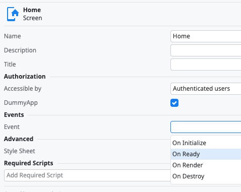
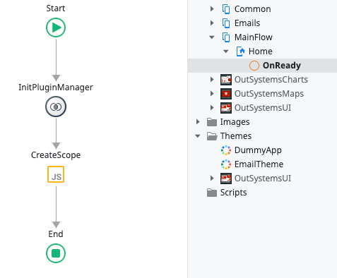
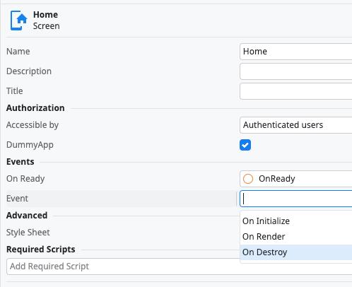
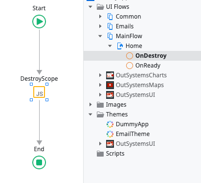

# Common Plugin

<div class="info" markdown="1">

Applies only to Mobile Apps.

</div>

The Common Plugin provides you with a set of actions that facilitates obtaining crucial information for the development of mobile apps.

<div class="info" markdown="1">

To learn how to install and reference a plugin in your OutSystems apps, as well as how to install a demo app, refer to  [Adding plugins](../intro.md#adding-plugins).

</div>

Using the Common Plugin you will be able to:

1. Write to the device's console - **ConsoleLog** client action

2. Get the value of the **device.uuid** variable, which should uniquely identify the current device/installation - **GetDeviceID** client action

3. Check the device’s operating system in which the app is running- **GetOperatingSystem** client action

4. Get the Cordova's platform information - **GetPlatform** client action

5. Get the Webview's User Agent - **GetUserAgent** client action

6. Checks if Cordova is defined or not - **IsCordovaDefined** client action

7. Create a scope for your plugin needs - more information bellow

## Plugin Manager 

PluginManager is a JavaScript module that allows you to create and use specific scopes in your mobile app. A scope created by the PluginManager module can be used to follow the same lifecycles as OutSystems App screens and UI Blocks, allowing you to, for example, safely perform native background tasks and dispatch related information to your OutSystems' App.

For example, the File Transfer Plugin creates a scope in its **HandleDownload** and **HandleUpload** UI blocks: one scope for download-related events and another for upload-related events. 

## Using Plugin Manager 

To add the Plugin Manager JavaScript module to your app screen, follow these steps:

1. In ODC Studio, go to **Logic > Client Action > Common Plugin**  and call the **InitPluginManager** client action in your screen’s **OnReady** event




2. Add a JavaScript node to your **OnReady** flow



3. Implement your own custom callback - for example, you can define a counter variable that gets increased when your callback is called and reset when your screen is destroyed

4. Then, you can create your own scope by calling `OSCommonPlugin.PluginManager.createScope(<scope_name>, <on_ready_callback>, <on_destroy_callback>)`

    For the counter example, the code inside the JavaScript node would be:

```Javascript
var onReady = function(scope) { 
    scope.counter = 0;
   
    scope.increaseCounter = scope.newCallback(function() {
        scope.counter += 1;
    });
};

var onDestroy = function(scope) {
    scope.counter = 0;
};

OSCommonPlugin.PluginManager.createScope("counter_scope", onReady, onDestroy);
```

5. To correctly destroy the new scope, you need to add logic to your screen’s **OnDestroy** event




6. Destroy your scope by calling `OSCommonPlugin.PluginManager.destroyScope(<scope_name>)` after verifying it exists.

```Javascript
let scope = OSCommonPlugin.PluginManager.scope("counter_scope");
if(scope !== undefined) {
    OSCommonPlugin.PluginManager.destroyScope("counter_scope");    
}
```

Now you can increase your counter by calling your scope’s new callback:

```Javascript
let scope = OSCommonPlugin.PluginManager.scope("counter_scope");
if(scope !== undefined) {
    scope.increaseCounter();
}
```


