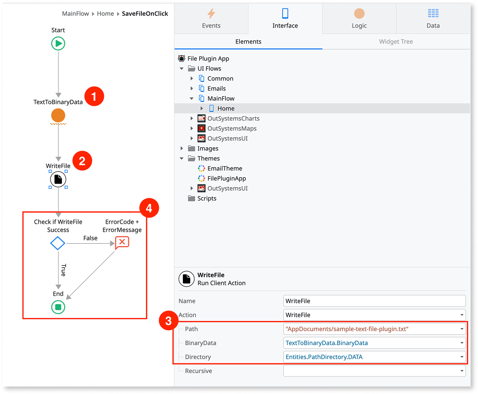
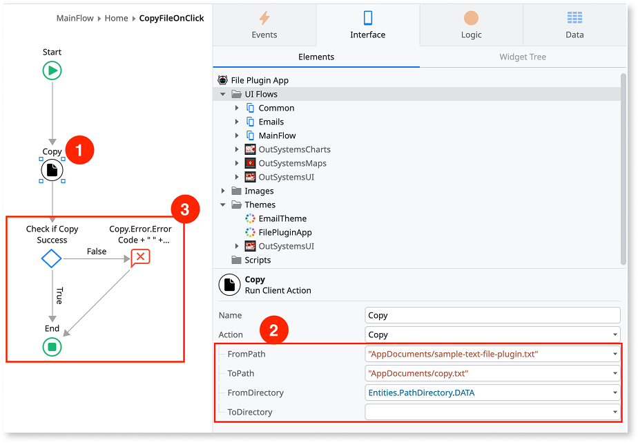
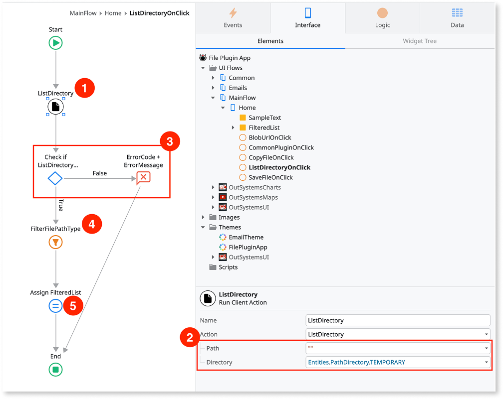

# File Plugin version 2

If you are looking for information about version 1.x of the File Plugin, refer to the [Version 1 documentation](file-plugin-version-1.md).

The File Plugin version 2.0.0 is a major revamp of the Plugin, and includes many changes in the plugin's logic. If you are using an older version and are looking to update to 2.0.0, refer to [the migration guide](file-plugin-migration-guide.md) for more information.

Applies only to Mobile Apps.

See [Installing plugins](../intro.md) to learn how to install a plugin in your OutSystems apps.

File Plugin lets you manage files and folders on a mobile device within the app sandbox.

## Working with binary content

File Plugin in some actions requires parameters of the binary data type.To convert data to binary you can use:

* **BinaryData extension**, an official and supported extension. The BinaryData extension exposes server Actions and **requires a connection to the server** when it runs one of the actions from the BinaryData extension. This extension doesn't work offline.
* **BinaryData Client Side**, a Forge plugin contributed by the OutSystems community and it's not officially supported. Actions in this plugin run in the client, and your app can **use them while offline**.

## Examples

Here are some examples of how to use File Plugin.

### Store some text in a file

The **WriteFile** requires a binary input, so you need to convert the text to binary first. Use the **TextToBinaryData** (1) action from the **BinaryData** extension (you need to reference the **BinaryData** extension first).

You can then use the **WriteFile** action from **Logic** > **Client Actions** > **FilePlugin** to create a file and save text (2). Set the **PathDirectory** and relative path to the file, along with the **Binary Data** (3).

Finally, check the result of **WriteFile**. If **Success** is true, it means the file was saved successfully. Otherwise, you can show the returned **Error** (4).

Refer to [Working with binary content](#working-with-binary-content) for more information on using **BinaryData**.

### Copy a file

Imagine that you want to copy the file [you stored previously](#store-some-text-in-a-file) - You can use the **Copy** action from **Logic** > **Client Actions** > **FilePlugin** (1). Pass the relative path and **PathDirectory** of the file you want to copy in **FromPath** and **FromDirectory**, respectively (2). In this example, the copied file will be in the same **PathDirectory**, so only **ToPath** is specified. You can provide a different **ToDirectory** if you'd like to copy a file to an entirely different location.

Finally, check the result of **Copy**. If Success is true, it means the file was copied successfully. Otherwise, you can show the returned Error (3).

### Get the list of files

Use the **ListDirectory** action from **Logic** > **Client Actions** > **FilePlugin** to get the list of the files (1). In this example, we want to list all the contents of in the **TEMPORARY** directory - passing an empty path to indicate we want the contents at the root of the temporary directory (2).

You can check if **ListDirectory** has **Success** equal to true. If so, proceed to the next step. Otherwise, you can show the returned Error (3).

The **ListDirectory** returns both files and sub-directories inside that directory. To get only the files, we can use the **ListFilter** action on the **Result** from **ListDirectory** and filter for **Type = Entities.PathType.File** (4).

Then, assign the **FilteredList** to a variable to use in your UI (5).

## Reference

The File Plugin is dual-stack, as it uses a Cordova plugin for Cordova apps, and a Capacitor plugin for Capacitor apps. For more information check[cordova-outsystems-file](https://github.com/ionic-team/cordova-outsystems-file) and [capacitor-filesystem](https://github.com/ionic-team/capacitor-filesystem).

For more information on the plugin elements, refer to the [File Plugin version 2 reference page](file-plugin-ref.md).
