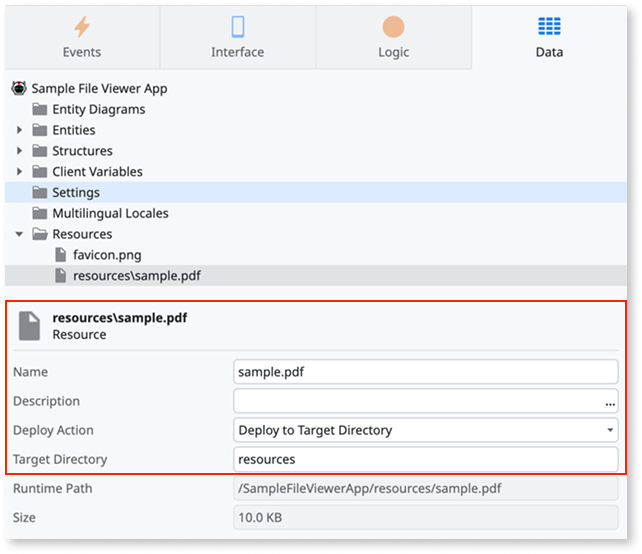
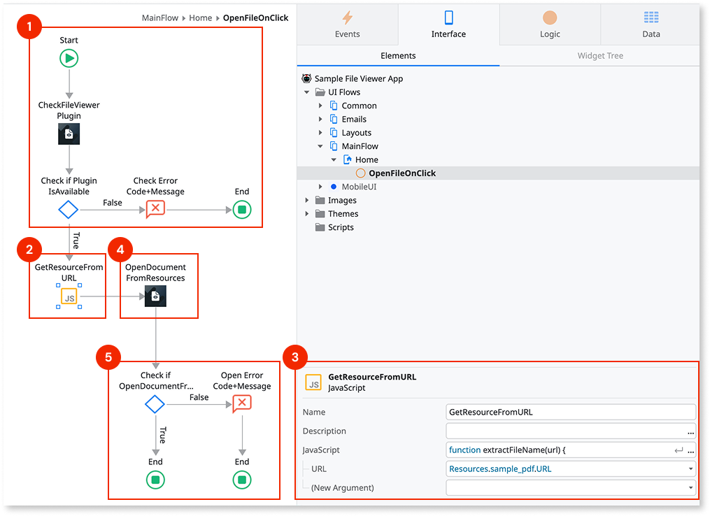

# File Viewer plugin

<div class="info" markdown="1">

Applies only to Mobile Apps.

</div>

Use the File Viewer Plugin to create logic that lets users open remote or app resource files. In Android, users select an app to open the file. iOS provides a native preview for supported file types.

<div class="info" markdown="1">

See [Installing plugins](../intro.md) to learn how to install and reference a plugin in your OutSystems apps.

</div>

The File Viewer plugin can open:

* A **file from the app resources**: The plugin can access the **resources** path to load the file that's part of the app static content. For more information, refer to [Working with app resources](#working-with-app-resources).
* A **remote file**: The plugin downloads the file to the app sandbox and then opens the file.


## Viewing files in Android and iOS

To let users view files in the mobile apps, create logic with one of these client actions:

* **OpenDocumentFromLocalPath**: Provide a local file path in the **FilePath** argument.
* **OpenDocumentFromUrl**: Provide the url pointing to a remote file in the **URL** argument.
* **OpenDocumentFromResources**: If you want to open a file from the app resources, refer to [Working with app resources](#working-with-app-resources).

For an example of how to use the plugin, refer to [the example in this document](#example-of-using-the-file-viewer-plugin).

<div class="info" markdown="1">

For opening media files in iOS apps, use one of the following actions: **PreviewMediaContentFromLocalPath**, **PreviewMediaContentFromResources**, or **PreviewMediaContentFromUrl**.

These actions let apps handle the media files better by opening them in a media player.

</div>

## Working with app resources

Here is how to add a file as a resource and open the file with the plugin.

1. In ODC Studio, go to the **Data** tab.

1. Right-click the **Resources** folder and select **Import resources**. A file dialog opens, where you can select the file you want to add as a resource.

1. Select the file you added under **Resources**, and:

    * Enter `resources` in the **Target Directory** property. Note that this value must be `resources` and you can't change it.
    * Select **Deploy to Target Directory** in the **Deploy Action** list.

    

1. In the **OpenDocumentFromResources** action, set the **ResourcePath** input parameter to the resource name based on the URL generated by Outsystems. For more information, refer to the [example of using the File Viewer Plugin](#example-of-using-the-file-viewer-plugin).

<div class="info" markdown="1">

The plugin can access only resources you deploy in the **resources** path. This is a security limitation by design. Limiting access of the plugin prevents accidental access to the resources of the app.

</div>

## Example of using the File Viewer Plugin

Here is an example of how to use the File Viewer Plugin.



A good practice is to check if the plugin is available to the app, and report an error if not. You can check the plugin availability by using the **CheckFileViewerPlugin** action and checking the value of the **CheckFileViewerPlugin.IsAvailable** boolean (1). If it is true, you can proceed.

This example [works with app resources](#working-with-app-resources). You'll need an extra step to retrieve the resource file from the URL generated by ODC, which you can do using a JavaScript Block (2) - with an **URL** Text input parameter and a **Path** Text output parameter.

```javascript
function extractFileName(url) {
    const match = url.match(/\/([^\/?]+)\?/);
    return match ? match[1] : '';
}

let fileName = extractFileName($parameters.URL);
$parameters.Path = "resources/" + fileName;
```

If you added a resource called **sample.pdf**, you get the URL using **Resources.sample_pdf.URL** (3). For working with a local file or a remote URL directly, this step isn't required.

After that, you can use the **OpenDocumentFromResources** (4) action using the **GetResourceFromURL.Path**, to ask the operating system to view the resource file.

Finally, to confirm that the file has been opened successfully, check the **OpenDocumentFromResources.Success** boolean (5). If it is false, you may get the **OpenDocumentFromResources.Error** structure for more information. Check the [errors section](#errors) for the types of errors the plugin can return.

## Reference

More information about parts of the plugin.

### Actions

Here is the reference of the actions you can use from the File Viewer plugin. The File Viewer plugin is dual-stack, as it uses a Cordova plugin for Cordova apps, and a Capacitor plugin for Capacitor apps. For more information check out [cordova-outsystems-file-viewer](https://github.com/ionic-team/cordova-outsystems-file-viewer) and [capacitor/file-viewer](https://github.com/ionic-team/capacitor-file-viewer).

| Action                               | Description                                                                                  |
| ------------------------------------ | -------------------------------------------------------------------------------------------- |
| **CheckFileViewerPlugin**            | Checks if the plugin is loaded.                                                              |
| **OpenDocumentFromLocalPath**        | Opens a file stored in the local filesystem. For PWA, a file picker is opened.               |
| **OpenDocumentFromResources**        | Opens a file from the app resources.                                                 |
| **OpenDocumentFromUrl**              | Opens a file from a remote URL.                                                              |
| **PreviewMediaContentFromLocalPath** | iOS only. Opens media files in the device's local filesystem, using a built-in media player. |
| **PreviewMediaContentFromResources** | iOS only. Opens media files from the app resources, using a built-in media player.   |
| **PreviewMediaContentFromUrl**       | iOS only. Opens media files from a URL, using a built-in media player.                       |

#### Deprecated Client Actions

The following client actions are still offered, but have been deprecated since version 2.0.0 of the plugin, in favor of the actions referenced above.

| Action                  | Description                                                                          | Deprecated Reason                                                                       |
| ----------------------- | ------------------------------------------------------------------------------------ | --------------------------------------------------------------------------------------- |
| **CheckPlugin**         | Checks if the plugin is available in the app.                                        | Use **CheckFileViewerPlugin** instead.                                                  |
| **OpenDocument**        | Opens a remote file or a [file from the app resources](#working-with-app-resources). | Use **OpenDocumentFrom(X)** where (X) can be `LocalPath`, `Resources`, or `Url`.        |
| **PreviewMediaContent** | iOS only. Action to preview media content.                                           | Use **PreviewMediaContentFrom(X)** where (X) can be `LocalPath`, `Resources`, or `Url`. |

### Errors

Since version 2.0.0 of the Plugin, specific errors are returned on native platforms.

| Error code        | Platform(s)      | Message                                                                                   |
| ------------------| ---------------- | ----------------------------------------------------------------------------------------- |
| OS-PLUG-FLVW-0001 | Android, iOS     | Cordova and Capacitor isn't defined.                                                        |
| OS-PLUG-FLVW-0002 | Android, iOS     | The app is running with an old version of the plugin. Please create a new mobile package. |
| OS-PLUG-FLVW-0003 | Android, iOS     | File Viewer Plugin is not loaded.                                                         |
| OS-PLUG-FLVW-0004 | Android, iOS     | The file you are trying to open does not exist.                                           |
| OS-PLUG-FLVW-0005 | Android, iOS     | The URL you are trying to open is malformed.                                              |
| OS-PLUG-FLVW-0006 | Android, iOS     | Path of the file to open is either null or empty.                                         |
| OS-PLUG-FLVW-0007 | Android, iOS     | URL to open is either null or empty.                                                      |
| OS-PLUG-FLVW-0008 | Android, iOS     | Could not open the file.                                                                  |
| OS-PLUG-FLVW-0009 | Android, iOS     | Invalid parameters.                                                                       |
| OS-PLUG-FLVW-0010 | Android          | There is no app to open this file.                                                        |
| OS-PLUG-FLVW-0011 | iOS              | Cordova / Capacitor bridge isn’t initialized.                                             |
| OS-PLUG-FLVW-0012 | iOS              | The download failed.                                                                      |
| OS-PLUG-FLVW-0013 | iOS              | The file has no extension.                                                                |
