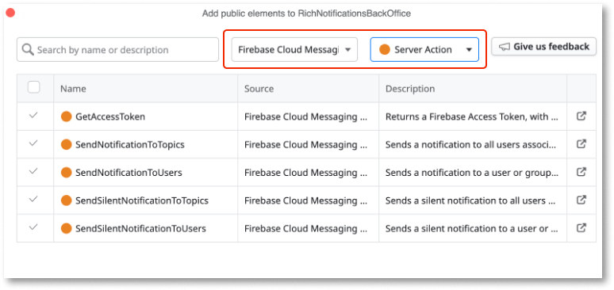
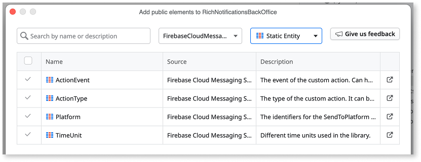
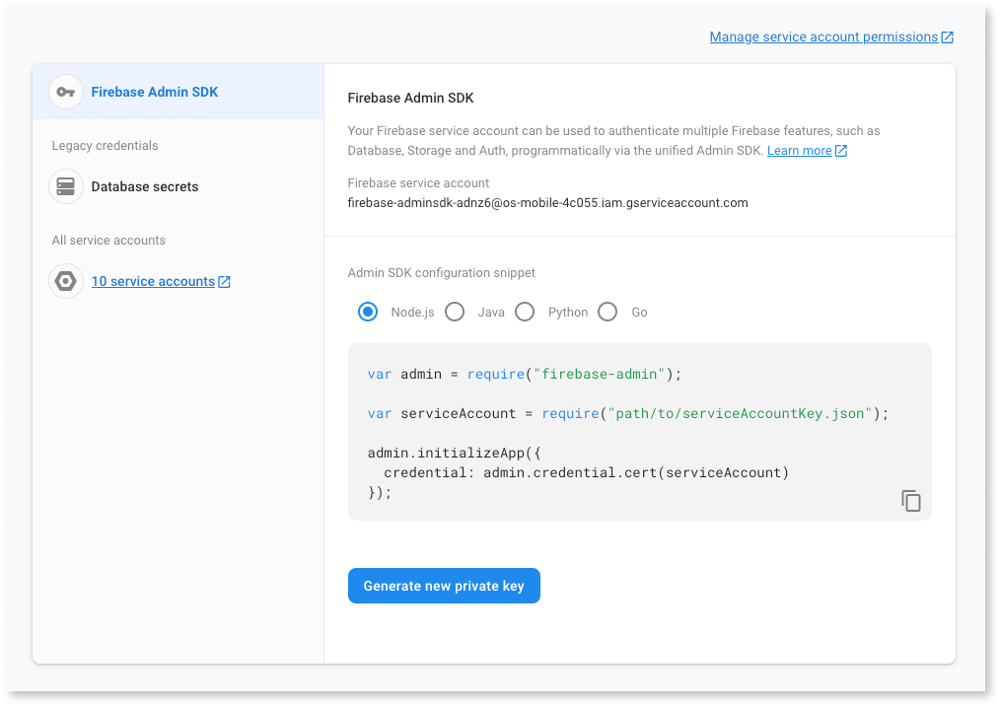
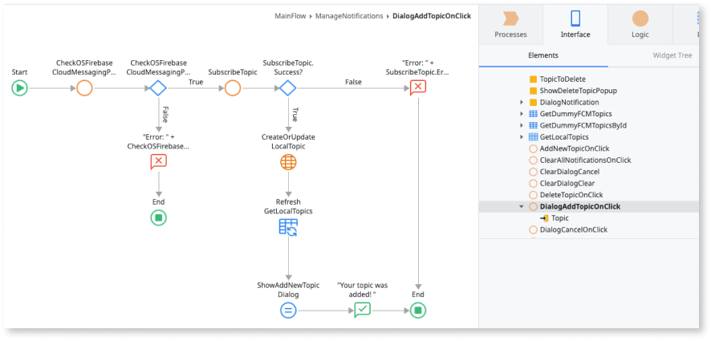
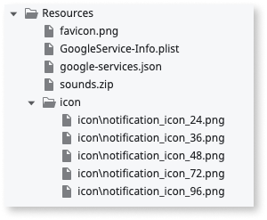
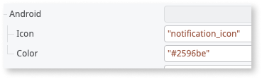

# Firebase Cloud Messaging plugin using server actions

<div class="info" markdown="1">

This article applies only to Firebase Cloud Messaging plugin version 1.0.0 and newer. The newer versions use [server actions](#server-actions-reference) to manage the notifications. From plugin version `3.0.0` onwards, the server actions are no longer part of the plugin. They have been moved to a separate library called **Firebase Cloud Messaging Server Actions**, available on Forge.

If you are still using Firebase Cloud Messaging plugin version 0.1.2 and older, OutSystems recommends that you migrate to version 1.0.0 and newer.

</div>

The **Firebase Cloud Messaging plugin** allows you to set a notification experience that starts the Firebase cross-platform messaging solution. This plugin lets you send normal and silent notifications to your mobile app users. Normal notifications can include customizable actions and sounds.

<div class="info" markdown="1">

You can install the Firebase Cloud Messaging plugin from the Forge in ODC Portal.

</div>

Normal notifications have a UI that displays visual and auditory cues. The cues either display in the notifications area of the app or in the scope of the app. Silent notifications don't display any visual cues. Notifications can deliver a data package to the app (called extra data). This data takes the form of a key-value pairs list.

OutSystems also has notification features you can use to create custom actions and custom sounds.  

Following is a high-level process describing how to implement and manage the notifications of your OutSystems app.

1. Use the **Firebase Cloud Messaging Server Actions** library to set up a back-end notification service.

1. Use the **Firebase Cloud Messaging Plugin's Client Actions** to implement basic notification functions in your app.

1. To prevent app runtime errors, verify if the plugin is available during runtime in your app. To check the availability of your plugin, from ODC Studio, go to **Logic** > **Client Actions** > **CloudMessagingPlugin** > **CheckCloudMessagingPlugin** action. If the plugin isn't available in your app, display an error to your end-users.

<div class="info" markdown="1">

To learn how to install and reference a plugin in your OutSystems apps, and how to install a sample app, see [Installing a plugin and adding a public element to your app](../intro.md#installing-a-plugin-and-adding-a-public-element-to-your-app). To use this plugin, verify your app meets all the [Firebase prerequisites](intro.md#prerequisites).

</div>

## Sample app

OutSystems provides a sample app that contains logic for common use cases. Install the Firebase sample app from Forge and then open it in ODC Studio.

This sample app shows you how to do the following:

* Trigger a basic notification, leading to internal routes.

* Trigger a notification with custom actions that lead to internal routes.

* Trigger a notification with custom actions that lead to a given URL in the device’s browser.

* Trigger a notification with custom actions that lead to an external app.

* Trigger a notification with custom actions that open a text field.

* Trigger a notification with a custom sound.

## Compose and manage push notifications

The following steps describe how to create a back-end notification service and how to prepare a mobile app to respond with push notifications:

1. [Set up a back-end notification service using the Firebase Cloud Messaging Server Actions library](#set-up-a-back-end-notification-service).

1. [Enable basic notification functions in your app using the plugin's actions](#enable-basic-notification-functions-in-your-app).

1. [Enable notifications with custom actions](#enable-notifications-with-custom-actions).

1. [Enable notifications with custom sounds](#enable-notifications-with-custom-sounds).

1. [Enable notifications with a custom icon and icon color for Android devices](#enable-notifications-with-a-custom-icon-and-icon-color-for-android-devices).

1. [Manage the experience of in-app notifications using the Notifications block](#manage-the-experience-of-in-app-notifications-using-the-notifications-block).

1. [Manage the experience of custom actions using the Notifications block](#manage-the-experience-of-custom-actions-using-the-notifications-block).

1. [Extend to your use case: authenticate your notification requests to FCM HTTP v1 REST API](#authenticate-push-notification-requests-to-fcm-http-v1-api).

### Set up a back-end notification service

<div class="info" markdown="1">

The Cloud Messaging Configurator, version 0.1.2 and older, is deprecated. For more information, see [Firebase Cloud Messaging HTTP protocol](https://firebase.google.com/docs/cloud-messaging/http-server-ref). This means the **v2** and **v1** endpoints are no longer functional.

The Cloud Messaging Configurator's REST APIs have been replaced by server actions available on the Firebase Cloud Messaging Plugin until version `2.3.5`. Starting on version `3.0.0`, they were removed from the plugin and are available in the Firebase Cloud Messaging Server Actions instead. If you are still consuming the REST APIs, they must be replaced with the server actions as soon as possible.

</div>

To set up a back-end notification service, do the following:

1. Install the **Firebase Cloud Messaging Server Actions** Forge component in your environment. This component includes four **Server Actions** that send notifications to a list of users or topics. It also includes one **Server Action** to generate an **Access Token**.

1. Create a new app to serve as your backend notification service.

1. In the newly created application, consume the **Firebase Cloud Messaging Server Actions** library. Add the server actions, along with its associated static entities.

   
   

1. Get your Firebase Service Account File via **Firebase Console > Settings > Service Accounts > Generate new private key**

   

1. Update the plugin’s settings with the information inside this service account JSON File

    1. In ODC Portal, go to the Details page of your app.

    1. Navigate to the Configurations tab, and expand the Settings section.

    1. For the **PrivateKey** setting, copy/paste the value of the private_key field of your Firebase Service Account JSON File.

    1. For the **PrivateKeyID** setting, copy/paste the value of the private_key_id field of your Firebase Service Account JSON File.

    1. For the **FirebaseProjectInfo** setting, open your Service Account File in your text editor of choice, remove private_key_id and private_key fields and copy/paste the resulting JSON.

        The Original Service Account JSON format is:

          ```JSON
          {
              "type": "service_account",
              "project_id": "YOUR_PROJECT_ID",
              "private_key_id": "YOUR_PRIVATE_KEY_ID",
              "private_key": "YOUR_PRIVATE_KEY",
              "client_email": "YOUR_CLIENT_EMAIL",
              "client_id": "YOUR_CLIENT_ID",
              "auth_uri": "https://accounts.google.com/o/oauth2/auth",
              "token_uri": "https://oauth2.googleapis.com/token",
              "auth_provider_x509_cert_url": "AUTH_PROVIDER_CERT_URL",
              "client_x509_cert_url": "CLIENT_CERT_URL",
              "universe_domain": "googleapis.com"
          }
          ```

        While the FirebaseProjectInfo JSON setting should be:

          ```JSON
          {
              "type": "service_account",
              "project_id": "YOUR_PROJECT_ID",
              "client_email": "YOUR_CLIENT_EMAIL",
              "client_id": "YOUR_CLIENT_ID",
              "auth_uri": "https://accounts.google.com/o/oauth2/auth",
              "token_uri": "https://oauth2.googleapis.com/token",
              "auth_provider_x509_cert_url": "AUTH_PROVIDER_CERT_URL",
              "client_x509_cert_url": "CLIENT_CERT_URL",
              "universe_domain": "googleapis.com"
          }
          ```

1. Create the logic to store and manage your Firebase Access Token in the app you just created.

    Call the new server action GetAcessToken and store its return value. This token expires after one hour. To avoid calling the action GetAccessToken unnecessarily, store its value and creation time in a Database table. Before calling the server action, check if the token has expired and only then refresh its value.

Now you can start to create the UI for your back-end notification service. If you want to send the notification to specific users, note that these are identified by their Firebase Token, that can be obtained with the **GetToken** client action of the **Firebase Cloud Messaging Plugin**.

To send a notification to all users, or to all Android or iOS users, you need to fill the **SenderID** structure attribute of the **SendRequest** parameter. You can find this ID on the Firebase Project Settings under the Cloud Messaging tab.

Moreover, to send a notification specifically to all Android or iOS users, you should set the **SendToPlatform** structure attribute to one of the values in the **Platform** static entity that the plugin provides.


Other available methods include **SendNotificationToTopics**, **SendSilentNotificationToUsers**, and **SendSilentNotificationToTopics**.

For silent notifications (**SendSilentNotificationToUsers** and **SendSilentNotificationToTopics**), the **TimeToLive** structure attribute sets the notifications' expiration time. More specifically, if the **TimeValue** for a specific **TimeUnit** is greater than 0, the message persists in the local storage and is delivered at the first opportunity, until the expiration time has passed.

For topic notifications (**SendNotificationToTopics**, **SendSilentNotificationToTopics**), set the topics to which a notification is delivered in the **SendToTopics** structure attribute.

#### Send notifications to a 100+ users list

<div class="info" markdown="1">

From Firebase Cloud Messaging plugin version 0.1.3 onwards, sending notifications to more than 100 users in a single request is not supported. This limitation also applies to the Firebase Cloud Messaging Server Actions library.

</div>

This section describes how you can send notifications to a big user list, using the **SendNotificationToUsers** and **SendSilentNotificationsToUsers** Server Actions.

Both server actions have a limit of 100 users (**SendToUsers** parameter), throwing an Exception if a list exceeds this limit. To send notifications to a bigger user list, we recommend using asynchronous logic, with Timers.

Inside a Timer, you can iterate over your user list and send notifications to up to 100 users at a time.

<div class="info" markdown="1">

To learn more about how to use Timers, see the [documentation](https://success.outsystems.com/documentation/outsystems_developer_cloud/building_apps/use_timers/).

</div>

## Enable basic notification functions in your app

This section describes some of the actions that you can use to leverage notification functions on your mobile app.

On first use, you might want to register your users to receive notifications. For that, you can use the **RegisterDevice** action when your app opens. For example, if the user isn’t already registered, you can call the **RegisterDevice** action on the **OnReady** event of the app’s home screen. On first use, this action displays a native permission request and, upon user acceptance, the device is registered on the Firebase Cloud Messaging service, ready to receive notifications.

Alternatively, you can provide an explicit way to register and unregister the device from the Firebase cloud Messaging service using the **RegisterDevice** / **UnregisterDevice** actions. Then associate the actions to a UI element such as a toggle.

To prevent errors, it's a good practice to first check if the plugin is available using the **CheckCloudMessagingPlugin** action.


After registering the device on the Firebase Cloud Messaging service, the active device's token becomes available and can be retrieved using the action **GetToken**. For iOS devices, the Apple Push Notification service token can also be retrieved, using the **GetAPNsToken** action.

To manage topic subscriptions, you can use the **Subscribe / Unsubscribe** actions. The user needs to set the topic name to which the app subscribes (or unsubscribes). If the topic doesn't exist yet on the Firebase Cloud Messaging project, it creates a new one.



To retrieve all pending silent notifications, you can use the **GetPendingNotification** action. This action outputs a silent notifications list with Timestamp, MessageID, TimeToLive, and an ExtraData list of key-value pairs. Silent notifications are notifications that have no UI representation in the form of a visual or auditory stimulus in the app. Despite being silent, these notifications can deliver a data package to the app (called extra data), in the form of a list of key-value pairs.

<div class="info" markdown="1">

Note that when receiving a silent notification without extra data and your app is in the background, the notification is not saved in the database, that is, it won’t be returned in the **GetPendingNotifications** action.

</div>

As part of the notification experience, the developer might want to control the badge number which is a value that appears on the top-right corner of the app icon. The way you control the badge number differs from operative system:

* For iOS you can use the **GetBadgeNumber** action to retrieve the current badge number and the **SetBadgeNumber** to specify a given number to be shown on the app icon badge.

* For Android you can only specify a given badge number after receiving a notification. Thus, you can use the **SendLocalNotification** action and set the badge number through the action parameter _BadgeNumber_.

<div class="info" markdown="1">

Starting on Android 14, most devices do not show the badge number when long-pressing the app's icon.

</div>


Finally, you might want to give the opportunity to your user to clear all the app's notifications remaining in the notification center. For this, you can associate the **ClearNotifications** action to a piece of UI, such as a button.


### Enable notifications with custom actions

To enhance your notification with custom actions you must use the **Firebase Cloud Messaging Server Actions** library, using the **ActionList** parameter inside the **Notification** parameter on the **SendNotificationToTopics** or **SendNotificationToUsers** Server Actions.

We offer the following types of custom actions:

* **Internal route** - Sends an event to be handled by the app, similar to a basic notification click.

    * For this action, you must check **Manage the experience of custom actions using the Notifications block**.

* **Web route** - Opens a given URL in the device’s browser.

* **App route** - Opens a route in an external app.

* **Reply field** - Opens a text field that lets users send a text directly to the app.

### Enable notifications with custom sounds

To enhance your notification with custom sounds, follow these steps:

1. Put the .wav files you want to use as notification sounds into a .zip file called **sounds.zip**.

1. Upload the .zip file to the app’s Resources folder.

1. Use the **Firebase Cloud Messaging Server Actions** library, using the **Sound** parameter inside the **Notification** parameter on the **SendNotificationToTopics** or **SendNotificationToUsers** methods.

It is important to note the following requirements for custom sounds:

* Only .wav files are supported.

* The name of the zip sound file (.wav) can only contain lowercase letters, numbers, and underscores. If you add any other characters, the android build won't work.

* The sounds.zip file should be included with the “Deploy Action” set to “Deploy to Target Directory”.

## Enable notifications with a custom icon and icon color for Android devices

By default, a Cloud Messaging notification uses the app's launcher icon as the notification icon. However, for **Android** notifications, you can also define a custom icon and a custom icon color.
To setup a custom icon and custom icon color for Android notifications, follow these steps:

1. Upload your custom icon (and it's various resolutions) to the resources of your mobile app

    

1. Update the application's Extensibility Configuration JSON so that the different icon resolutions are added to their correct paths

(Recommended) Using the universal extensibility configurations schema:

```json
{
  "buildConfigurations": {
    "resources": {
      "android": [
        {
          "source": "$resources.notification_icon_24.png",
          "target": "app/src/main/res/drawable-mdpi/notification_icon.png"
        },
        {
          "source": "$resources.notification_icon_36.png",
          "target": "app/src/main/res/drawable-hdpi/notification_icon.png"
        },
        {
          "source": "$resources.notification_icon_48.png",
          "target": "app/src/main/res/drawable-xhdpi/notification_icon.png"
        },
        {
          "source": "$resources.notification_icon_72.png",
          "target": "app/src/main/res/drawable-xxhdpi/notification_icon.png"
        },
        {
          "source": "$resources.notification_icon_96.png",
          "target": "app/src/main/res/drawable-xxxhdpi/notification_icon.png"
        }
      ]
    }
  }
}
```

Using the Cordova-based extensibiility configurations schema (for MABS versions lower than 12):

```json
{
  "resources": {
    "android": {
      "NotificationIcon24": {
        "src": "$resources.notification_icon_24.png",
        "target": "app/src/main/res/drawable-mdpi/notification_icon.png"
      },
      "NotificationIcon36": {
        "src": "$resources.notification_icon_36.png",
        "target": "app/src/main/res/drawable-hdpi/notification_icon.png"
      },
      "NotificationIcon48": {
        "src": "$resources.notification_icon_48.png",
        "target": "app/src/main/res/drawable-xhdpi/notification_icon.png"
      },
      "NotificationIcon72": {
        "src": "$resources.notification_icon_72.png",
        "target": "app/src/main/res/drawable-xxhdpi/notification_icon.png"
      },
      "NotificationIcon96": {
        "src": "$resources.notification_icon_96.png",
        "target": "app/src/main/res/drawable-xxxhdpi/notification_icon.png"
      }
    }
  }
}

```

Note that you can only use the Cordova-based extensibility for MABS versions lower than 12. It won't work on MABS 12.

1. In your push notification request, either via the `SendNotificationToUsers` or `SendNotificationToTopic` server actions available in the Firebase Cloud Messaging Server Actions library, specify the custom icon and color in the **Android** attribute.

    

<div class="info" markdown="1">

* If no value for the custom **Icon** is passed, the app's launcher icon is used, and the **Color** isn't applied.
* The value passed to **Color** must be a RGB HEX code (`#rrggbb`).

</div>

## Manage the experience of in-app notifications using the Notifications block

By default, a cloud messaging notification displays in the notification center. However, you can also display the notification in-app when the app is on the foreground. To enable this notification, you can use the **NotificationsHandler** block. This block triggers events that pass the parameters of both notifications and silent notifications to the context of the app.

You need to add this block to each screen that might handle the notification content.

Optionally, you can use the **NotificationDialog** block, which provides a notification dialog UI inside the app.

## Manage the experience of custom actions using the Notifications block

By default, a cloud messaging notification displays in the notification center. However, you can also display the notification in-app when the app is in the foreground. To enable this you can use the **NotificationsHandler** block, using **InternalRouteActionClicked** for custom actions. This block triggers events that pass the parameters of both notifications and silent notifications to the context of the app.

Add this block to each screen that might handle the notification content.

## Manage the experience of notification clicks

When the end-user clicks on a notification in the notification center, the app opens by default. If you want your app to handle the notification click, you can use the **NotificationsHandler** block and define a handler for the **NotificationClicked** event.

If you want to navigate to a screen inside your app when the end-user clicks on a notification, you can use the **BuildInternalDeepLink** client action from the plugin. You should pass the name of the destination screen to the **Notification > DeepLink** attribute of the **SendRequest** parameter of the server action you called to send the notification (**SendNotificationToUsers** or **SendNotificationToTopics**). If you want the **BuildInternalDeepLink** action to build a deep link with query parameters, you should set the **key-value** pairs using the **ExtraDataList** attribute.

Our Sample App has this scenario implemented. If you want your app to do something else when the end-user clicks on a notification, simply implement your logic in the handler you create for the **NotificationClicked** event.

<div class="warning" markdown="1">

When sending a notification with a deep link, you should avoid using the following values for the **Key** attribute of **ExtraDataList**: from, notification, deepLink, showDialog, timeToLive, com.outsystems.fcm.notification, google.message_id, google.product_id, google.delivered_priority, google.original_priority, google.sent_time, google.ttl, gcm.n.analytics_data, collapse_key, FMOCA_TITLE, FMOCA_BODY, FMOCA_IMAGE, FMOCA_DATA.

</div>

## Optional setup for notification channel name and description - Android only

<div class="info" markdown="1">

This setup is specific to Cordova. Refer to [the Capacitor section](#using-the-plugin-in-capacitor-apps) on how to configure this for Capacitor apps.

</div>

By default, the Cloud Messaging plugin defines values for the notification channel name and description on local notifications. However, in some instances, you might want to define a different default value. You can do this by adding the following name and value properties on the extensibility configurations of your app.

(Recommended) Using the universal extensibility configurations schema:

```json
{
  "appConfigurations": {
    "cordova": {
      "preferences": {
        "android": {
          "NotificationChannelDefaultName": "This is my channel Name",
          "NotificationChannelDefaultDescription": "This is my channel Description",
        }
      }
    }
  }
}
```

Using the Cordova-based extensibiility configurations schema (for MABS versions lower than 12):

```json
{
  "preferences": {
    "android": [
      {
        "name": "NotificationChannelDefaultName",
        "value": "This is my channel Name"
      },
      {
        "name": "NotificationChannelDefaultDescription",
        "value": "This is my channel Description"
      }
    ],
  }
}
```

Note that you can only use the Cordova-based extensibility for MABS versions lower than 12. It won't work on MABS 12.

The following image illustrates how the notification channel's name and description appear in the user device:


## Optional setup for custom schemes - iOS only

<div class="info" markdown="1">

This setup is specific to Cordova. Refer to [the Capacitor section](#using-the-plugin-in-capacitor-apps) on how to configure this for Capacitor apps.

</div>

If you plan on having push notifications that link to other iOS apps (for example, a push notification that when clicked opens Google Maps mobile app), you need to provide the schemes you plan to use. You can do that by providing a list of comma-separated values on the extensibility configurations of your app.

(Recommended) Using the universal extensibility configurations schema:

```json
{
  "appConfigurations": {
    "cordova": {
      "preferences": {
        "ios": {
          "APPLICATION_SCHEMES": "comgooglemaps,appcustomscheme"
        }
      }
    }
  }
}
```

Using the Cordova-based extensibiility configurations schema (for MABS versions lower than 12):

```json
{
  "preferences": {
    "ios": [
      {
        "name": "APPLICATION_SCHEMES",
        "value": "comgooglemaps,appcustomscheme"
      }
    ],
  }
}
```

Note that you can only use the Cordova-based extensibility for MABS versions lower than 12. It won't work on MABS 12.

## Using the plugin in Capacitor apps

If you want to update the notification channel name and description on Android for Capacitor apps, you should set the **NotificationChannelDefaultName** and **NotificationChannelDefaultDescription** extensibility settings on your application’s detail page on the ODC Portal, under the Mobile distribution tab.

If you want to allow specific custom schemes when clicking push notifications (equivalent to Cordova's **APPLICATION_SCHEMES**), use a build action. Follow these steps to configure the build action:

1. Create a .json file to configure the build action to add the **LSApplicationQueriesSchemes** key to your app's **Info.plist** file, like this example below:

        ```json
        {
          "platforms": {
            "ios": {
              "plist": [
                {
                  "entries": [
                    {
                      "LSApplicationQueriesSchemes": [
                        "comgooglemaps",
                        "appcustomscheme"
                      ]
                    }
                  ]
                }
              ]
            }
          }
        }
        ```

1. In your app, go to the Resources folder in the Data tab and import a new resource: your .json file. Set the "Deploy Action" to "Deploy to Target Directory".

1. Finally, include the file in your app’s Extensibility Configurations, like so:

        ```json
        {
          "buildConfigurations": {
            "buildAction": {
              "config": $resources.yourJsonFileName.json
            }
          }
        }
        ```

For more info about build actions, see [Build actions in the official OutSystems documentation](https://success.outsystems.com/documentation/outsystems_developer_cloud/building_apps/mobile_apps/configuring_mobile_apps/build_actions/).

## Enable message delivery data export to BigQuery

BigQuery allows to:

* analyze the push notification data using BigQuery SQL
* export it to another cloud provider
* use the data for your custom ML models.

Starting on version 2.1.0, the plugin offers a way to enable an app's message delivery data export to BigQuery. This is available through two client actions:

* `DeliveryMetricsExportToBigQueryEnabled`: Determines whether Firebase Cloud Messaging exports message delivery metrics to BigQuery.
* `SetDeliveryMetricsExportToBigQuery`: Enables or disables Firebase Cloud Messaging message delivery metrics export to BigQuery.

To have a better idea of what BigQuery is and how to enable it within the Firebase Console, please refer to the [official documentation](https://firebase.google.com/docs/cloud-messaging/understand-delivery?platform=ios#bigquery-data-export).

The feature is disabled by default. To enable it, `SetDeliveryMetricsExportToBigQuery` needs to be called with its `Enable` input parameter set to `true`.

## Authenticate push notification requests to FCM HTTP v1 API

Firebase Cloud Messaging offers a variety of uses cases with their HTTP v1 API which aren't covered by the Server Actions offered in the Firebase Cloud Messaging Server Actions library (and until version `2.3.5` of the Firebase Cloud Messaging Plugin), and as they can be very use-case specific. As such, our Server Actions won't ever fully cover 100% of the HTTP v1 API.

Nevertheless, starting from version `2.2.0` of the plugin, you can use the token generated with the `GetAccessToken` Server Action to authenticate requests for Firebase's HTTP v1 API. Note that starting on version `3.0.0` of the plugin, this server action has been moved to the Firebase Cloud Messaging Server Actions library.

<div class="info" markdown="1">

* The generated access token expires after 1 hour.
* Refer to [Consume Rest APIs](https://success.outsystems.com/documentation/11/integration_with_external_systems/rest/consume_rest_apis/) to learn more about how to consume Firebase's HTTP v1 REST API in an OutSystems App.

</div>

### Known limitations on iOS

As explained in the following [page](https://firebase.google.com/docs/cloud-messaging/understand-delivery?platform=ios#enable-message-delivery-data-export), there are two ways to enable the data export on iOS, one for [alert](https://firebase.google.com/docs/cloud-messaging/understand-delivery?platform=ios#enable_delivery_data_export_for_alert_notifications) and another for [background notifications](https://firebase.google.com/docs/cloud-messaging/understand-delivery?platform=ios#enable_delivery_data_export_for_background_notifications). On OutSystems mobile apps, it is not possible to enable data export for alert notifications, so you won't be able to enable the feature for all notifications.

## Server actions reference

### GetAcessToken

Returns the Firebase Access Token of the Firebase Project defined in the OutSystems app settings. This token expires after one hour.

| Parameter | Type   | Data type | Description                                           |
| :-------- | :----- | :-------- | :---------------------------------------------------- |
| Token     | Output | Text      | The generated access token. Expires after one hour.   |

### SendNotificationToTopics

Sends a notification to all users associated with a topic or group of topics.

| Parameter   | Type   | Data type                       | Description                         |
| :---------- | :----- | :------------------------------ | :---------------------------------- |
| AuthToken   | Input  | Text                            | The Firebase Access Token.          |
| SendRequest | Input  | SendToTopics Data Structure     | The notification to topics request. |
| Response    | Output | FirebaseResponse Data Structure | The response sent by Firebase.      |

### SendNotificationToUsers

Sends a notification to a user or group of users.

| Parameter   | Type   | Data type                       | Description                         |
| :---------- | :----- | :------------------------------ | :---------------------------------- |
| AuthToken   | Input  | Text                            | The Firebase Access Token.          |
| SendRequest | Input  | SendToUsers Data Structure      | The notification to users request.  |
| Response    | Output | FirebaseResponse Data Structure | The response sent by Firebase.      |

### SendSilentNotificationToTopics

Sends a silent notification to all users associated with a topic or group of topics.

| Parameter   | Type   | Data type                              | Description                                  |
| :---------- | :----- | :------------------------------------- | :------------------------------------------- |
| AuthToken   | Input  | Text                                   | The Firebase Access Token.                   |
| SendRequest | Input  | SilentTopicNotification Data Structure | The silent notification to topic request.    |
| Response    | Output | FirebaseResponse Data Structure        | The response sent by Firebase.               |

### SendSilentNotificationToUsers

SendSilentNotificationToUsers sends a silent notification to a user or group of users.

| Parameter   | Type   | Data type                             | Description                                  |
| :---------- | :----- | :------------------------------------ | :------------------------------------------- |
| AuthToken   | Input  | Text                                  | The Firebase Access Token.                   |
| SendRequest | Input  | SilentUserNotification Data Structure | The silent notification to users request.    |
| Response    | Output | FirebaseResponse Data Structure       | The response sent by Firebase.               |

## Limitations

### On silent notifications

For iOS.

When a device has a low battery, apps don't process silent notifications.

For more information, see [Apple documentation](https://developer.apple.com/documentation/).

### On subscribe to topic

For both iOS and Android.

Firebase SDKs for Android and iOS don't support subscribing to topics if the name contains spaces, like `TV Shows`.

### On transitive dependencies

Starting on version 4.0.0 of the plugin, builds of your app can fail if:

1. it contains a dependency to another app, mobile or web, that includes an asset from the Firebase Cloud Messaging plugin
1. the app doesn't include the necessary configuration files for Firebase plugins (e.g. google-services.json).

## On compatibility with Firebase Performance

For both iOS and Android.

Using the Firebase Cloud Messaging in combination with Firebase Performance requires v1.0.4 (or higher) of the latter.
